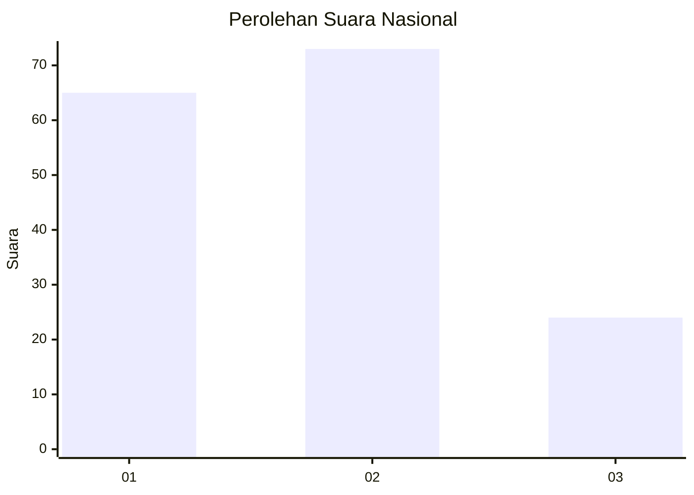
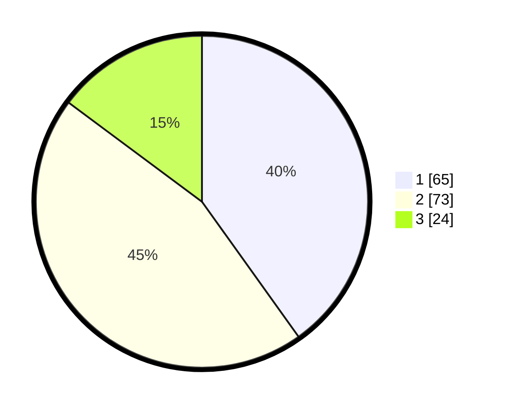

# Hasil

## Grafik

## Tabel

| No.    | Nama Paslon    | Suara | Suara (raw) | Persentase |
|:------ |:-------------- | -----:| -----------:| ----------:|
| 100025 | ANIES MUHAIMIN | 65    | [65][p-1]   | 40,12      |
| 100026 | PRABOWO GIBRAN | 73    | [73][p-2]   | 45,06      |
| 100027 | GANJAR MAHFUD  | 24    | [24][p-3]   | 14,81      |

[p-1]: https://github.com/gigit-pemilu/pemilu-2024/blob/main/pilpres/hitung-suara/sub/31-dki-jakarta/sub/72-jakarta-utara/sub/05-pademangan/sub/1002-pademangan-barat/sub/244-tps/sub/paslon-1.txt
[p-2]: https://github.com/gigit-pemilu/pemilu-2024/blob/main/pilpres/hitung-suara/sub/31-dki-jakarta/sub/72-jakarta-utara/sub/05-pademangan/sub/1002-pademangan-barat/sub/244-tps/sub/paslon-2.txt
[p-3]: https://github.com/gigit-pemilu/pemilu-2024/blob/main/pilpres/hitung-suara/sub/31-dki-jakarta/sub/72-jakarta-utara/sub/05-pademangan/sub/1002-pademangan-barat/sub/244-tps/sub/paslon-3.txt

## Foto C Plano

https://sirekap-obj-formc.kpu.go.id/a9b1/pemilu/ppwp/31/72/05/10/02/3172051002244-20240215-043833--2246b798-708d-4586-a52f-c61b10595de2.jpg

https://sirekap-obj-formc.kpu.go.id/a9b1/pemilu/ppwp/31/72/05/10/02/3172051002244-20240215-043945--72701a00-a1e0-4b21-b44a-57876f08ce96.jpg

https://sirekap-obj-formc.kpu.go.id/a9b1/pemilu/ppwp/31/72/05/10/02/3172051002244-20240215-044035--0da01e87-d0e4-4f1b-99b6-76b789bb9c6b.jpg

## Metadata

| Key        | Value               |
| ---------- | ------------------- |
| Time Stamp | 2024-02-21 16:00:00 |

