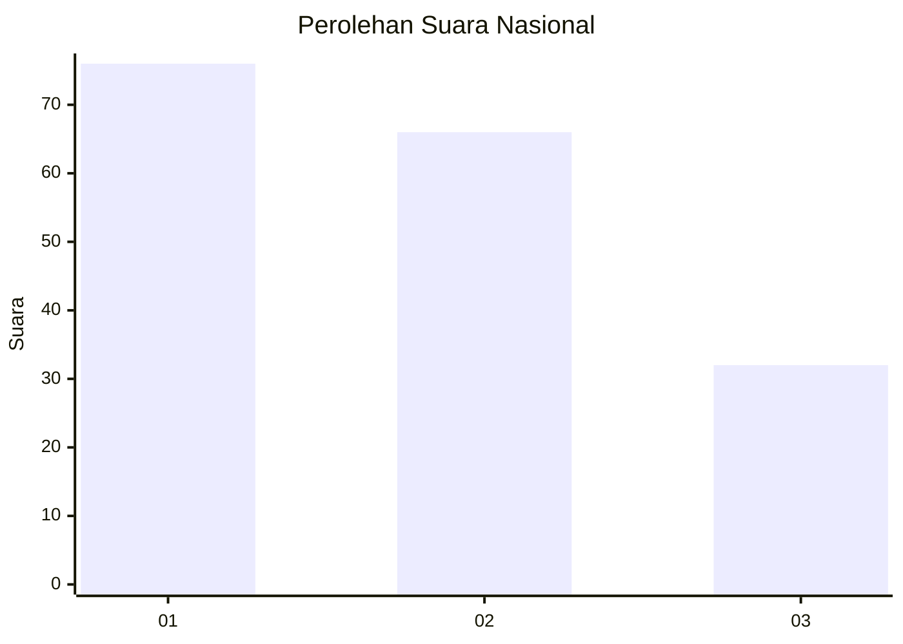
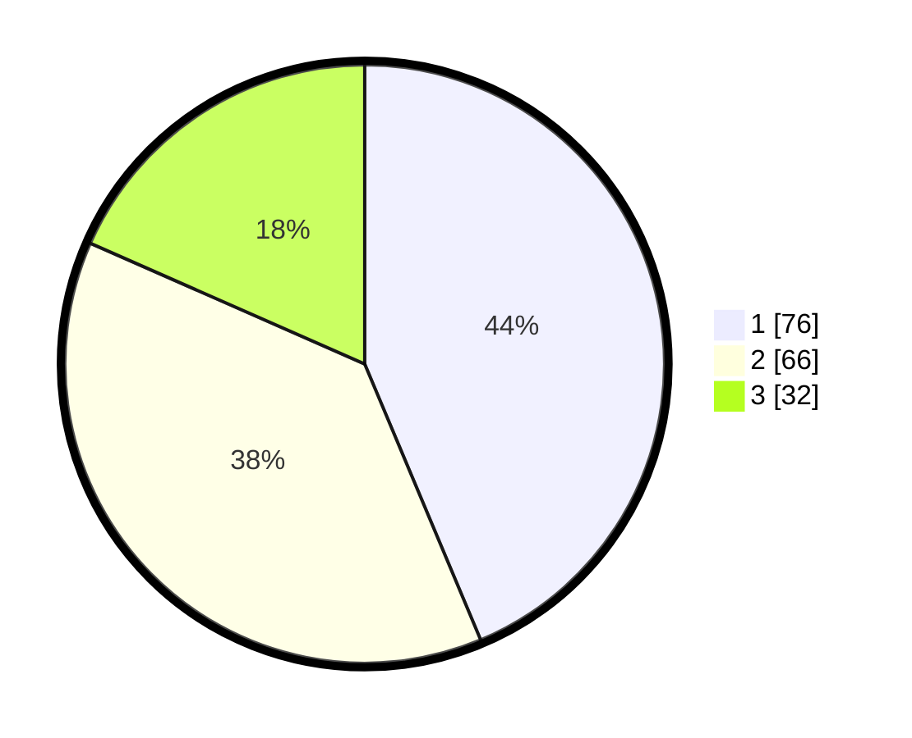

# Hasil

## Grafik

## Tabel

| No.    | Nama Paslon    | Suara | Suara (raw) | Persentase |
|:------ |:-------------- | -----:| -----------:| ----------:|
| 100025 | ANIES MUHAIMIN | 76    | [76][p-1]   | 43,68      |
| 100026 | PRABOWO GIBRAN | 66    | [66][p-2]   | 37,93      |
| 100027 | GANJAR MAHFUD  | 32    | [32][p-3]   | 18,39      |

[p-1]: https://github.com/gigit-pemilu/pemilu-2024/blob/main/pilpres/hitung-suara/sub/31-dki-jakarta/sub/72-jakarta-utara/sub/05-pademangan/sub/1002-pademangan-barat/sub/249-tps/sub/paslon-1.txt
[p-2]: https://github.com/gigit-pemilu/pemilu-2024/blob/main/pilpres/hitung-suara/sub/31-dki-jakarta/sub/72-jakarta-utara/sub/05-pademangan/sub/1002-pademangan-barat/sub/249-tps/sub/paslon-2.txt
[p-3]: https://github.com/gigit-pemilu/pemilu-2024/blob/main/pilpres/hitung-suara/sub/31-dki-jakarta/sub/72-jakarta-utara/sub/05-pademangan/sub/1002-pademangan-barat/sub/249-tps/sub/paslon-3.txt

## Foto C Plano

https://sirekap-obj-formc.kpu.go.id/aa26/pemilu/ppwp/31/72/05/10/02/3172051002249-20240214-231008--a20fc447-0de4-418c-88cd-e4be51df6f30.jpg

https://sirekap-obj-formc.kpu.go.id/aa26/pemilu/ppwp/31/72/05/10/02/3172051002249-20240214-193412--cbcccf54-009a-488f-b047-33aec613d368.jpg

https://sirekap-obj-formc.kpu.go.id/aa26/pemilu/ppwp/31/72/05/10/02/3172051002249-20240214-231243--d04978a5-0a6b-47f2-90b8-1775ae03ab7a.jpg

## Metadata

| Key        | Value               |
| ---------- | ------------------- |
| Time Stamp | 2024-02-19 21:00:00 |

