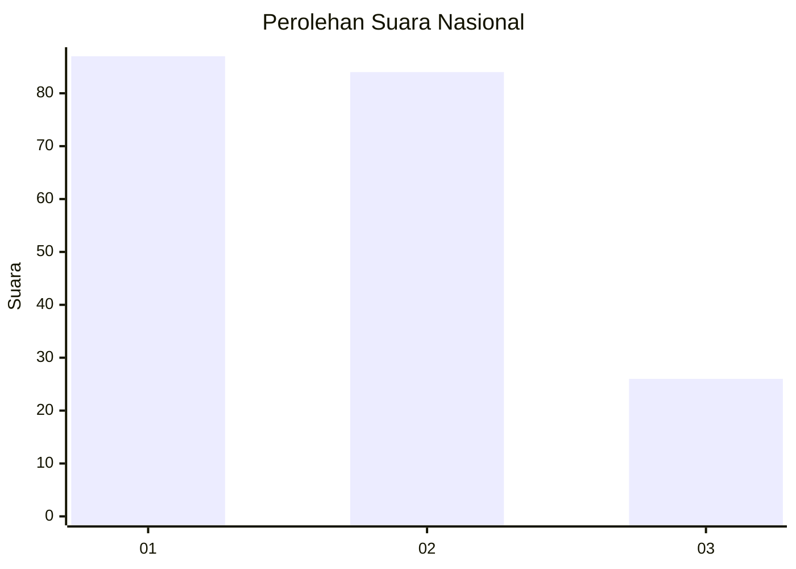
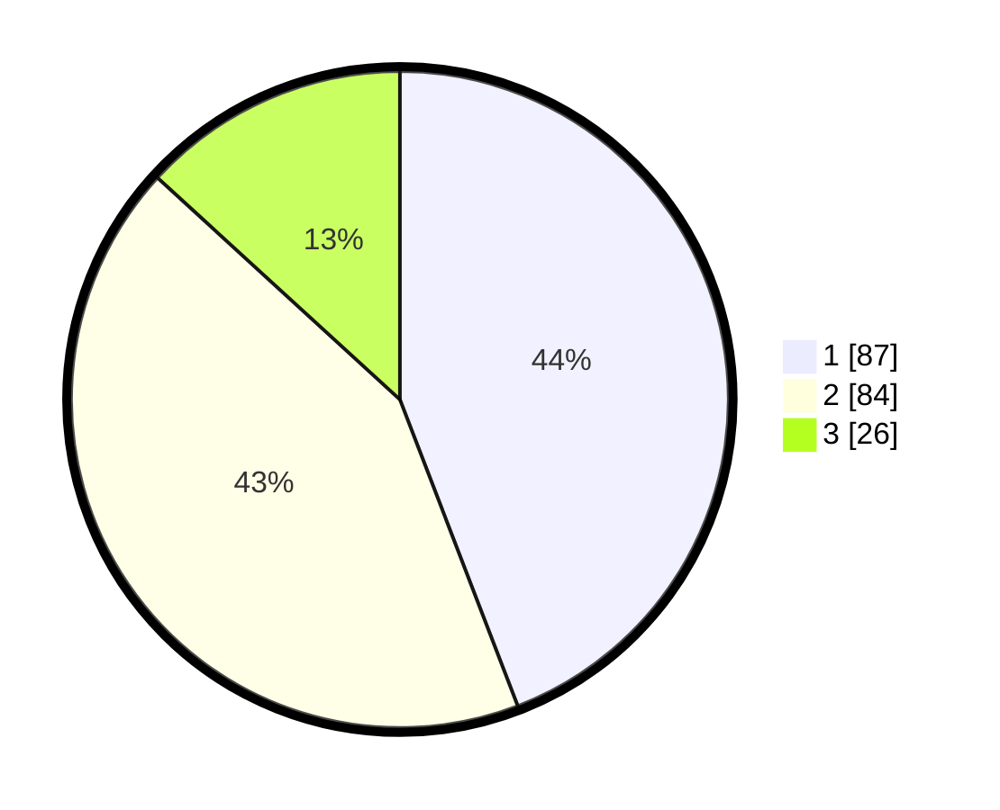

# Hasil

## Grafik

## Tabel

| No.    | Nama Paslon    | Suara | Suara (raw) | Persentase |
|:------ |:-------------- | -----:| -----------:| ----------:|
| 100025 | ANIES MUHAIMIN | 87    | [87][p-1]   | 44,16      |
| 100026 | PRABOWO GIBRAN | 84    | [84][p-2]   | 42,64      |
| 100027 | GANJAR MAHFUD  | 26    | [26][p-3]   | 13,20      |

[p-1]: https://github.com/gigit-pemilu/pemilu-2024/blob/main/pilpres/hitung-suara/sub/31-dki-jakarta/sub/72-jakarta-utara/sub/05-pademangan/sub/1003-ancol/sub/002-tps/sub/paslon-1.txt
[p-2]: https://github.com/gigit-pemilu/pemilu-2024/blob/main/pilpres/hitung-suara/sub/31-dki-jakarta/sub/72-jakarta-utara/sub/05-pademangan/sub/1003-ancol/sub/002-tps/sub/paslon-2.txt
[p-3]: https://github.com/gigit-pemilu/pemilu-2024/blob/main/pilpres/hitung-suara/sub/31-dki-jakarta/sub/72-jakarta-utara/sub/05-pademangan/sub/1003-ancol/sub/002-tps/sub/paslon-3.txt

## Foto C Plano

https://sirekap-obj-formc.kpu.go.id/2120/pemilu/ppwp/31/72/05/10/03/3172051003002-20240217-104519--9b9977f8-79c9-4bb2-bfec-9a040c1111ce.jpg

https://sirekap-obj-formc.kpu.go.id/2120/pemilu/ppwp/31/72/05/10/03/3172051003002-20240217-104702--3c28fe26-2f15-4b99-b126-f30601d7f17f.jpg

https://sirekap-obj-formc.kpu.go.id/2120/pemilu/ppwp/31/72/05/10/03/3172051003002-20240217-104737--feab47ae-a386-433f-803d-4987fcaf2005.jpg

## Metadata

| Key        | Value               |
| ---------- | ------------------- |
| Time Stamp | 2024-02-17 18:30:00 |

