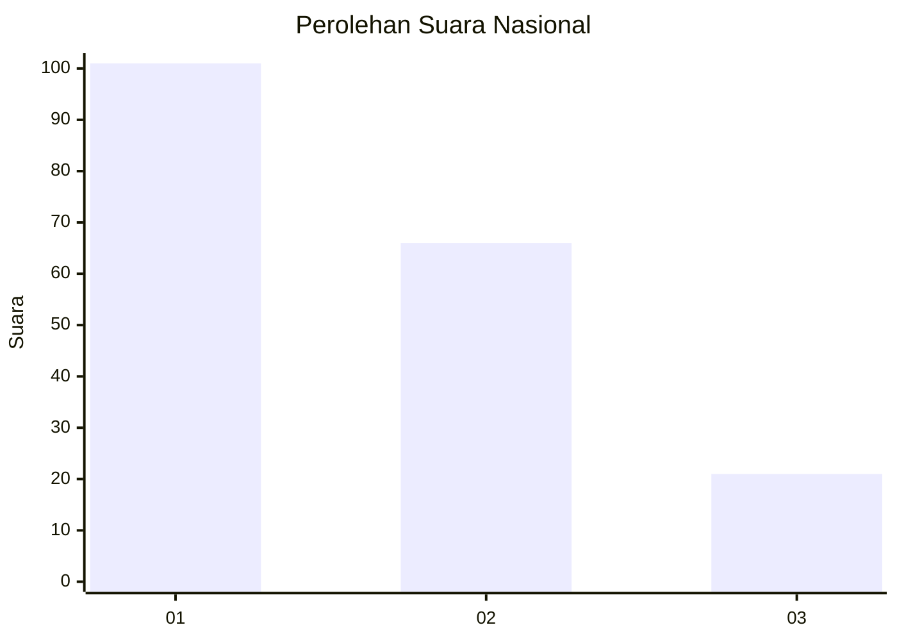
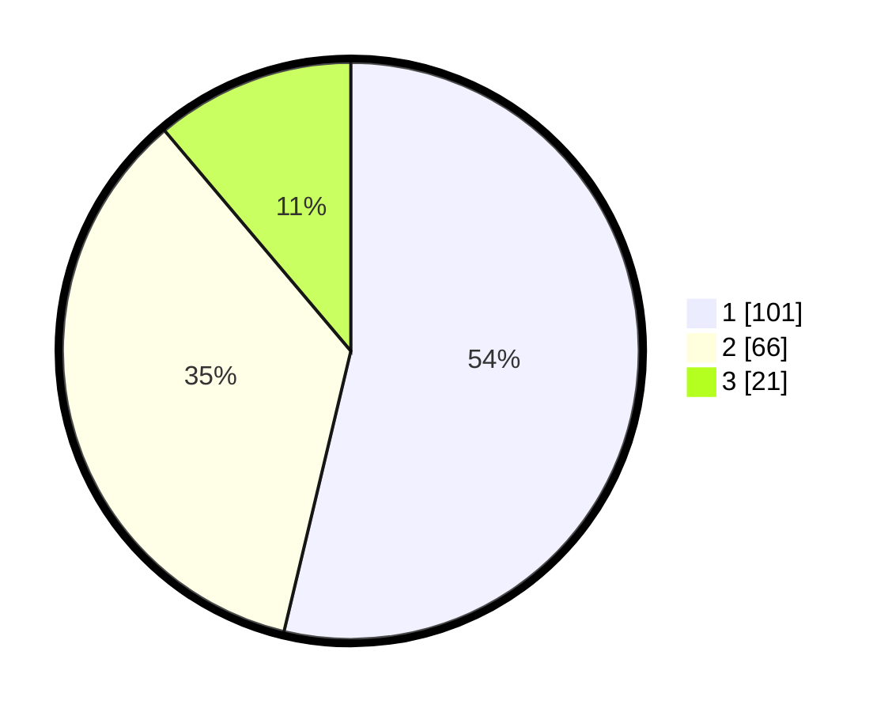

# Hasil

## Grafik

## Tabel

| No.    | Nama Paslon    | Suara | Suara (raw) | Persentase |
|:------ |:-------------- | -----:| -----------:| ----------:|
| 100025 | ANIES MUHAIMIN | 101   | [101][p-1]  | 53,72      |
| 100026 | PRABOWO GIBRAN | 66    | [66][p-2]   | 35,11      |
| 100027 | GANJAR MAHFUD  | 21    | [21][p-3]   | 11,17      |

[p-1]: https://github.com/gigit-pemilu/pemilu-2024/blob/main/pilpres/hitung-suara/sub/31-dki-jakarta/sub/72-jakarta-utara/sub/05-pademangan/sub/1003-ancol/sub/011-tps/sub/paslon-1.txt
[p-2]: https://github.com/gigit-pemilu/pemilu-2024/blob/main/pilpres/hitung-suara/sub/31-dki-jakarta/sub/72-jakarta-utara/sub/05-pademangan/sub/1003-ancol/sub/011-tps/sub/paslon-2.txt
[p-3]: https://github.com/gigit-pemilu/pemilu-2024/blob/main/pilpres/hitung-suara/sub/31-dki-jakarta/sub/72-jakarta-utara/sub/05-pademangan/sub/1003-ancol/sub/011-tps/sub/paslon-3.txt

## Foto C Plano

https://sirekap-obj-formc.kpu.go.id/adaa/pemilu/ppwp/31/72/05/10/03/3172051003011-20240215-000025--4bb9fa27-3f6d-4490-a7c8-3dbb99625db8.jpg

https://sirekap-obj-formc.kpu.go.id/adaa/pemilu/ppwp/31/72/05/10/03/3172051003011-20240214-235907--58ce8f2f-0ba7-4d35-ac16-788a06b51496.jpg

https://sirekap-obj-formc.kpu.go.id/adaa/pemilu/ppwp/31/72/05/10/03/3172051003011-20240215-000158--8181b744-f6f6-4612-871f-65122cc7d71f.jpg

## Metadata

| Key        | Value               |
| ---------- | ------------------- |
| Time Stamp | 2024-02-21 20:00:00 |

