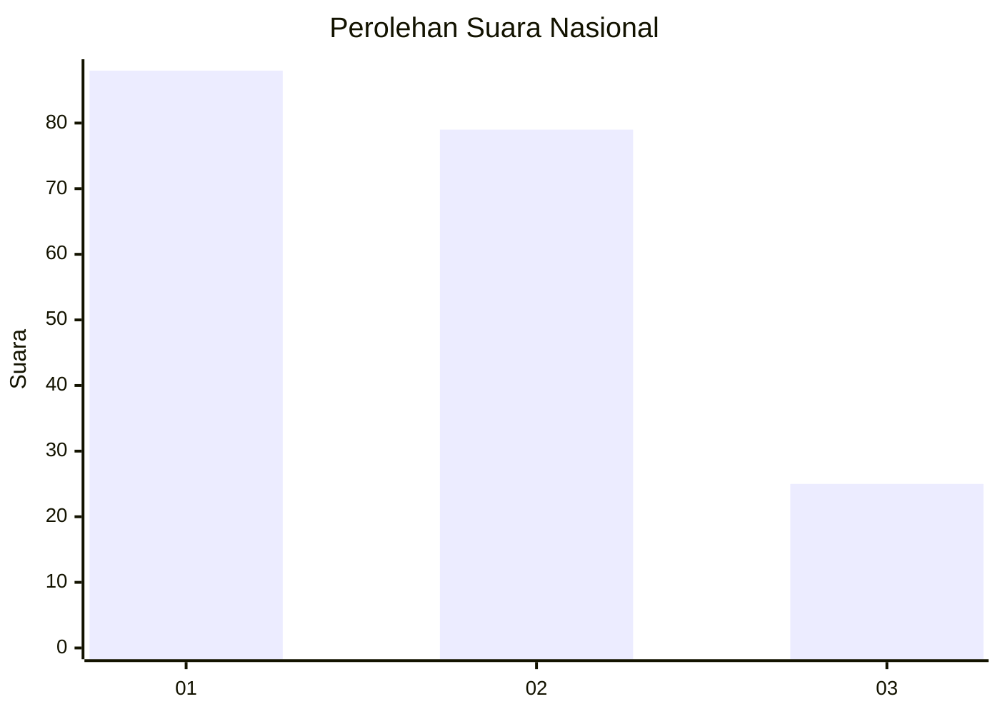
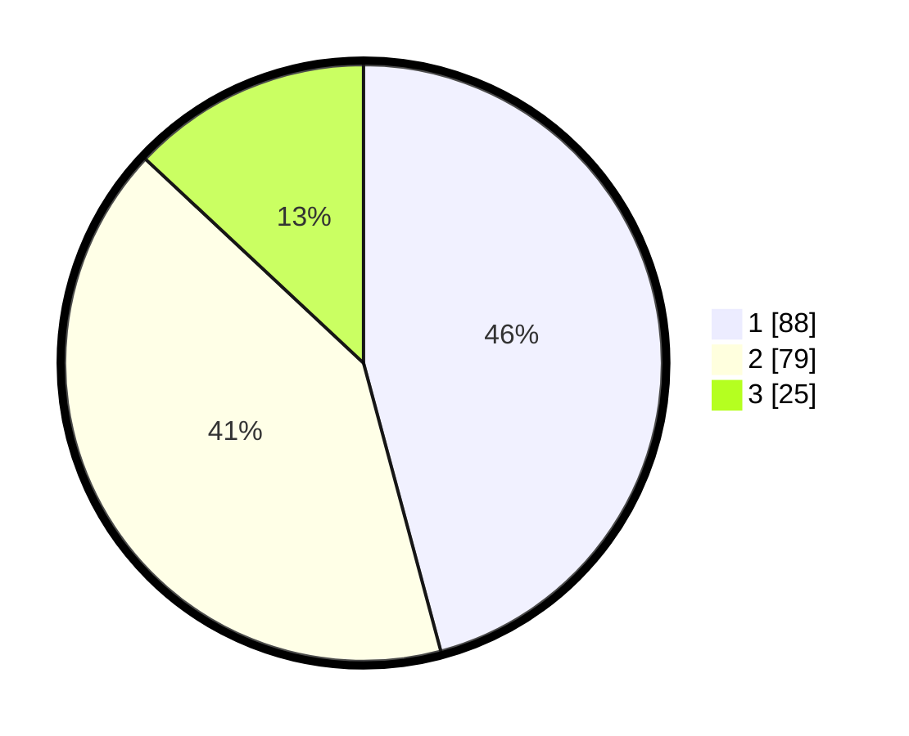

# Hasil

## Grafik

## Tabel

| No.    | Nama Paslon    | Suara | Suara (raw) | Persentase |
|:------ |:-------------- | -----:| -----------:| ----------:|
| 100025 | ANIES MUHAIMIN | 88    | [88][p-1]   | 45,83      |
| 100026 | PRABOWO GIBRAN | 79    | [79][p-2]   | 41,15      |
| 100027 | GANJAR MAHFUD  | 25    | [25][p-3]   | 13,02      |

[p-1]: https://github.com/gigit-pemilu/pemilu-2024/blob/main/pilpres/hitung-suara/sub/31-dki-jakarta/sub/72-jakarta-utara/sub/05-pademangan/sub/1003-ancol/sub/021-tps/sub/paslon-1.txt
[p-2]: https://github.com/gigit-pemilu/pemilu-2024/blob/main/pilpres/hitung-suara/sub/31-dki-jakarta/sub/72-jakarta-utara/sub/05-pademangan/sub/1003-ancol/sub/021-tps/sub/paslon-2.txt
[p-3]: https://github.com/gigit-pemilu/pemilu-2024/blob/main/pilpres/hitung-suara/sub/31-dki-jakarta/sub/72-jakarta-utara/sub/05-pademangan/sub/1003-ancol/sub/021-tps/sub/paslon-3.txt

## Foto C Plano

https://sirekap-obj-formc.kpu.go.id/555e/pemilu/ppwp/31/72/05/10/03/3172051003021-20240214-231858--b70470e3-282a-45a7-9f1b-8df57f7a87bb.jpg

https://sirekap-obj-formc.kpu.go.id/555e/pemilu/ppwp/31/72/05/10/03/3172051003021-20240214-231943--8fda3a1c-041c-47fc-8f94-984b74f3ae47.jpg

https://sirekap-obj-formc.kpu.go.id/555e/pemilu/ppwp/31/72/05/10/03/3172051003021-20240214-232017--ef9d8c5f-2f7c-4d16-892e-c75f5e187a6e.jpg

## Metadata

| Key        | Value               |
| ---------- | ------------------- |
| Time Stamp | 2024-02-21 21:00:04 |

