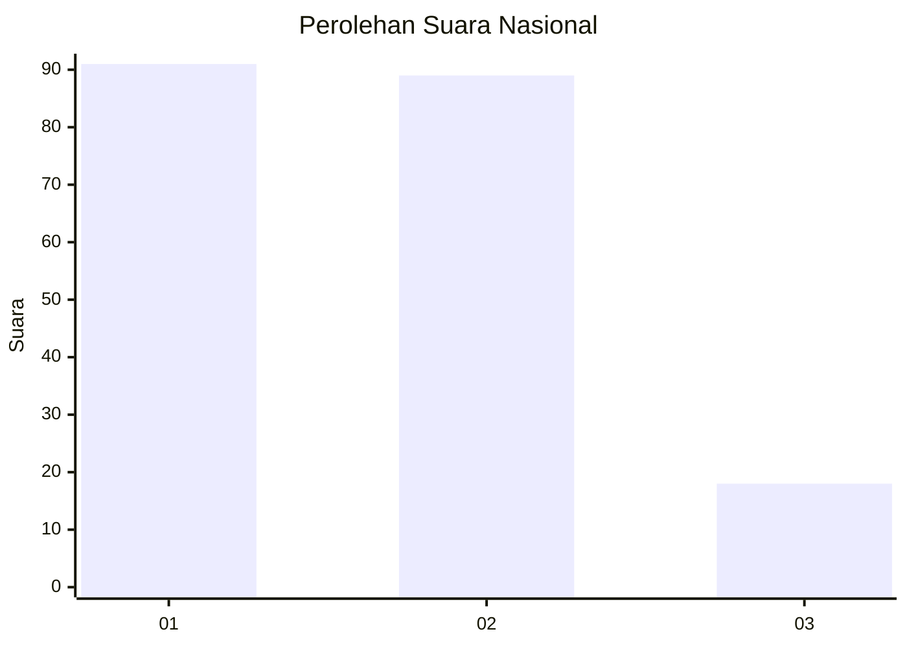
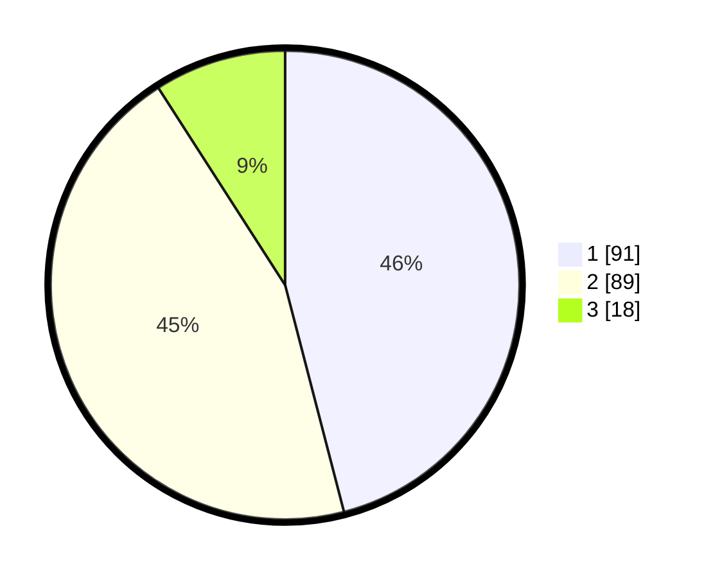

# Hasil

## Grafik

## Tabel

| No.    | Nama Paslon    | Suara | Suara (raw) | Persentase |
|:------ |:-------------- | -----:| -----------:| ----------:|
| 100025 | ANIES MUHAIMIN | 91    | [91][p-1]   | 45,96      |
| 100026 | PRABOWO GIBRAN | 89    | [89][p-2]   | 44,95      |
| 100027 | GANJAR MAHFUD  | 18    | [18][p-3]   | 9,09       |

[p-1]: https://github.com/gigit-pemilu/pemilu-2024/blob/main/pilpres/hitung-suara/sub/31-dki-jakarta/sub/72-jakarta-utara/sub/05-pademangan/sub/1003-ancol/sub/022-tps/sub/paslon-1.txt
[p-2]: https://github.com/gigit-pemilu/pemilu-2024/blob/main/pilpres/hitung-suara/sub/31-dki-jakarta/sub/72-jakarta-utara/sub/05-pademangan/sub/1003-ancol/sub/022-tps/sub/paslon-2.txt
[p-3]: https://github.com/gigit-pemilu/pemilu-2024/blob/main/pilpres/hitung-suara/sub/31-dki-jakarta/sub/72-jakarta-utara/sub/05-pademangan/sub/1003-ancol/sub/022-tps/sub/paslon-3.txt

## Foto C Plano

https://sirekap-obj-formc.kpu.go.id/7cd0/pemilu/ppwp/31/72/05/10/03/3172051003022-20240215-112430--cd6b88bf-73ab-43bf-8148-b2780d365202.jpg

https://sirekap-obj-formc.kpu.go.id/7cd0/pemilu/ppwp/31/72/05/10/03/3172051003022-20240214-234732--3696d44e-63d9-49d7-a1e2-3e199ce4f608.jpg

https://sirekap-obj-formc.kpu.go.id/7cd0/pemilu/ppwp/31/72/05/10/03/3172051003022-20240214-235019--6609ac6a-ca47-40a0-9511-544fa7e9b8d3.jpg

## Metadata

| Key        | Value               |
| ---------- | ------------------- |
| Time Stamp | 2024-02-15 15:30:25 |

