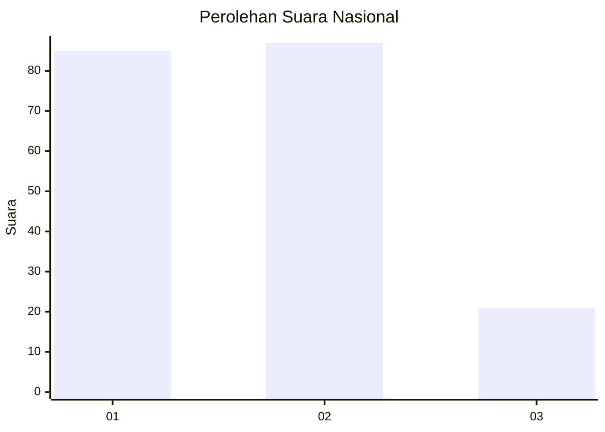
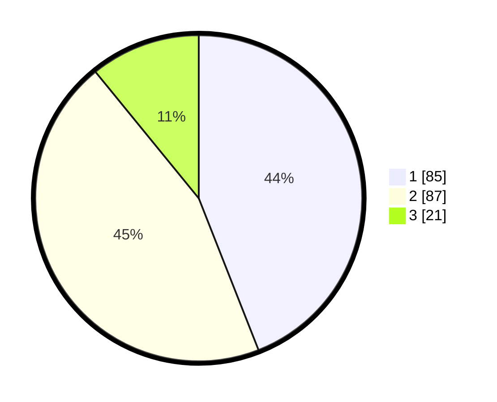

# Hasil

## Grafik

## Tabel

| No.    | Nama Paslon    | Suara | Suara (raw) | Persentase |
|:------ |:-------------- | -----:| -----------:| ----------:|
| 100025 | ANIES MUHAIMIN | 85    | [85][p-1]   | 44,04      |
| 100026 | PRABOWO GIBRAN | 87    | [87][p-2]   | 45,08      |
| 100027 | GANJAR MAHFUD  | 21    | [21][p-3]   | 10,88      |

[p-1]: https://github.com/gigit-pemilu/pemilu-2024/blob/main/pilpres/hitung-suara/sub/31-dki-jakarta/sub/72-jakarta-utara/sub/05-pademangan/sub/1003-ancol/sub/037-tps/sub/paslon-1.txt
[p-2]: https://github.com/gigit-pemilu/pemilu-2024/blob/main/pilpres/hitung-suara/sub/31-dki-jakarta/sub/72-jakarta-utara/sub/05-pademangan/sub/1003-ancol/sub/037-tps/sub/paslon-2.txt
[p-3]: https://github.com/gigit-pemilu/pemilu-2024/blob/main/pilpres/hitung-suara/sub/31-dki-jakarta/sub/72-jakarta-utara/sub/05-pademangan/sub/1003-ancol/sub/037-tps/sub/paslon-3.txt

## Foto C Plano

https://sirekap-obj-formc.kpu.go.id/8717/pemilu/ppwp/31/72/05/10/03/3172051003037-20240214-210659--9e1c5ad9-dba3-463f-bc72-831dae48966f.jpg

https://sirekap-obj-formc.kpu.go.id/8717/pemilu/ppwp/31/72/05/10/03/3172051003037-20240214-210710--91929609-9bc9-4f82-aa6f-6bd098c2e6cf.jpg

https://sirekap-obj-formc.kpu.go.id/8717/pemilu/ppwp/31/72/05/10/03/3172051003037-20240214-210720--05e338c8-2f43-43d5-b0d4-cc02e191317a.jpg

## Metadata

| Key        | Value               |
| ---------- | ------------------- |
| Time Stamp | 2024-02-21 20:00:00 |

