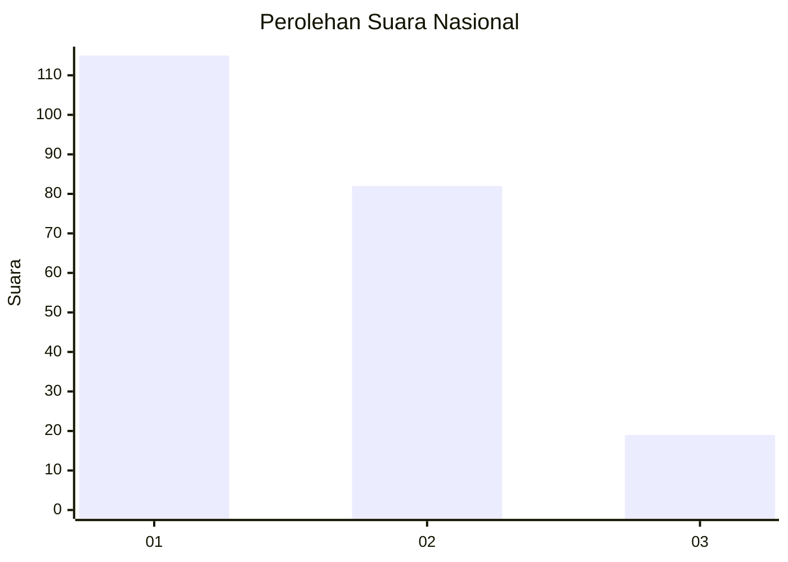
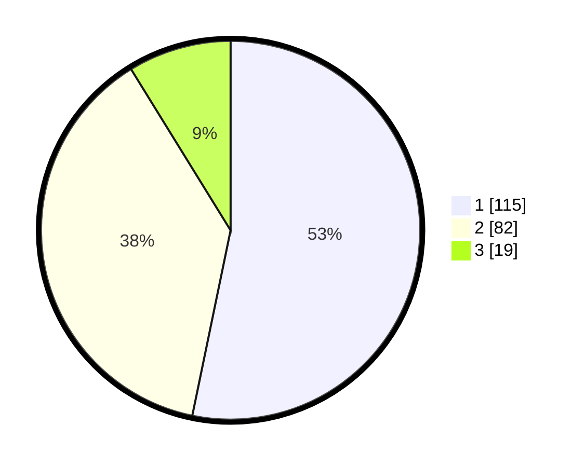

# Hasil

## Grafik

## Tabel

| No.    | Nama Paslon    | Suara | Suara (raw) | Persentase |
|:------ |:-------------- | -----:| -----------:| ----------:|
| 100025 | ANIES MUHAIMIN | 115   | [115][p-1]  | 53,24      |
| 100026 | PRABOWO GIBRAN | 82    | [82][p-2]   | 37,96      |
| 100027 | GANJAR MAHFUD  | 19    | [19][p-3]   | 8,80       |

[p-1]: https://github.com/gigit-pemilu/pemilu-2024/blob/main/pilpres/hitung-suara/sub/31-dki-jakarta/sub/72-jakarta-utara/sub/05-pademangan/sub/1003-ancol/sub/046-tps/sub/paslon-1.txt
[p-2]: https://github.com/gigit-pemilu/pemilu-2024/blob/main/pilpres/hitung-suara/sub/31-dki-jakarta/sub/72-jakarta-utara/sub/05-pademangan/sub/1003-ancol/sub/046-tps/sub/paslon-2.txt
[p-3]: https://github.com/gigit-pemilu/pemilu-2024/blob/main/pilpres/hitung-suara/sub/31-dki-jakarta/sub/72-jakarta-utara/sub/05-pademangan/sub/1003-ancol/sub/046-tps/sub/paslon-3.txt

## Foto C Plano

https://sirekap-obj-formc.kpu.go.id/e8a3/pemilu/ppwp/31/72/05/10/03/3172051003046-20240215-213525--b2392bda-4564-441c-b6f5-5848c41d23b0.jpg

https://sirekap-obj-formc.kpu.go.id/e8a3/pemilu/ppwp/31/72/05/10/03/3172051003046-20240217-002243--9b1f6cd9-99a9-4535-aff8-5ec2e25638db.jpg

https://sirekap-obj-formc.kpu.go.id/e8a3/pemilu/ppwp/31/72/05/10/03/3172051003046-20240218-150914--08a6ee70-817e-4178-9da1-9af346cbcfed.jpg

## Metadata

| Key        | Value               |
| ---------- | ------------------- |
| Time Stamp | 2024-02-21 18:00:00 |

