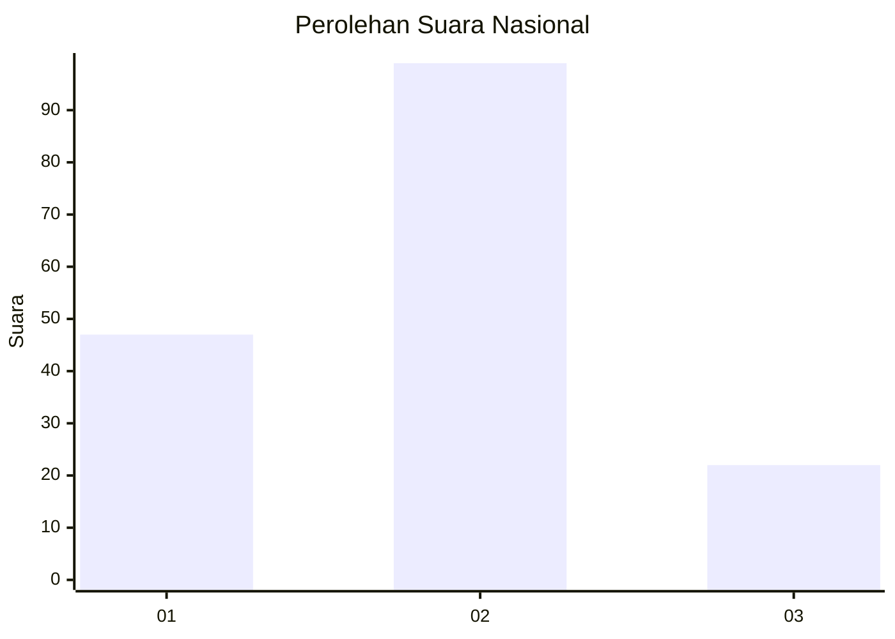
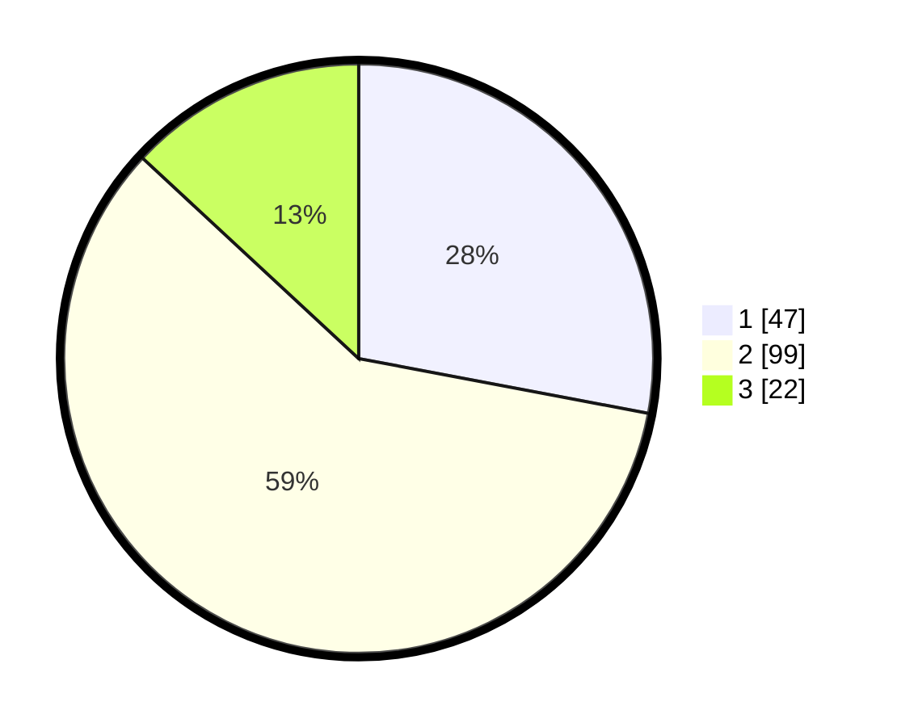

# Hasil

## Grafik

## Tabel

| No.    | Nama Paslon    | Suara | Suara (raw) | Persentase |
|:------ |:-------------- | -----:| -----------:| ----------:|
| 100025 | ANIES MUHAIMIN | 47    | [47][p-1]   | 27,98      |
| 100026 | PRABOWO GIBRAN | 99    | [99][p-2]   | 58,93      |
| 100027 | GANJAR MAHFUD  | 22    | [22][p-3]   | 13,10      |

[p-1]: https://github.com/gigit-pemilu/pemilu-2024/blob/main/pilpres/hitung-suara/sub/31-dki-jakarta/sub/72-jakarta-utara/sub/05-pademangan/sub/1003-ancol/sub/054-tps/sub/paslon-1.txt
[p-2]: https://github.com/gigit-pemilu/pemilu-2024/blob/main/pilpres/hitung-suara/sub/31-dki-jakarta/sub/72-jakarta-utara/sub/05-pademangan/sub/1003-ancol/sub/054-tps/sub/paslon-2.txt
[p-3]: https://github.com/gigit-pemilu/pemilu-2024/blob/main/pilpres/hitung-suara/sub/31-dki-jakarta/sub/72-jakarta-utara/sub/05-pademangan/sub/1003-ancol/sub/054-tps/sub/paslon-3.txt

## Foto C Plano

https://sirekap-obj-formc.kpu.go.id/700b/pemilu/ppwp/31/72/05/10/03/3172051003054-20240214-223528--a5a6fc8a-4b65-44bd-a1e5-8546d74e8da1.jpg

https://sirekap-obj-formc.kpu.go.id/700b/pemilu/ppwp/31/72/05/10/03/3172051003054-20240214-223747--6d32df88-efac-4abd-8591-35af7de0476f.jpg

https://sirekap-obj-formc.kpu.go.id/700b/pemilu/ppwp/31/72/05/10/03/3172051003054-20240214-223905--1c25038d-fc9a-4de4-9d8a-99168133a929.jpg

## Metadata

| Key        | Value               |
| ---------- | ------------------- |
| Time Stamp | 2024-02-21 20:00:00 |

