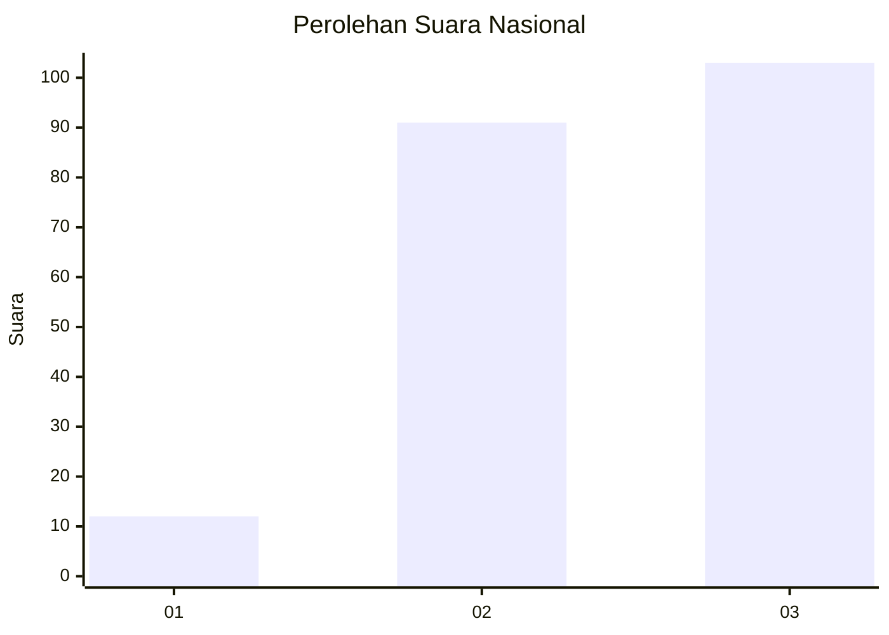
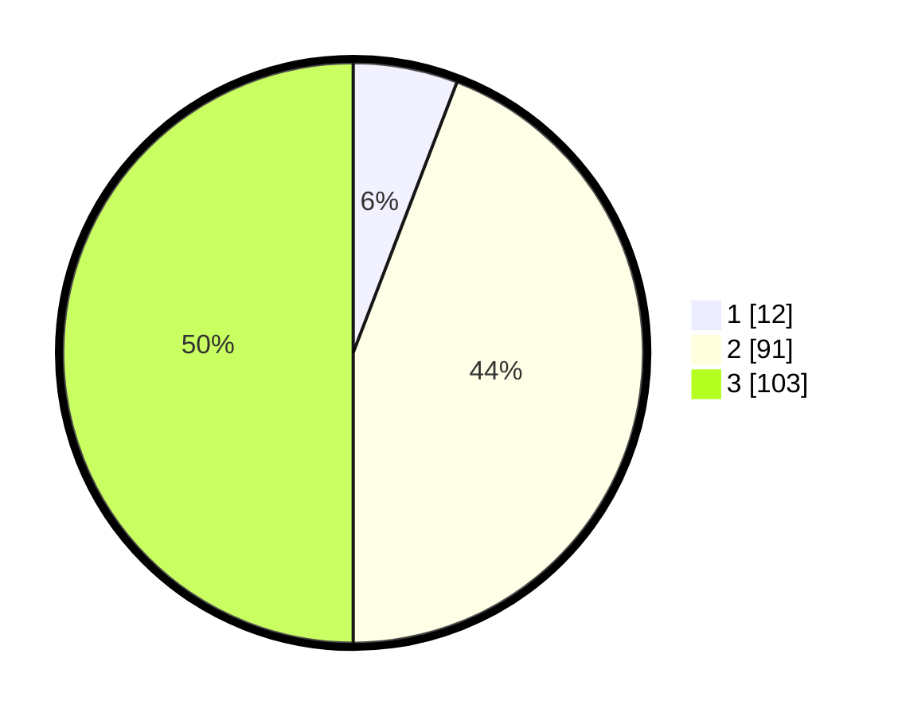

# Hasil

## Grafik

## Tabel

| No.    | Nama Paslon    | Suara | Suara (raw) | Persentase |
|:------ |:-------------- | -----:| -----------:| ----------:|
| 100025 | ANIES MUHAIMIN | 12    | [12][p-1]   | 5,83       |
| 100026 | PRABOWO GIBRAN | 91    | [91][p-2]   | 44,17      |
| 100027 | GANJAR MAHFUD  | 103   | [103][p-3]  | 50,00      |

[p-1]: https://github.com/gigit-pemilu/pemilu-2024/blob/main/pilpres/hitung-suara/sub/31-dki-jakarta/sub/72-jakarta-utara/sub/05-pademangan/sub/1003-ancol/sub/076-tps/sub/paslon-1.txt
[p-2]: https://github.com/gigit-pemilu/pemilu-2024/blob/main/pilpres/hitung-suara/sub/31-dki-jakarta/sub/72-jakarta-utara/sub/05-pademangan/sub/1003-ancol/sub/076-tps/sub/paslon-2.txt
[p-3]: https://github.com/gigit-pemilu/pemilu-2024/blob/main/pilpres/hitung-suara/sub/31-dki-jakarta/sub/72-jakarta-utara/sub/05-pademangan/sub/1003-ancol/sub/076-tps/sub/paslon-3.txt

## Foto C Plano

https://sirekap-obj-formc.kpu.go.id/56d8/pemilu/ppwp/31/72/05/10/03/3172051003076-20240220-004004--9df860d5-a24f-437d-afc5-b60cca4da40b.jpg

https://sirekap-obj-formc.kpu.go.id/56d8/pemilu/ppwp/31/72/05/10/03/3172051003076-20240220-003855--d24f27b7-ec16-46e3-8d2e-1554a23a5658.jpg

https://sirekap-obj-formc.kpu.go.id/56d8/pemilu/ppwp/31/72/05/10/03/3172051003076-20240220-004053--dc282fac-9fc8-4d21-bc58-2183b1c25e32.jpg

## Metadata

| Key        | Value               |
| ---------- | ------------------- |
| Time Stamp | 2024-02-21 16:00:00 |

