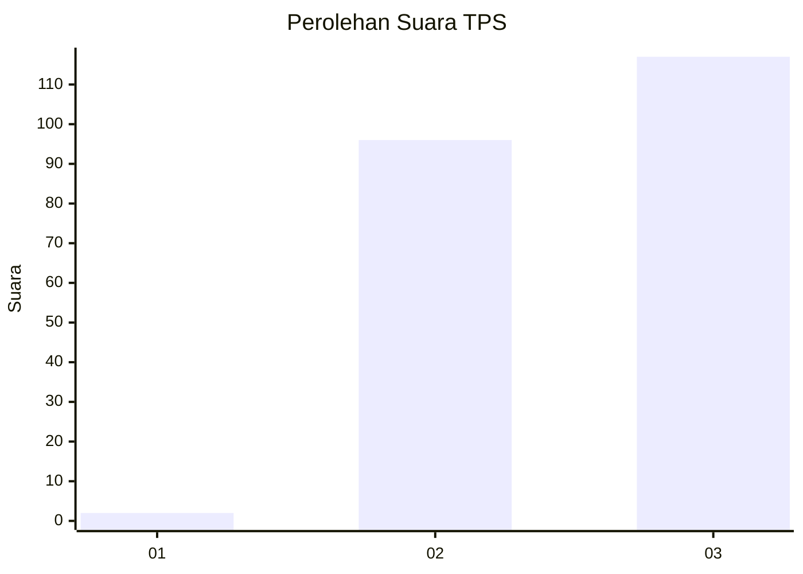
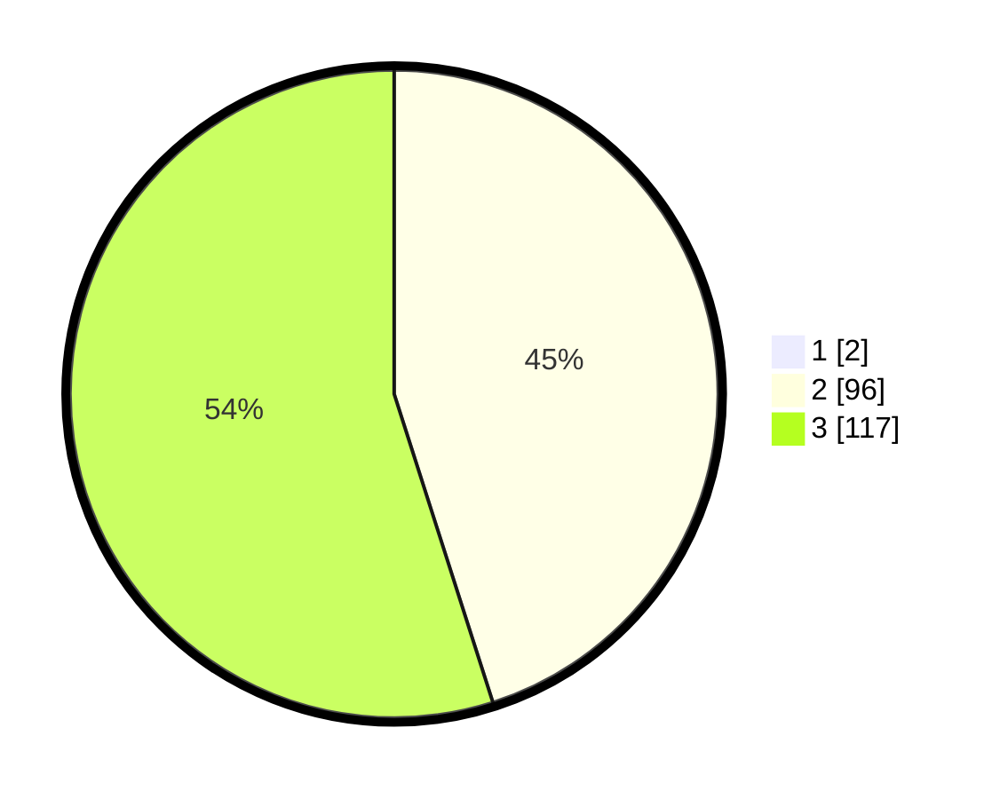

# Hasil

## Grafik

## Tabel

| No. | Nama Paslon    | Suara | Suara (raw) | Persentase |
|:--- |:-------------- | -----:| -----------:| ----------:|
| 1   | ANIES MUHAIMIN | 2     | [2][p-1]    | 0,93       |
| 2   | PRABOWO GIBRAN | 96    | [96][p-2]   | 44,65      |
| 3   | GANJAR MAHFUD  | 117   | [117][p-3]  | 54,42      |

[p-1]: https://github.com/gigit-pemilu/pemilu-2024-31-dki-jakarta/blob/main/pilpres/hitung-suara/sub/31-dki-jakarta/sub/72-jakarta-utara/sub/06-kelapa-gading/sub/1001-kelapa-gading-timur/sub/001-tps/sub/paslon-1.txt
[p-2]: https://github.com/gigit-pemilu/pemilu-2024-31-dki-jakarta/blob/main/pilpres/hitung-suara/sub/31-dki-jakarta/sub/72-jakarta-utara/sub/06-kelapa-gading/sub/1001-kelapa-gading-timur/sub/001-tps/sub/paslon-2.txt
[p-3]: https://github.com/gigit-pemilu/pemilu-2024-31-dki-jakarta/blob/main/pilpres/hitung-suara/sub/31-dki-jakarta/sub/72-jakarta-utara/sub/06-kelapa-gading/sub/1001-kelapa-gading-timur/sub/001-tps/sub/paslon-3.txt

## Foto C Plano

https://sirekap-obj-formc.kpu.go.id/8bd6/pemilu/ppwp/31/72/06/10/01/3172061001001-20240216-134942--12f244c1-0e13-4a66-95fe-b1b5452bff88.jpg

https://sirekap-obj-formc.kpu.go.id/8bd6/pemilu/ppwp/31/72/06/10/01/3172061001001-20240216-135052--c661e7c7-2341-4a32-824b-374c3400036c.jpg

https://sirekap-obj-formc.kpu.go.id/8bd6/pemilu/ppwp/31/72/06/10/01/3172061001001-20240216-135116--e29d529a-9a16-4a74-9b46-cdadabcdad74.jpg

## Metadata

| Key        | Value               |
| ---------- | ------------------- |
| Time Stamp | 2024-02-22 11:00:00 |

