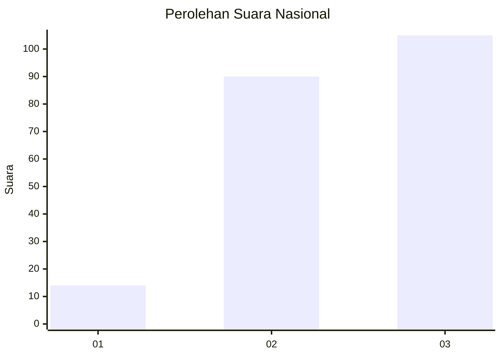
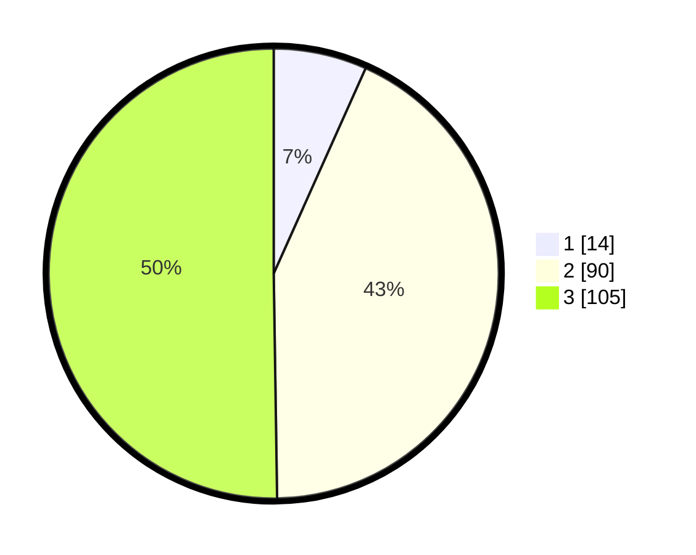

# Hasil

## Grafik

## Tabel

| No.    | Nama Paslon    | Suara | Suara (raw) | Persentase |
|:------ |:-------------- | -----:| -----------:| ----------:|
| 100025 | ANIES MUHAIMIN | 14    | [14][p-1]   | 6,70       |
| 100026 | PRABOWO GIBRAN | 90    | [90][p-2]   | 43,06      |
| 100027 | GANJAR MAHFUD  | 105   | [105][p-3]  | 50,24      |

[p-1]: https://github.com/gigit-pemilu/pemilu-2024/blob/main/pilpres/hitung-suara/sub/31-dki-jakarta/sub/72-jakarta-utara/sub/06-kelapa-gading/sub/1001-kelapa-gading-timur/sub/002-tps/sub/paslon-1.txt
[p-2]: https://github.com/gigit-pemilu/pemilu-2024/blob/main/pilpres/hitung-suara/sub/31-dki-jakarta/sub/72-jakarta-utara/sub/06-kelapa-gading/sub/1001-kelapa-gading-timur/sub/002-tps/sub/paslon-2.txt
[p-3]: https://github.com/gigit-pemilu/pemilu-2024/blob/main/pilpres/hitung-suara/sub/31-dki-jakarta/sub/72-jakarta-utara/sub/06-kelapa-gading/sub/1001-kelapa-gading-timur/sub/002-tps/sub/paslon-3.txt

## Foto C Plano

https://sirekap-obj-formc.kpu.go.id/1990/pemilu/ppwp/31/72/06/10/01/3172061001002-20240216-141219--3e94de66-2258-4038-837b-1337c88d7ac0.jpg

https://sirekap-obj-formc.kpu.go.id/1990/pemilu/ppwp/31/72/06/10/01/3172061001002-20240216-141249--7a31259c-cec2-47cb-ae26-b780e5ac1637.jpg

https://sirekap-obj-formc.kpu.go.id/1990/pemilu/ppwp/31/72/06/10/01/3172061001002-20240216-141320--c057a29c-6091-4a40-ae7d-370c0cf6717e.jpg

## Metadata

| Key        | Value               |
| ---------- | ------------------- |
| Time Stamp | 2024-02-21 14:00:00 |

