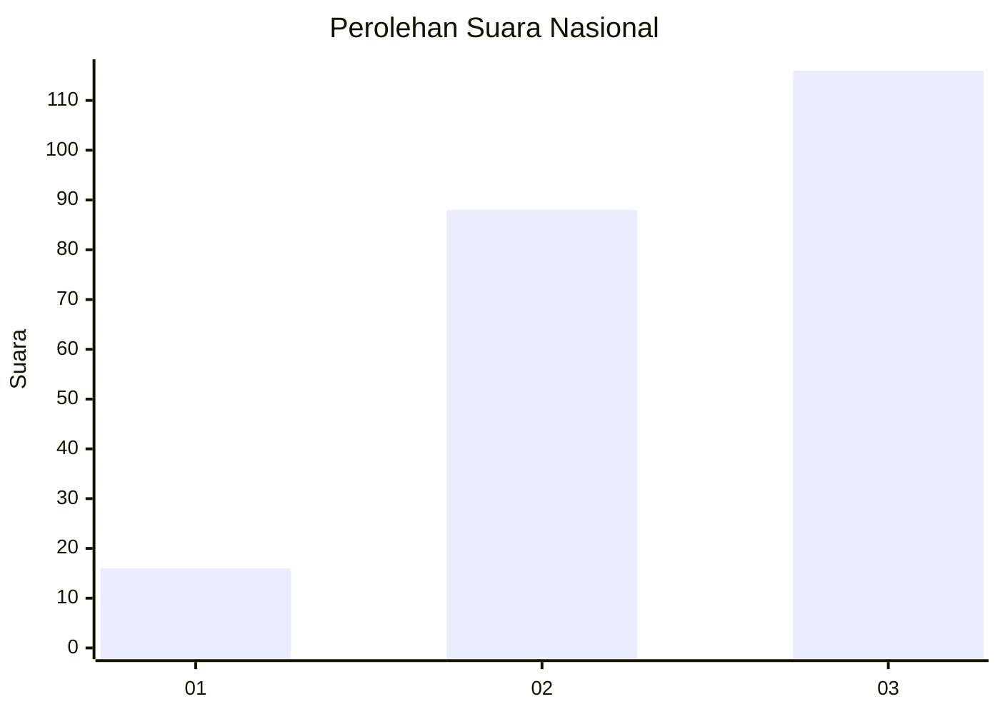
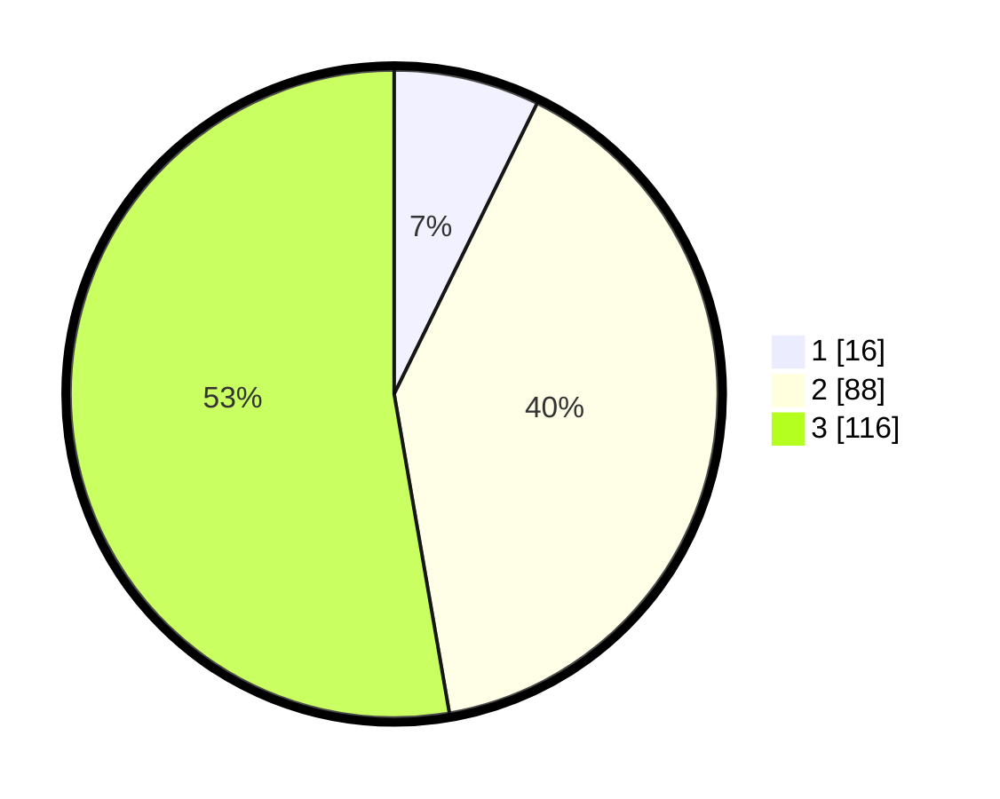

# Hasil

## Grafik

## Tabel

| No.    | Nama Paslon    | Suara | Suara (raw) | Persentase |
|:------ |:-------------- | -----:| -----------:| ----------:|
| 100025 | ANIES MUHAIMIN | 16    | [16][p-1]   | 7,27       |
| 100026 | PRABOWO GIBRAN | 88    | [88][p-2]   | 40,00      |
| 100027 | GANJAR MAHFUD  | 116   | [116][p-3]  | 52,73      |

[p-1]: https://github.com/gigit-pemilu/pemilu-2024/blob/main/pilpres/hitung-suara/sub/31-dki-jakarta/sub/72-jakarta-utara/sub/06-kelapa-gading/sub/1001-kelapa-gading-timur/sub/003-tps/sub/paslon-1.txt
[p-2]: https://github.com/gigit-pemilu/pemilu-2024/blob/main/pilpres/hitung-suara/sub/31-dki-jakarta/sub/72-jakarta-utara/sub/06-kelapa-gading/sub/1001-kelapa-gading-timur/sub/003-tps/sub/paslon-2.txt
[p-3]: https://github.com/gigit-pemilu/pemilu-2024/blob/main/pilpres/hitung-suara/sub/31-dki-jakarta/sub/72-jakarta-utara/sub/06-kelapa-gading/sub/1001-kelapa-gading-timur/sub/003-tps/sub/paslon-3.txt

## Foto C Plano

https://sirekap-obj-formc.kpu.go.id/126e/pemilu/ppwp/31/72/06/10/01/3172061001003-20240216-142441--7a86e41c-d9d1-4ce3-ba5a-cc810a11edc1.jpg

https://sirekap-obj-formc.kpu.go.id/126e/pemilu/ppwp/31/72/06/10/01/3172061001003-20240216-142503--46ef15ff-905f-4b81-8447-a212e4426b39.jpg

https://sirekap-obj-formc.kpu.go.id/126e/pemilu/ppwp/31/72/06/10/01/3172061001003-20240216-142522--166aba9d-f31f-4761-9823-1fe867a2f803.jpg

## Metadata

| Key        | Value               |
| ---------- | ------------------- |
| Time Stamp | 2024-02-21 15:00:00 |

