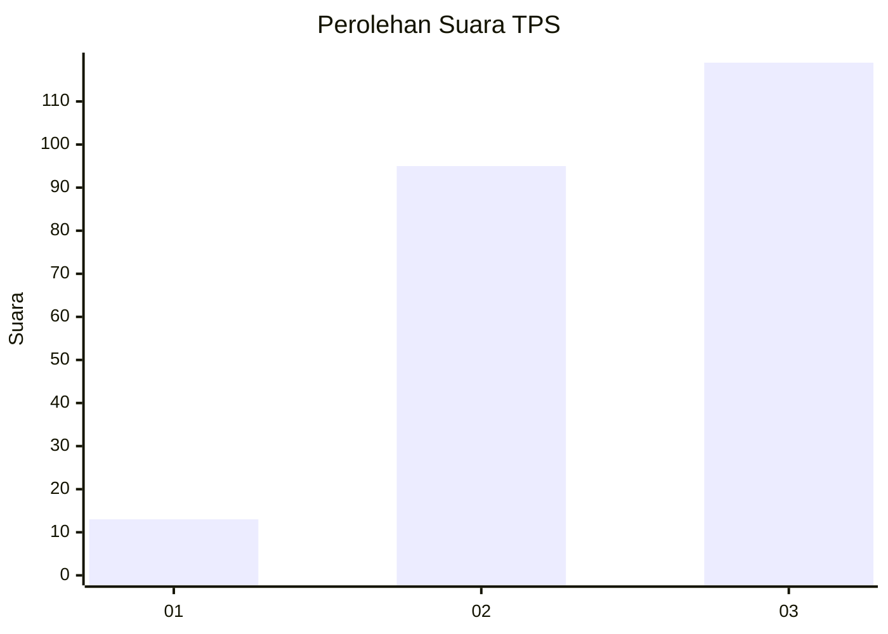
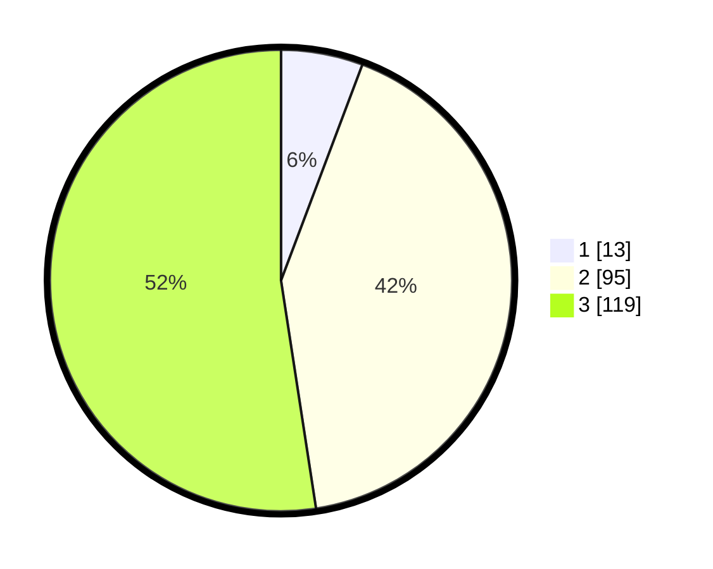

# Hasil

## Grafik

## Tabel

| No. | Nama Paslon    | Suara | Suara (raw) | Persentase |
|:--- |:-------------- | -----:| -----------:| ----------:|
| 1   | ANIES MUHAIMIN | 13    | [13][p-1]   | 5,73       |
| 2   | PRABOWO GIBRAN | 95    | [95][p-2]   | 41,85      |
| 3   | GANJAR MAHFUD  | 119   | [119][p-3]  | 52,42      |

[p-1]: https://github.com/gigit-pemilu/pemilu-2024-31-dki-jakarta/blob/main/pilpres/hitung-suara/sub/31-dki-jakarta/sub/72-jakarta-utara/sub/06-kelapa-gading/sub/1001-kelapa-gading-timur/sub/004-tps/sub/paslon-1.txt
[p-2]: https://github.com/gigit-pemilu/pemilu-2024-31-dki-jakarta/blob/main/pilpres/hitung-suara/sub/31-dki-jakarta/sub/72-jakarta-utara/sub/06-kelapa-gading/sub/1001-kelapa-gading-timur/sub/004-tps/sub/paslon-2.txt
[p-3]: https://github.com/gigit-pemilu/pemilu-2024-31-dki-jakarta/blob/main/pilpres/hitung-suara/sub/31-dki-jakarta/sub/72-jakarta-utara/sub/06-kelapa-gading/sub/1001-kelapa-gading-timur/sub/004-tps/sub/paslon-3.txt

## Foto C Plano

https://sirekap-obj-formc.kpu.go.id/7ee3/pemilu/ppwp/31/72/06/10/01/3172061001004-20240216-144103--0473f3f9-0ed1-4889-8f32-1e9eceb92bfc.jpg

https://sirekap-obj-formc.kpu.go.id/7ee3/pemilu/ppwp/31/72/06/10/01/3172061001004-20240216-144129--78b63acc-2331-4f7b-854e-54d015d5b24a.jpg

https://sirekap-obj-formc.kpu.go.id/7ee3/pemilu/ppwp/31/72/06/10/01/3172061001004-20240216-144152--7fde2061-d4e5-4c95-b5dd-721e5670a71b.jpg

## Metadata

| Key        | Value               |
| ---------- | ------------------- |
| Time Stamp | 2024-02-21 18:00:00 |

