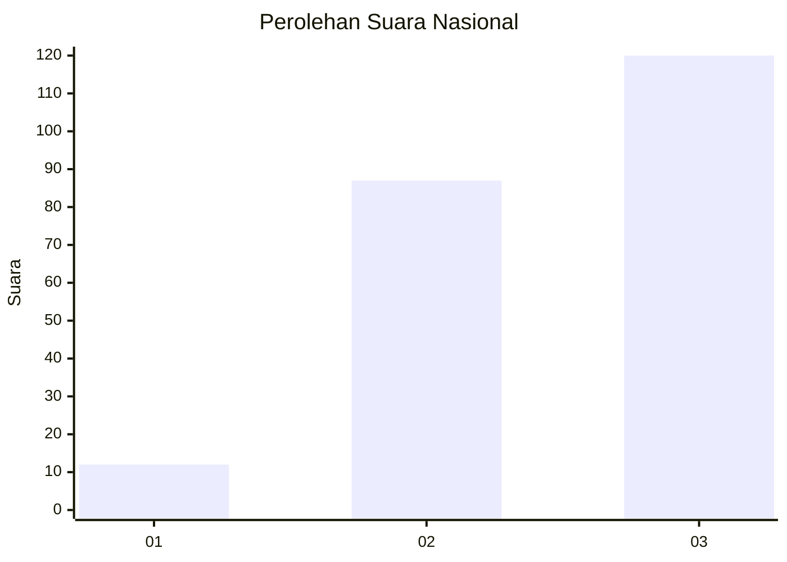
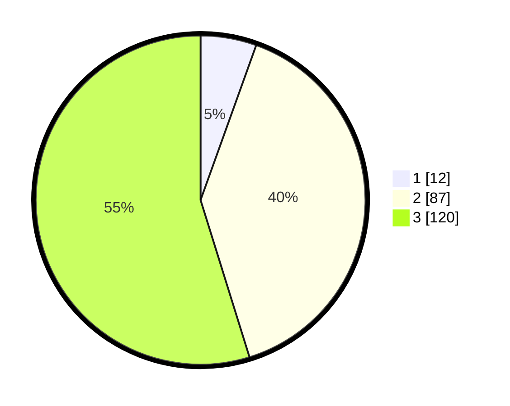

# Hasil

## Grafik

## Tabel

| No. | Nama Paslon    | Suara | Suara (raw) | Persentase |
|:--- |:-------------- | -----:| -----------:| ----------:|
| 1   | ANIES MUHAIMIN | 12    | [12][p-1]   | 5,48       |
| 2   | PRABOWO GIBRAN | 87    | [87][p-2]   | 39,73      |
| 3   | GANJAR MAHFUD  | 120   | [120][p-3]  | 54,79      |

[p-1]: https://github.com/gigit-pemilu/pemilu-2024/blob/main/pilpres/hitung-suara/sub/31-dki-jakarta/sub/72-jakarta-utara/sub/06-kelapa-gading/sub/1001-kelapa-gading-timur/sub/005-tps/sub/paslon-1.txt
[p-2]: https://github.com/gigit-pemilu/pemilu-2024/blob/main/pilpres/hitung-suara/sub/31-dki-jakarta/sub/72-jakarta-utara/sub/06-kelapa-gading/sub/1001-kelapa-gading-timur/sub/005-tps/sub/paslon-2.txt
[p-3]: https://github.com/gigit-pemilu/pemilu-2024/blob/main/pilpres/hitung-suara/sub/31-dki-jakarta/sub/72-jakarta-utara/sub/06-kelapa-gading/sub/1001-kelapa-gading-timur/sub/005-tps/sub/paslon-3.txt

## Foto C Plano

https://sirekap-obj-formc.kpu.go.id/a16a/pemilu/ppwp/31/72/06/10/01/3172061001005-20240216-145753--bd6ec166-e182-4150-9bb8-07cd962d3a07.jpg

https://sirekap-obj-formc.kpu.go.id/a16a/pemilu/ppwp/31/72/06/10/01/3172061001005-20240216-145819--9b11f9d5-f445-451d-ae53-0813f02b29a9.jpg

https://sirekap-obj-formc.kpu.go.id/a16a/pemilu/ppwp/31/72/06/10/01/3172061001005-20240216-145840--181bf4db-e5bf-4703-8636-cee8fb6c8c25.jpg

## Metadata

| Key        | Value               |
| ---------- | ------------------- |
| Time Stamp | 2024-02-21 19:00:00 |

