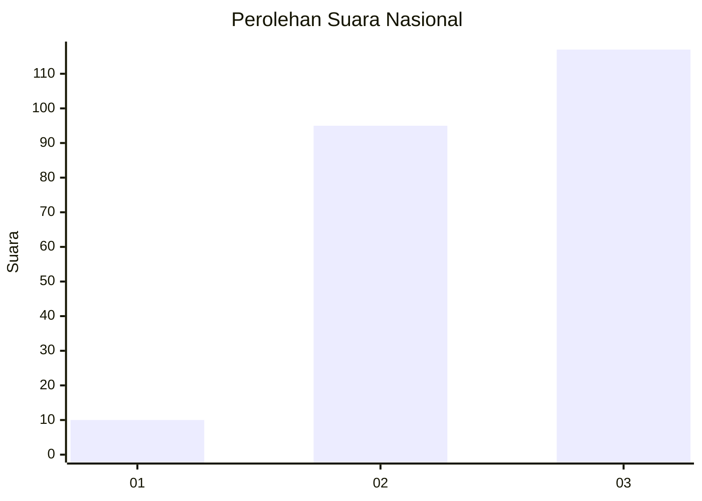
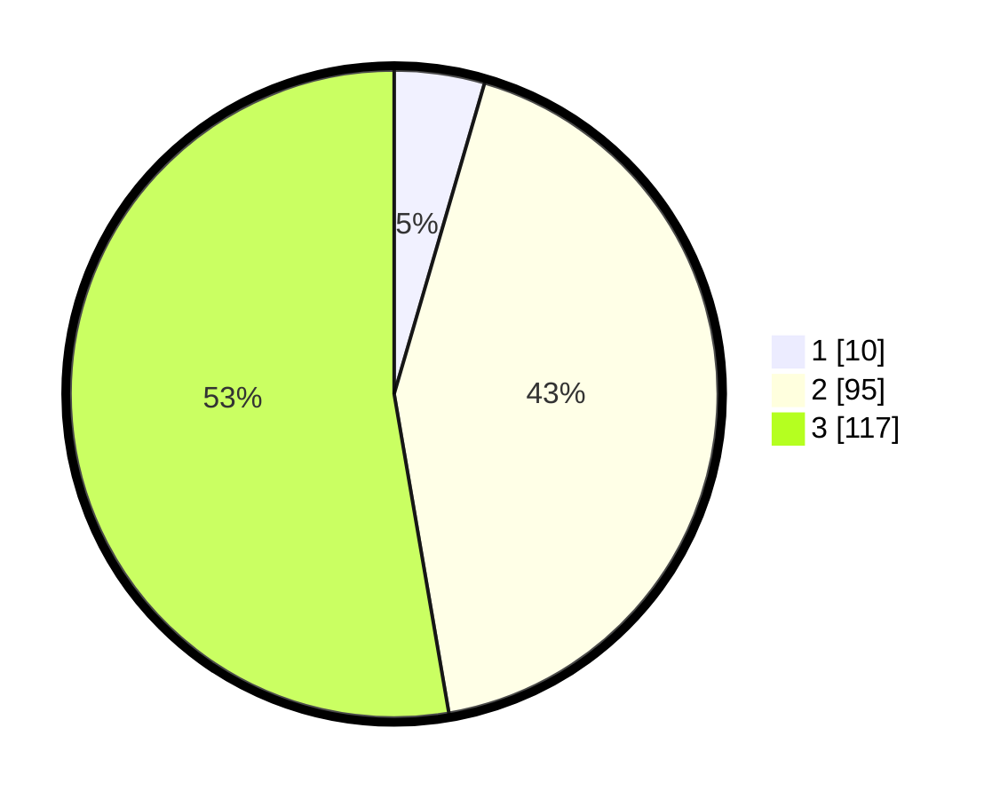

# Hasil

## Grafik

## Tabel

| No.    | Nama Paslon    | Suara | Suara (raw) | Persentase |
|:------ |:-------------- | -----:| -----------:| ----------:|
| 100025 | ANIES MUHAIMIN | 10    | [10][p-1]   | 4,50       |
| 100026 | PRABOWO GIBRAN | 95    | [95][p-2]   | 42,79      |
| 100027 | GANJAR MAHFUD  | 117   | [117][p-3]  | 52,70      |

[p-1]: https://github.com/gigit-pemilu/pemilu-2024/blob/main/pilpres/hitung-suara/sub/31-dki-jakarta/sub/72-jakarta-utara/sub/06-kelapa-gading/sub/1001-kelapa-gading-timur/sub/006-tps/sub/paslon-1.txt
[p-2]: https://github.com/gigit-pemilu/pemilu-2024/blob/main/pilpres/hitung-suara/sub/31-dki-jakarta/sub/72-jakarta-utara/sub/06-kelapa-gading/sub/1001-kelapa-gading-timur/sub/006-tps/sub/paslon-2.txt
[p-3]: https://github.com/gigit-pemilu/pemilu-2024/blob/main/pilpres/hitung-suara/sub/31-dki-jakarta/sub/72-jakarta-utara/sub/06-kelapa-gading/sub/1001-kelapa-gading-timur/sub/006-tps/sub/paslon-3.txt

## Foto C Plano

https://sirekap-obj-formc.kpu.go.id/ccfd/pemilu/ppwp/31/72/06/10/01/3172061001006-20240216-150701--d417750e-2cb1-42dd-991b-dce42f40a36a.jpg

https://sirekap-obj-formc.kpu.go.id/ccfd/pemilu/ppwp/31/72/06/10/01/3172061001006-20240216-150730--03422fbb-4a80-417e-b3e7-4a46d4f57dd0.jpg

https://sirekap-obj-formc.kpu.go.id/ccfd/pemilu/ppwp/31/72/06/10/01/3172061001006-20240216-150746--e94d50ae-11e9-4a36-b012-59fd4638ada3.jpg

## Metadata

| Key        | Value               |
| ---------- | ------------------- |
| Time Stamp | 2024-02-21 19:00:00 |

