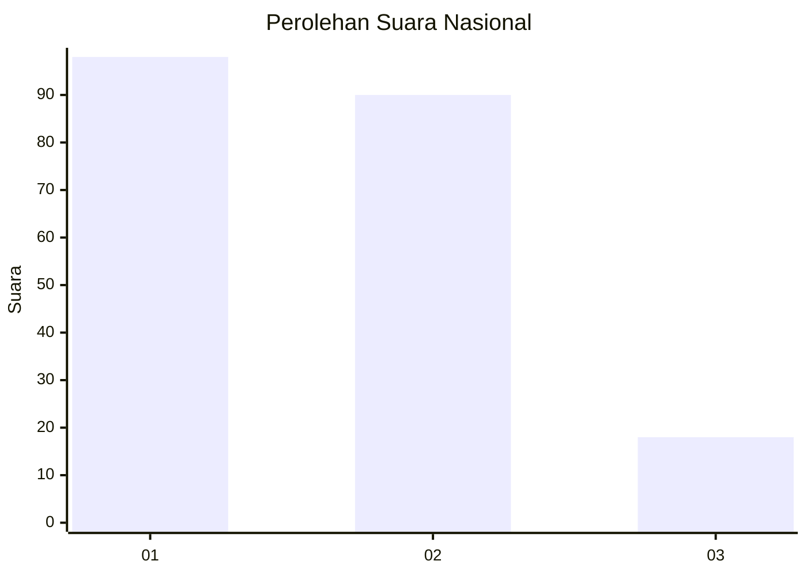
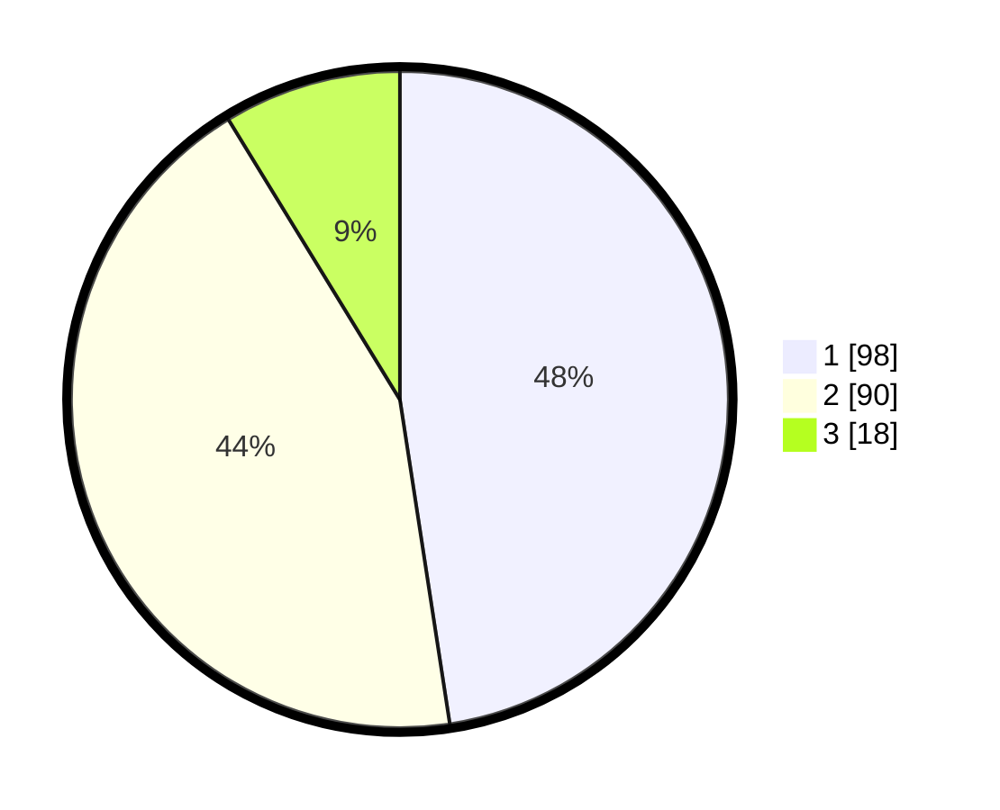

# Hasil

## Grafik

## Tabel

| No.    | Nama Paslon    | Suara | Suara (raw) | Persentase |
|:------ |:-------------- | -----:| -----------:| ----------:|
| 100025 | ANIES MUHAIMIN | 98    | [98][p-1]   | 47,57      |
| 100026 | PRABOWO GIBRAN | 90    | [90][p-2]   | 43,69      |
| 100027 | GANJAR MAHFUD  | 18    | [18][p-3]   | 8,74       |

[p-1]: https://github.com/gigit-pemilu/pemilu-2024/blob/main/pilpres/hitung-suara/sub/31-dki-jakarta/sub/72-jakarta-utara/sub/06-kelapa-gading/sub/1001-kelapa-gading-timur/sub/018-tps/sub/paslon-1.txt
[p-2]: https://github.com/gigit-pemilu/pemilu-2024/blob/main/pilpres/hitung-suara/sub/31-dki-jakarta/sub/72-jakarta-utara/sub/06-kelapa-gading/sub/1001-kelapa-gading-timur/sub/018-tps/sub/paslon-2.txt
[p-3]: https://github.com/gigit-pemilu/pemilu-2024/blob/main/pilpres/hitung-suara/sub/31-dki-jakarta/sub/72-jakarta-utara/sub/06-kelapa-gading/sub/1001-kelapa-gading-timur/sub/018-tps/sub/paslon-3.txt

## Foto C Plano

https://sirekap-obj-formc.kpu.go.id/fd30/pemilu/ppwp/31/72/06/10/01/3172061001018-20240216-175007--fc3cd5fa-2f1b-49e5-b541-eb6677efa4f7.jpg

https://sirekap-obj-formc.kpu.go.id/fd30/pemilu/ppwp/31/72/06/10/01/3172061001018-20240216-175026--93a30a46-fac3-415a-ad10-ec3b1941c01e.jpg

https://sirekap-obj-formc.kpu.go.id/fd30/pemilu/ppwp/31/72/06/10/01/3172061001018-20240216-175045--c2ba67ce-d456-4986-bd06-f4d648daddc7.jpg

## Metadata

| Key        | Value               |
| ---------- | ------------------- |
| Time Stamp | 2024-02-21 19:00:00 |

