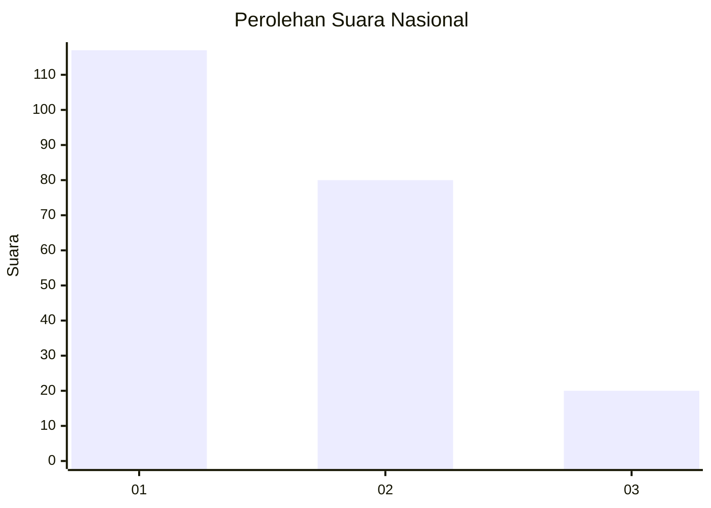
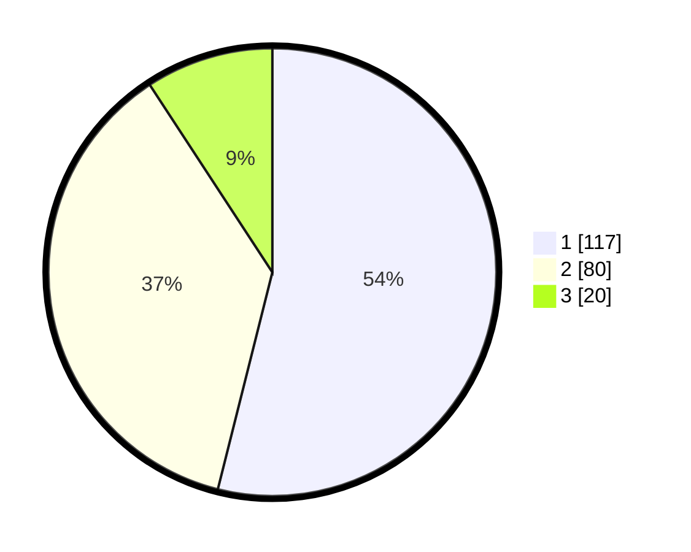

# Hasil

## Grafik

## Tabel

| No.    | Nama Paslon    | Suara | Suara (raw) | Persentase |
|:------ |:-------------- | -----:| -----------:| ----------:|
| 100025 | ANIES MUHAIMIN | 117   | [117][p-1]  | 53,92      |
| 100026 | PRABOWO GIBRAN | 80    | [80][p-2]   | 36,87      |
| 100027 | GANJAR MAHFUD  | 20    | [20][p-3]   | 9,22       |

[p-1]: https://github.com/gigit-pemilu/pemilu-2024/blob/main/pilpres/hitung-suara/sub/31-dki-jakarta/sub/72-jakarta-utara/sub/06-kelapa-gading/sub/1001-kelapa-gading-timur/sub/019-tps/sub/paslon-1.txt
[p-2]: https://github.com/gigit-pemilu/pemilu-2024/blob/main/pilpres/hitung-suara/sub/31-dki-jakarta/sub/72-jakarta-utara/sub/06-kelapa-gading/sub/1001-kelapa-gading-timur/sub/019-tps/sub/paslon-2.txt
[p-3]: https://github.com/gigit-pemilu/pemilu-2024/blob/main/pilpres/hitung-suara/sub/31-dki-jakarta/sub/72-jakarta-utara/sub/06-kelapa-gading/sub/1001-kelapa-gading-timur/sub/019-tps/sub/paslon-3.txt

## Foto C Plano

https://sirekap-obj-formc.kpu.go.id/399d/pemilu/ppwp/31/72/06/10/01/3172061001019-20240216-202501--cbd11f4a-c5a9-4c91-a72d-fb9daaa03632.jpg

https://sirekap-obj-formc.kpu.go.id/399d/pemilu/ppwp/31/72/06/10/01/3172061001019-20240216-202520--5acfa604-acee-4bde-96bb-5f1dff5fc6d3.jpg

https://sirekap-obj-formc.kpu.go.id/399d/pemilu/ppwp/31/72/06/10/01/3172061001019-20240216-202613--6ea79123-e3e6-4239-8c0b-87844e8f660a.jpg

## Metadata

| Key        | Value               |
| ---------- | ------------------- |
| Time Stamp | 2024-02-21 19:00:00 |

