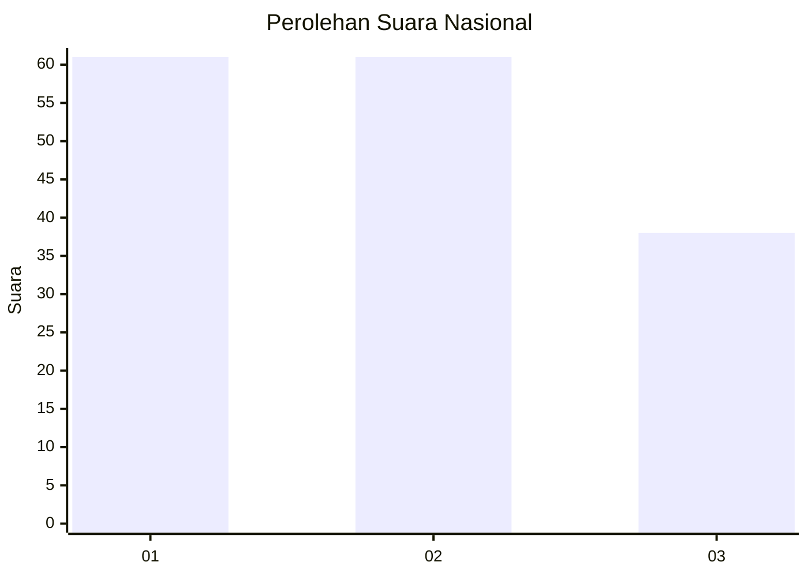
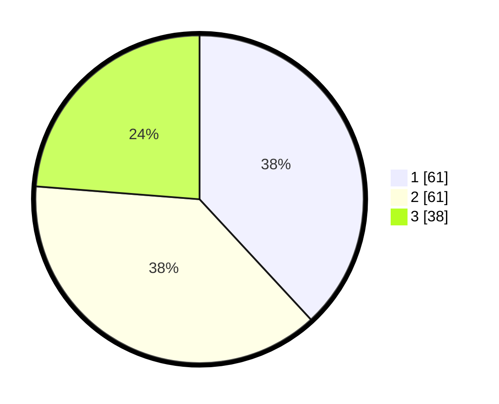

# Hasil

## Grafik

## Tabel

| No.    | Nama Paslon    | Suara | Suara (raw) | Persentase |
|:------ |:-------------- | -----:| -----------:| ----------:|
| 100025 | ANIES MUHAIMIN | 61    | [61][p-1]   | 38,13      |
| 100026 | PRABOWO GIBRAN | 61    | [61][p-2]   | 38,13      |
| 100027 | GANJAR MAHFUD  | 38    | [38][p-3]   | 23,75      |

[p-1]: https://github.com/gigit-pemilu/pemilu-2024/blob/main/pilpres/hitung-suara/sub/31-dki-jakarta/sub/72-jakarta-utara/sub/06-kelapa-gading/sub/1001-kelapa-gading-timur/sub/031-tps/sub/paslon-1.txt
[p-2]: https://github.com/gigit-pemilu/pemilu-2024/blob/main/pilpres/hitung-suara/sub/31-dki-jakarta/sub/72-jakarta-utara/sub/06-kelapa-gading/sub/1001-kelapa-gading-timur/sub/031-tps/sub/paslon-2.txt
[p-3]: https://github.com/gigit-pemilu/pemilu-2024/blob/main/pilpres/hitung-suara/sub/31-dki-jakarta/sub/72-jakarta-utara/sub/06-kelapa-gading/sub/1001-kelapa-gading-timur/sub/031-tps/sub/paslon-3.txt

## Foto C Plano

https://sirekap-obj-formc.kpu.go.id/d876/pemilu/ppwp/31/72/06/10/01/3172061001031-20240220-173408--727770ea-750b-4275-8640-718b50f8ce6d.jpg

https://sirekap-obj-formc.kpu.go.id/d876/pemilu/ppwp/31/72/06/10/01/3172061001031-20240220-173439--05a7b466-ea02-498d-838d-f7ec319c8d96.jpg

https://sirekap-obj-formc.kpu.go.id/d876/pemilu/ppwp/31/72/06/10/01/3172061001031-20240220-173506--ef791ff2-3942-4a47-b7c4-bd825ce43186.jpg

## Metadata

| Key        | Value               |
| ---------- | ------------------- |
| Time Stamp | 2024-02-21 14:00:00 |

