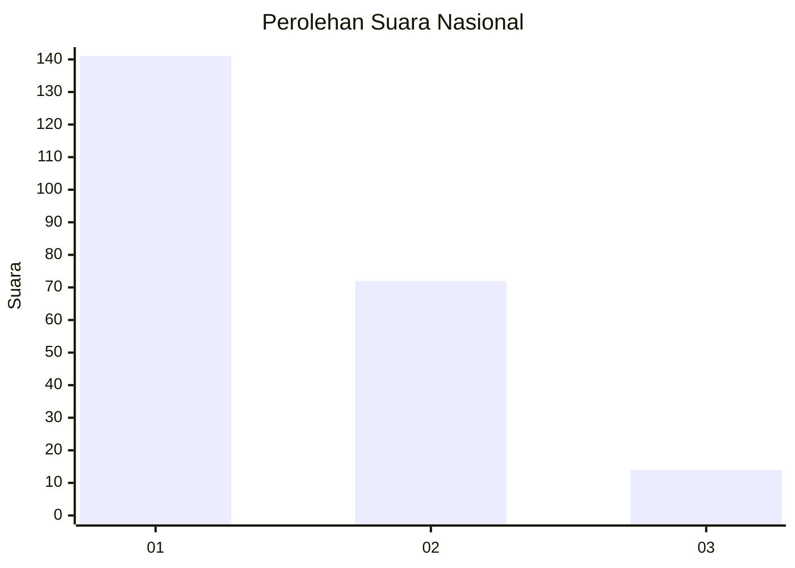
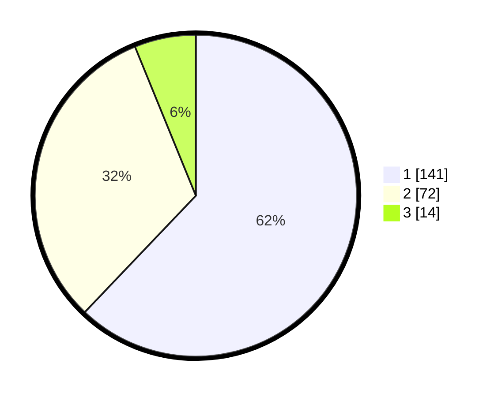

# Hasil

## Grafik

## Tabel

| No.    | Nama Paslon    | Suara | Suara (raw) | Persentase |
|:------ |:-------------- | -----:| -----------:| ----------:|
| 100025 | ANIES MUHAIMIN | 141   | [141][p-1]  | 62,11      |
| 100026 | PRABOWO GIBRAN | 72    | [72][p-2]   | 31,72      |
| 100027 | GANJAR MAHFUD  | 14    | [14][p-3]   | 6,17       |

[p-1]: https://github.com/gigit-pemilu/pemilu-2024/blob/main/pilpres/hitung-suara/sub/31-dki-jakarta/sub/72-jakarta-utara/sub/06-kelapa-gading/sub/1001-kelapa-gading-timur/sub/035-tps/sub/paslon-1.txt
[p-2]: https://github.com/gigit-pemilu/pemilu-2024/blob/main/pilpres/hitung-suara/sub/31-dki-jakarta/sub/72-jakarta-utara/sub/06-kelapa-gading/sub/1001-kelapa-gading-timur/sub/035-tps/sub/paslon-2.txt
[p-3]: https://github.com/gigit-pemilu/pemilu-2024/blob/main/pilpres/hitung-suara/sub/31-dki-jakarta/sub/72-jakarta-utara/sub/06-kelapa-gading/sub/1001-kelapa-gading-timur/sub/035-tps/sub/paslon-3.txt

## Foto C Plano

https://sirekap-obj-formc.kpu.go.id/c495/pemilu/ppwp/31/72/06/10/01/3172061001035-20240221-141555--ab3f1170-2c53-435a-b8f6-51b1e072ff93.jpg

https://sirekap-obj-formc.kpu.go.id/c495/pemilu/ppwp/31/72/06/10/01/3172061001035-20240221-141614--747e4c2c-35c9-468f-aee9-f623ecd5370d.jpg

https://sirekap-obj-formc.kpu.go.id/c495/pemilu/ppwp/31/72/06/10/01/3172061001035-20240221-141518--9f4953e5-fe22-4bf2-8a91-6c76c5c58e1b.jpg

## Metadata

| Key        | Value               |
| ---------- | ------------------- |
| Time Stamp | 2024-02-21 19:00:00 |

