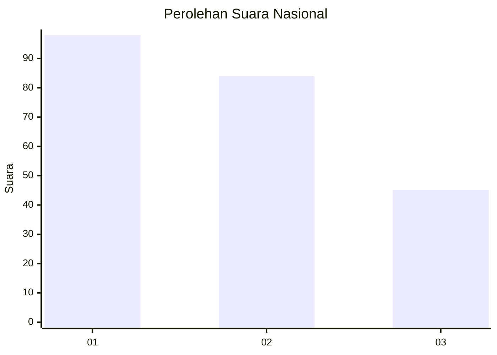
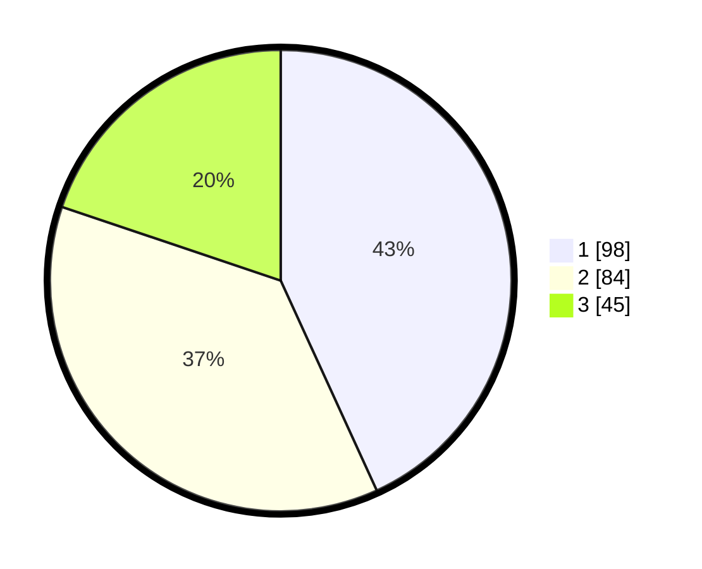

# Hasil

## Grafik

## Tabel

| No.    | Nama Paslon    | Suara | Suara (raw) | Persentase |
|:------ |:-------------- | -----:| -----------:| ----------:|
| 100025 | ANIES MUHAIMIN | 98    | [98][p-1]   | 43,17      |
| 100026 | PRABOWO GIBRAN | 84    | [84][p-2]   | 37,00      |
| 100027 | GANJAR MAHFUD  | 45    | [45][p-3]   | 19,82      |

[p-1]: https://github.com/gigit-pemilu/pemilu-2024/blob/main/pilpres/hitung-suara/sub/31-dki-jakarta/sub/72-jakarta-utara/sub/06-kelapa-gading/sub/1001-kelapa-gading-timur/sub/036-tps/sub/paslon-1.txt
[p-2]: https://github.com/gigit-pemilu/pemilu-2024/blob/main/pilpres/hitung-suara/sub/31-dki-jakarta/sub/72-jakarta-utara/sub/06-kelapa-gading/sub/1001-kelapa-gading-timur/sub/036-tps/sub/paslon-2.txt
[p-3]: https://github.com/gigit-pemilu/pemilu-2024/blob/main/pilpres/hitung-suara/sub/31-dki-jakarta/sub/72-jakarta-utara/sub/06-kelapa-gading/sub/1001-kelapa-gading-timur/sub/036-tps/sub/paslon-3.txt

## Foto C Plano

https://sirekap-obj-formc.kpu.go.id/1176/pemilu/ppwp/31/72/06/10/01/3172061001036-20240221-145241--66909eb4-3895-4ff0-a264-cf43bf07e6b2.jpg

https://sirekap-obj-formc.kpu.go.id/1176/pemilu/ppwp/31/72/06/10/01/3172061001036-20240221-145312--8be50641-0caa-42eb-b0a7-d6e13be1c56e.jpg

https://sirekap-obj-formc.kpu.go.id/1176/pemilu/ppwp/31/72/06/10/01/3172061001036-20240221-145332--25ddb700-ab88-41e2-88e2-a57b42928bb2.jpg

## Metadata

| Key        | Value               |
| ---------- | ------------------- |
| Time Stamp | 2024-02-21 19:00:00 |

