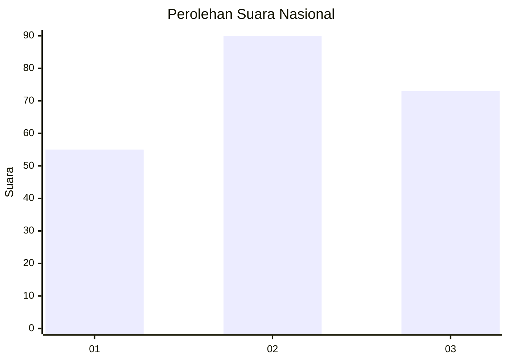
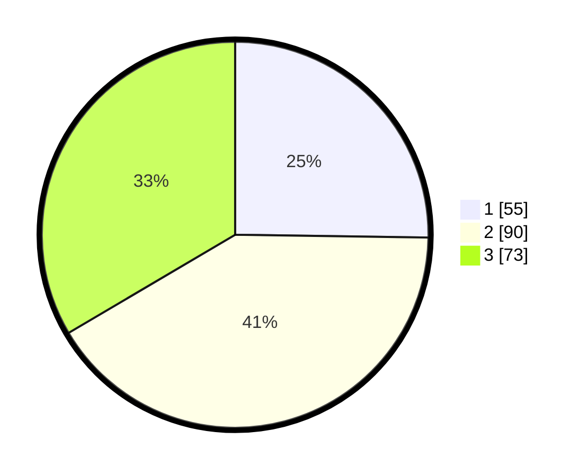

# Hasil

## Grafik

## Tabel

| No.    | Nama Paslon    | Suara | Suara (raw) | Persentase |
|:------ |:-------------- | -----:| -----------:| ----------:|
| 100025 | ANIES MUHAIMIN | 55    | [55][p-1]   | 25,23      |
| 100026 | PRABOWO GIBRAN | 90    | [90][p-2]   | 41,28      |
| 100027 | GANJAR MAHFUD  | 73    | [73][p-3]   | 33,49      |

[p-1]: https://github.com/gigit-pemilu/pemilu-2024/blob/main/pilpres/hitung-suara/sub/31-dki-jakarta/sub/72-jakarta-utara/sub/06-kelapa-gading/sub/1001-kelapa-gading-timur/sub/045-tps/sub/paslon-1.txt
[p-2]: https://github.com/gigit-pemilu/pemilu-2024/blob/main/pilpres/hitung-suara/sub/31-dki-jakarta/sub/72-jakarta-utara/sub/06-kelapa-gading/sub/1001-kelapa-gading-timur/sub/045-tps/sub/paslon-2.txt
[p-3]: https://github.com/gigit-pemilu/pemilu-2024/blob/main/pilpres/hitung-suara/sub/31-dki-jakarta/sub/72-jakarta-utara/sub/06-kelapa-gading/sub/1001-kelapa-gading-timur/sub/045-tps/sub/paslon-3.txt

## Foto C Plano

https://sirekap-obj-formc.kpu.go.id/27bd/pemilu/ppwp/31/72/06/10/01/3172061001045-20240221-215741--92909bba-32ce-4fd8-9ad4-d3adb20fc668.jpg

https://sirekap-obj-formc.kpu.go.id/27bd/pemilu/ppwp/31/72/06/10/01/3172061001045-20240221-215825--0e4444c0-bdcb-40fd-9fcc-8e976d20371f.jpg

https://sirekap-obj-formc.kpu.go.id/27bd/pemilu/ppwp/31/72/06/10/01/3172061001045-20240221-215903--2e08387c-b69c-4de3-9530-e47386885ebb.jpg

## Metadata

| Key        | Value               |
| ---------- | ------------------- |
| Time Stamp | 2024-02-22 10:00:00 |

