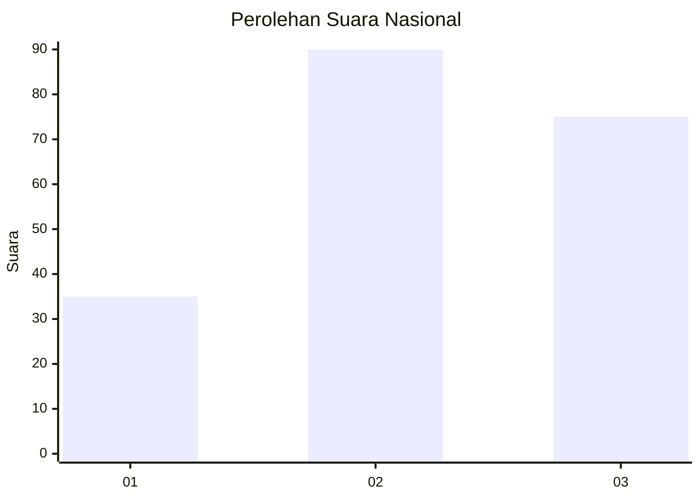
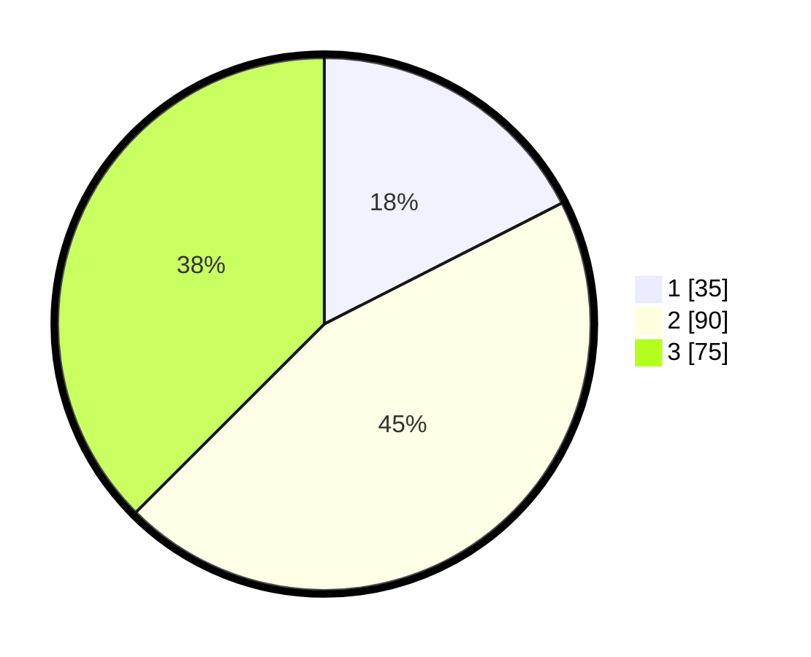

# Hasil

## Grafik

## Tabel

| No.    | Nama Paslon    | Suara | Suara (raw) | Persentase |
|:------ |:-------------- | -----:| -----------:| ----------:|
| 100025 | ANIES MUHAIMIN | 35    | [35][p-1]   | 17,50      |
| 100026 | PRABOWO GIBRAN | 90    | [90][p-2]   | 45,00      |
| 100027 | GANJAR MAHFUD  | 75    | [75][p-3]   | 37,50      |

[p-1]: https://github.com/gigit-pemilu/pemilu-2024/blob/main/pilpres/hitung-suara/sub/31-dki-jakarta/sub/72-jakarta-utara/sub/06-kelapa-gading/sub/1001-kelapa-gading-timur/sub/046-tps/sub/paslon-1.txt
[p-2]: https://github.com/gigit-pemilu/pemilu-2024/blob/main/pilpres/hitung-suara/sub/31-dki-jakarta/sub/72-jakarta-utara/sub/06-kelapa-gading/sub/1001-kelapa-gading-timur/sub/046-tps/sub/paslon-2.txt
[p-3]: https://github.com/gigit-pemilu/pemilu-2024/blob/main/pilpres/hitung-suara/sub/31-dki-jakarta/sub/72-jakarta-utara/sub/06-kelapa-gading/sub/1001-kelapa-gading-timur/sub/046-tps/sub/paslon-3.txt

## Foto C Plano

https://sirekap-obj-formc.kpu.go.id/01c7/pemilu/ppwp/31/72/06/10/01/3172061001046-20240222-104055--308af356-d978-410c-9fb7-1f51184db456.jpg

https://sirekap-obj-formc.kpu.go.id/01c7/pemilu/ppwp/31/72/06/10/01/3172061001046-20240222-104153--84c50a80-d4b7-46ee-8915-9c9a3556ba50.jpg

https://sirekap-obj-formc.kpu.go.id/01c7/pemilu/ppwp/31/72/06/10/01/3172061001046-20240222-104242--5fc52e1e-3e5e-42fc-ace5-9b245ef1bd1e.jpg

## Metadata

| Key        | Value               |
| ---------- | ------------------- |
| Time Stamp | 2024-02-22 12:00:00 |

