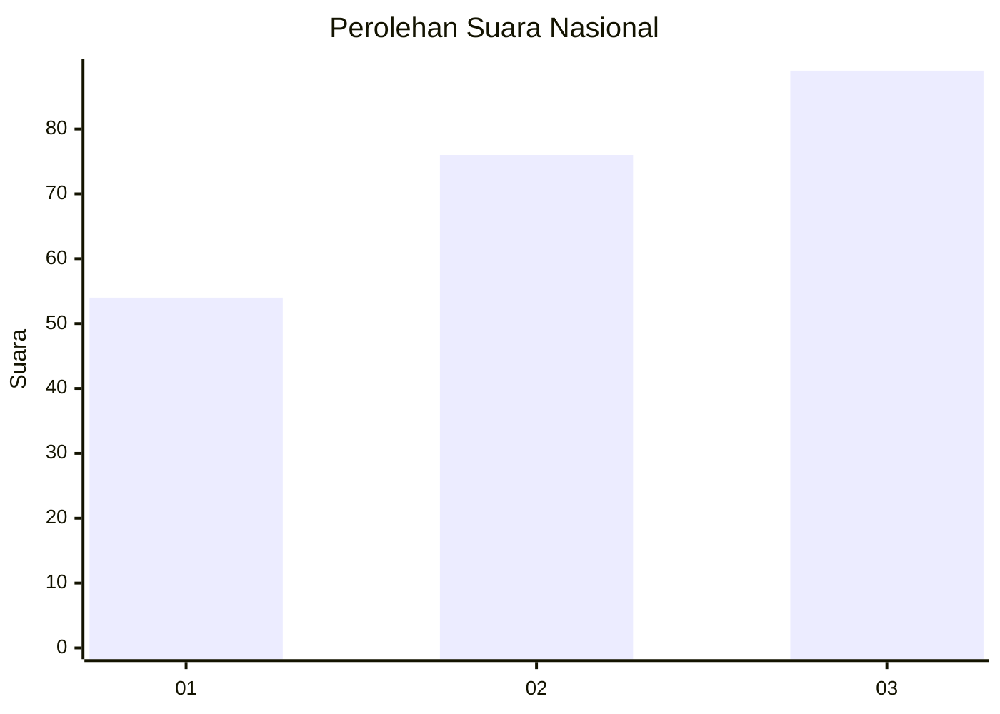
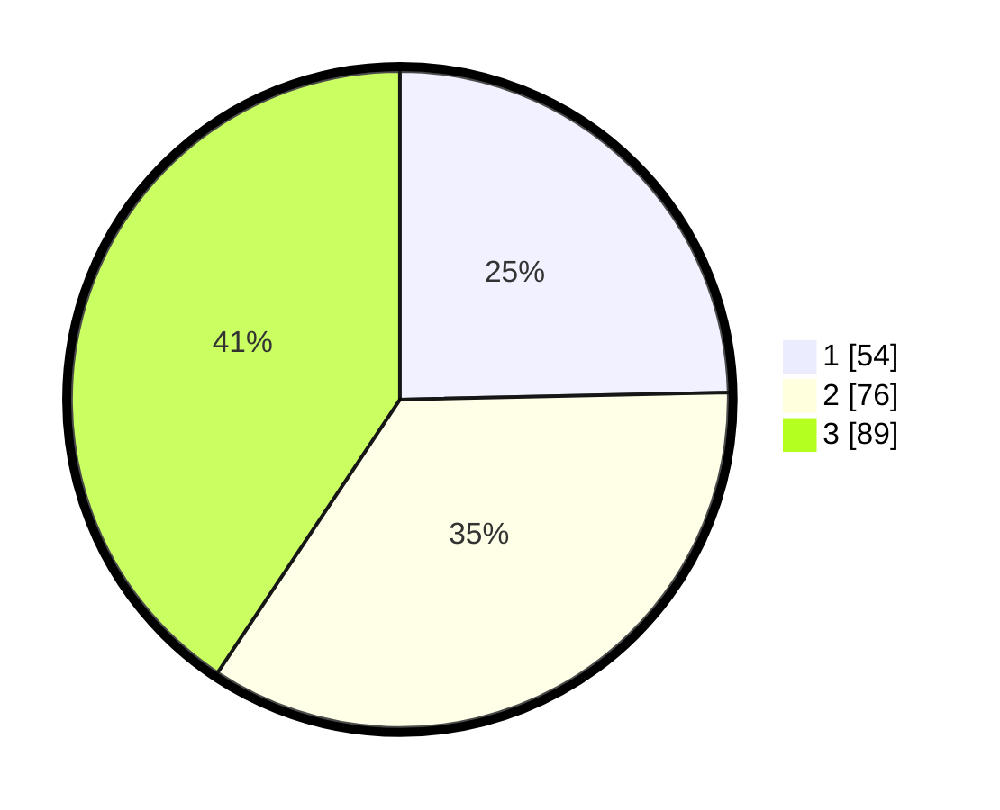

# Hasil

## Grafik

## Tabel

| No.    | Nama Paslon    | Suara | Suara (raw) | Persentase |
|:------ |:-------------- | -----:| -----------:| ----------:|
| 100025 | ANIES MUHAIMIN | 54    | [54][p-1]   | 24,66      |
| 100026 | PRABOWO GIBRAN | 76    | [76][p-2]   | 34,70      |
| 100027 | GANJAR MAHFUD  | 89    | [89][p-3]   | 40,64      |

[p-1]: https://github.com/gigit-pemilu/pemilu-2024/blob/main/pilpres/hitung-suara/sub/31-dki-jakarta/sub/72-jakarta-utara/sub/06-kelapa-gading/sub/1001-kelapa-gading-timur/sub/048-tps/sub/paslon-1.txt
[p-2]: https://github.com/gigit-pemilu/pemilu-2024/blob/main/pilpres/hitung-suara/sub/31-dki-jakarta/sub/72-jakarta-utara/sub/06-kelapa-gading/sub/1001-kelapa-gading-timur/sub/048-tps/sub/paslon-2.txt
[p-3]: https://github.com/gigit-pemilu/pemilu-2024/blob/main/pilpres/hitung-suara/sub/31-dki-jakarta/sub/72-jakarta-utara/sub/06-kelapa-gading/sub/1001-kelapa-gading-timur/sub/048-tps/sub/paslon-3.txt

## Foto C Plano

https://sirekap-obj-formc.kpu.go.id/b06e/pemilu/ppwp/31/72/06/10/01/3172061001048-20240222-134313--2d3acfab-80ed-4526-9835-e722b7574927.jpg

https://sirekap-obj-formc.kpu.go.id/b06e/pemilu/ppwp/31/72/06/10/01/3172061001048-20240222-134400--e9c5641d-139e-45ab-b785-b8203b9ea62e.jpg

https://sirekap-obj-formc.kpu.go.id/b06e/pemilu/ppwp/31/72/06/10/01/3172061001048-20240222-134434--4448bf2e-c5ef-4d3b-939e-a27011a0064c.jpg

## Metadata

| Key        | Value               |
| ---------- | ------------------- |
| Time Stamp | 2024-02-22 17:00:00 |

