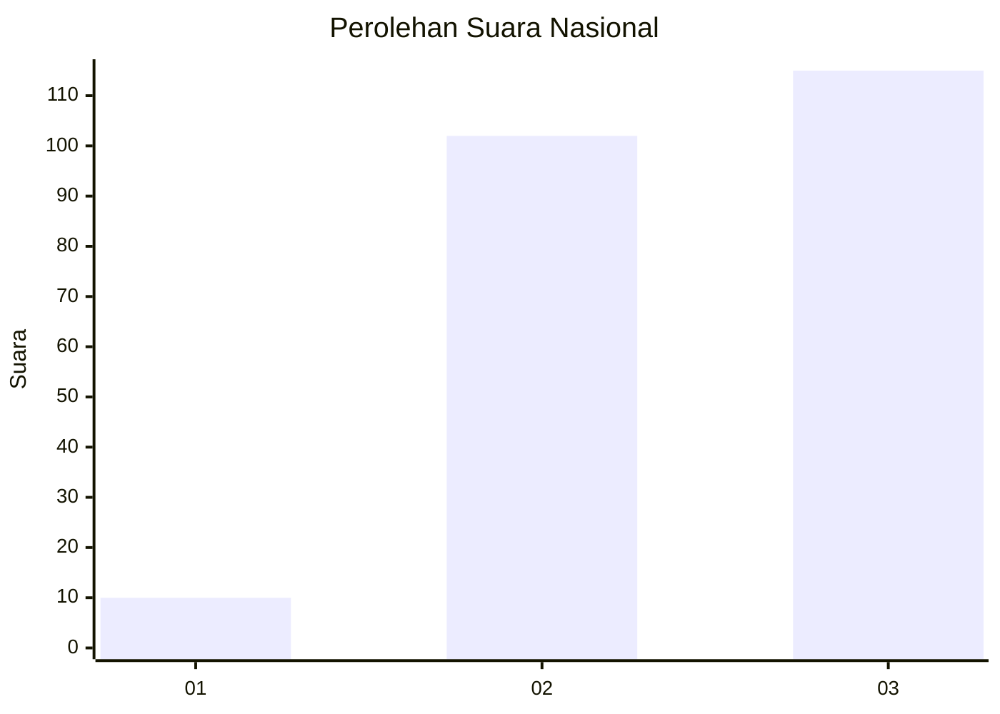
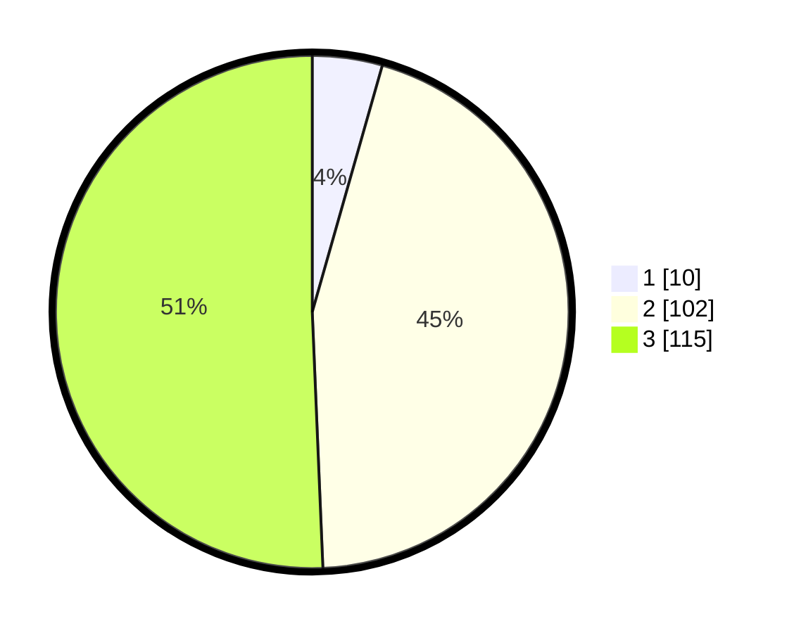

# Hasil

## Grafik

## Tabel

| No.    | Nama Paslon    | Suara | Suara (raw) | Persentase |
|:------ |:-------------- | -----:| -----------:| ----------:|
| 100025 | ANIES MUHAIMIN | 10    | [10][p-1]   | 4,41       |
| 100026 | PRABOWO GIBRAN | 102   | [102][p-2]  | 44,93      |
| 100027 | GANJAR MAHFUD  | 115   | [115][p-3]  | 50,66      |

[p-1]: https://github.com/gigit-pemilu/pemilu-2024/blob/main/pilpres/hitung-suara/sub/31-dki-jakarta/sub/72-jakarta-utara/sub/06-kelapa-gading/sub/1001-kelapa-gading-timur/sub/053-tps/sub/paslon-1.txt
[p-2]: https://github.com/gigit-pemilu/pemilu-2024/blob/main/pilpres/hitung-suara/sub/31-dki-jakarta/sub/72-jakarta-utara/sub/06-kelapa-gading/sub/1001-kelapa-gading-timur/sub/053-tps/sub/paslon-2.txt
[p-3]: https://github.com/gigit-pemilu/pemilu-2024/blob/main/pilpres/hitung-suara/sub/31-dki-jakarta/sub/72-jakarta-utara/sub/06-kelapa-gading/sub/1001-kelapa-gading-timur/sub/053-tps/sub/paslon-3.txt

## Foto C Plano

https://sirekap-obj-formc.kpu.go.id/d82d/pemilu/ppwp/31/72/06/10/01/3172061001053-20240222-174240--bc216336-85af-40a0-8b54-69201ec1d555.jpg

https://sirekap-obj-formc.kpu.go.id/d82d/pemilu/ppwp/31/72/06/10/01/3172061001053-20240222-174319--6610fd51-eaa7-4455-b7d9-1f7e6c76c894.jpg

https://sirekap-obj-formc.kpu.go.id/d82d/pemilu/ppwp/31/72/06/10/01/3172061001053-20240222-174346--198d00b5-1256-426b-abd6-b00388a77b17.jpg

## Metadata

| Key        | Value               |
| ---------- | ------------------- |
| Time Stamp | 2024-02-24 22:31:28 |

