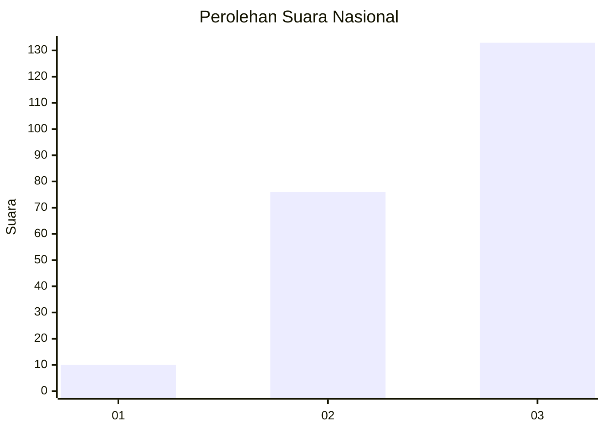
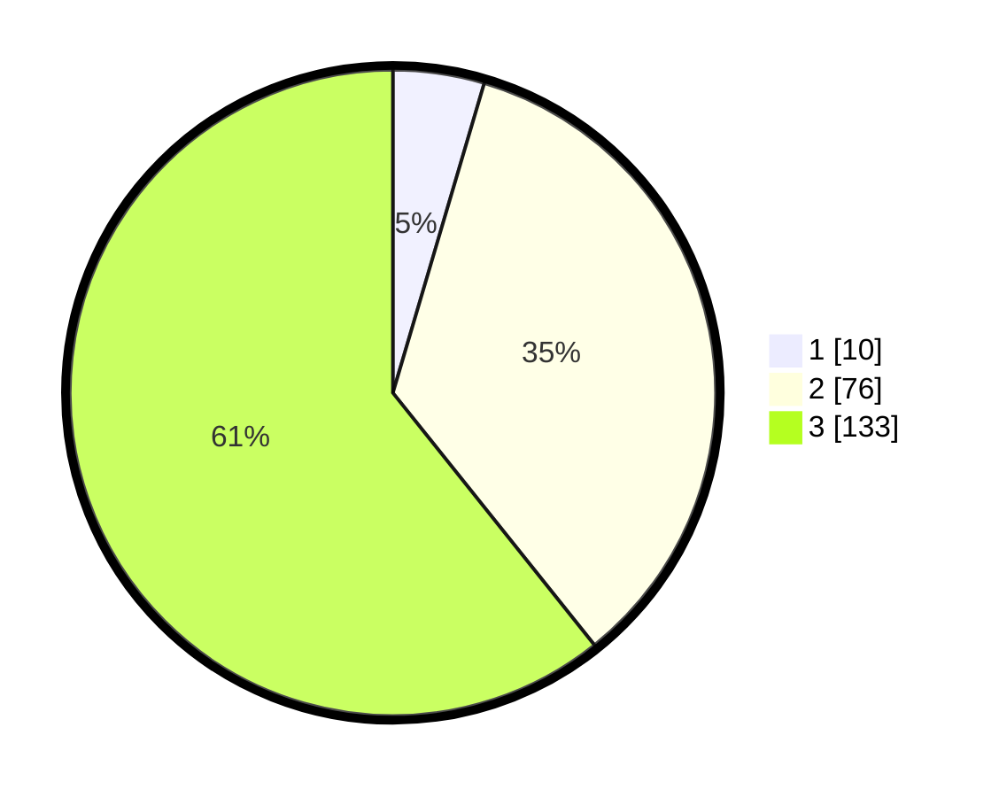

# Hasil

## Grafik

## Tabel

| No.    | Nama Paslon    | Suara | Suara (raw) | Persentase |
|:------ |:-------------- | -----:| -----------:| ----------:|
| 100025 | ANIES MUHAIMIN | 10    | [10][p-1]   | 4,57       |
| 100026 | PRABOWO GIBRAN | 76    | [76][p-2]   | 34,70      |
| 100027 | GANJAR MAHFUD  | 133   | [133][p-3]  | 60,73      |

[p-1]: https://github.com/gigit-pemilu/pemilu-2024/blob/main/pilpres/hitung-suara/sub/31-dki-jakarta/sub/72-jakarta-utara/sub/06-kelapa-gading/sub/1001-kelapa-gading-timur/sub/056-tps/sub/paslon-1.txt
[p-2]: https://github.com/gigit-pemilu/pemilu-2024/blob/main/pilpres/hitung-suara/sub/31-dki-jakarta/sub/72-jakarta-utara/sub/06-kelapa-gading/sub/1001-kelapa-gading-timur/sub/056-tps/sub/paslon-2.txt
[p-3]: https://github.com/gigit-pemilu/pemilu-2024/blob/main/pilpres/hitung-suara/sub/31-dki-jakarta/sub/72-jakarta-utara/sub/06-kelapa-gading/sub/1001-kelapa-gading-timur/sub/056-tps/sub/paslon-3.txt

## Foto C Plano

https://sirekap-obj-formc.kpu.go.id/9d3d/pemilu/ppwp/31/72/06/10/01/3172061001056-20240222-215504--0077b594-ba90-440a-a4c9-74a9bdcc307e.jpg

https://sirekap-obj-formc.kpu.go.id/9d3d/pemilu/ppwp/31/72/06/10/01/3172061001056-20240222-215527--94a67add-72a6-4143-8ccd-516fd51d6c42.jpg

https://sirekap-obj-formc.kpu.go.id/9d3d/pemilu/ppwp/31/72/06/10/01/3172061001056-20240222-215540--3cc58d7b-0bd6-4e6b-ad3a-6caacf62860c.jpg

## Metadata

| Key        | Value               |
| ---------- | ------------------- |
| Time Stamp | 2024-02-24 22:31:28 |

