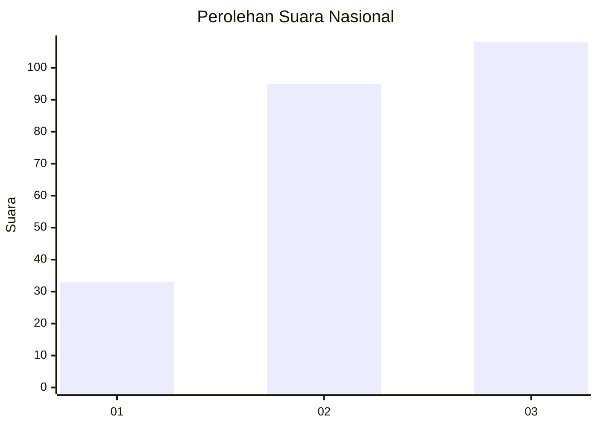
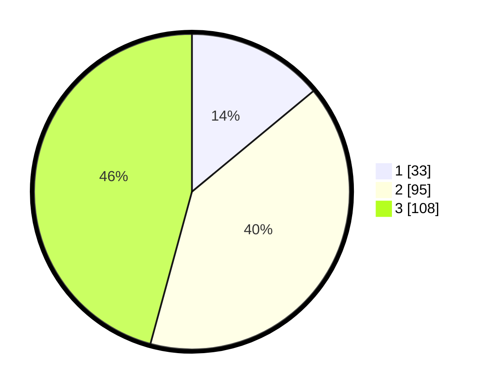

# Hasil

## Grafik

## Tabel

| No.    | Nama Paslon    | Suara | Suara (raw) | Persentase |
|:------ |:-------------- | -----:| -----------:| ----------:|
| 100025 | ANIES MUHAIMIN | 33    | [33][p-1]   | 13,98      |
| 100026 | PRABOWO GIBRAN | 95    | [95][p-2]   | 40,25      |
| 100027 | GANJAR MAHFUD  | 108   | [108][p-3]  | 45,76      |

[p-1]: https://github.com/gigit-pemilu/pemilu-2024/blob/main/pilpres/hitung-suara/sub/31-dki-jakarta/sub/72-jakarta-utara/sub/06-kelapa-gading/sub/1001-kelapa-gading-timur/sub/059-tps/sub/paslon-1.txt
[p-2]: https://github.com/gigit-pemilu/pemilu-2024/blob/main/pilpres/hitung-suara/sub/31-dki-jakarta/sub/72-jakarta-utara/sub/06-kelapa-gading/sub/1001-kelapa-gading-timur/sub/059-tps/sub/paslon-2.txt
[p-3]: https://github.com/gigit-pemilu/pemilu-2024/blob/main/pilpres/hitung-suara/sub/31-dki-jakarta/sub/72-jakarta-utara/sub/06-kelapa-gading/sub/1001-kelapa-gading-timur/sub/059-tps/sub/paslon-3.txt

## Foto C Plano

https://sirekap-obj-formc.kpu.go.id/7ef1/pemilu/ppwp/31/72/06/10/01/3172061001059-20240223-154101--e41cb2db-a9d3-4edf-ba78-0403ec59b0e3.jpg

https://sirekap-obj-formc.kpu.go.id/7ef1/pemilu/ppwp/31/72/06/10/01/3172061001059-20240223-154114--dce1387f-fdcc-429f-a246-cf0ca28b46a2.jpg

https://sirekap-obj-formc.kpu.go.id/7ef1/pemilu/ppwp/31/72/06/10/01/3172061001059-20240223-154130--ef8cea3f-73a6-443f-b531-9351e5117ab4.jpg

## Metadata

| Key        | Value               |
| ---------- | ------------------- |
| Time Stamp | 2024-02-24 22:31:28 |

