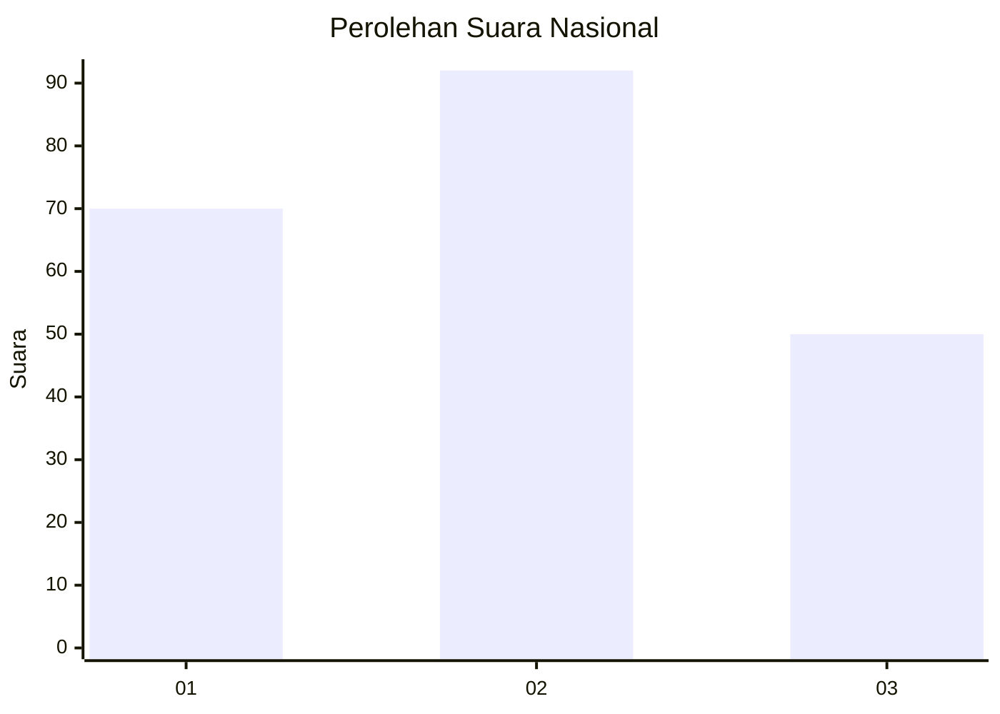
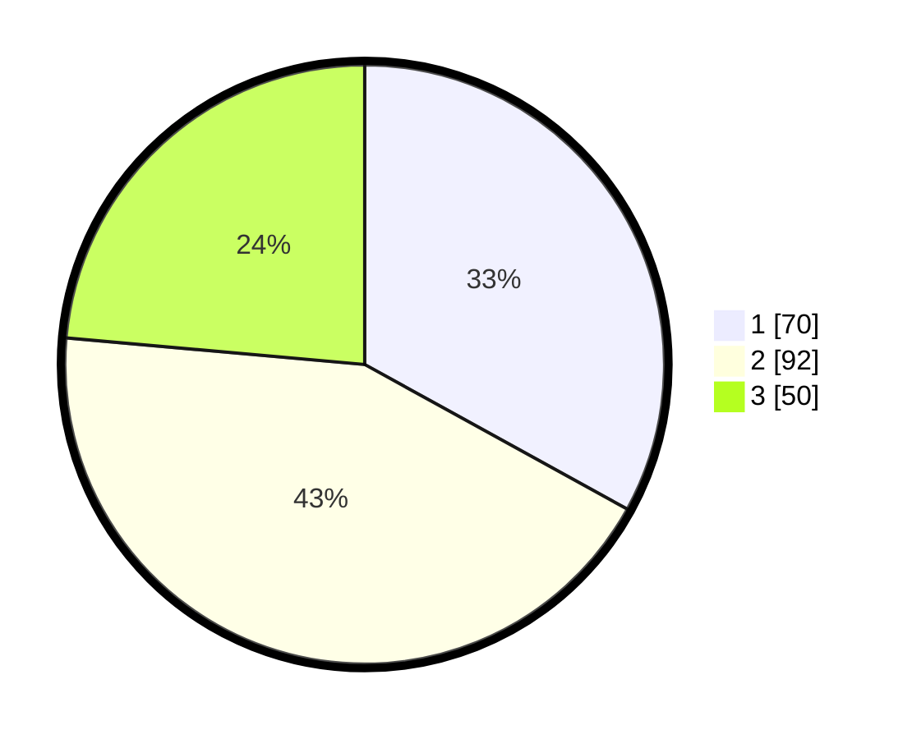

# Hasil

## Grafik

## Tabel

| No.    | Nama Paslon    | Suara | Suara (raw) | Persentase |
|:------ |:-------------- | -----:| -----------:| ----------:|
| 100025 | ANIES MUHAIMIN | 70    | [70][p-1]   | 33,02      |
| 100026 | PRABOWO GIBRAN | 92    | [92][p-2]   | 43,40      |
| 100027 | GANJAR MAHFUD  | 50    | [50][p-3]   | 23,58      |

[p-1]: https://github.com/gigit-pemilu/pemilu-2024/blob/main/pilpres/hitung-suara/sub/31-dki-jakarta/sub/72-jakarta-utara/sub/06-kelapa-gading/sub/1001-kelapa-gading-timur/sub/061-tps/sub/paslon-1.txt
[p-2]: https://github.com/gigit-pemilu/pemilu-2024/blob/main/pilpres/hitung-suara/sub/31-dki-jakarta/sub/72-jakarta-utara/sub/06-kelapa-gading/sub/1001-kelapa-gading-timur/sub/061-tps/sub/paslon-2.txt
[p-3]: https://github.com/gigit-pemilu/pemilu-2024/blob/main/pilpres/hitung-suara/sub/31-dki-jakarta/sub/72-jakarta-utara/sub/06-kelapa-gading/sub/1001-kelapa-gading-timur/sub/061-tps/sub/paslon-3.txt

## Foto C Plano

https://sirekap-obj-formc.kpu.go.id/d004/pemilu/ppwp/31/72/06/10/01/3172061001061-20240223-164020--46327b48-115d-4ed5-8803-41f8076269c5.jpg

https://sirekap-obj-formc.kpu.go.id/d004/pemilu/ppwp/31/72/06/10/01/3172061001061-20240223-164033--c7387766-5275-4697-bf7a-68ce22339d5e.jpg

https://sirekap-obj-formc.kpu.go.id/d004/pemilu/ppwp/31/72/06/10/01/3172061001061-20240223-164238--9a66fe59-e5d4-4657-8a4a-1f81862c98bc.jpg

## Metadata

| Key        | Value               |
| ---------- | ------------------- |
| Time Stamp | 2024-02-24 22:31:28 |

