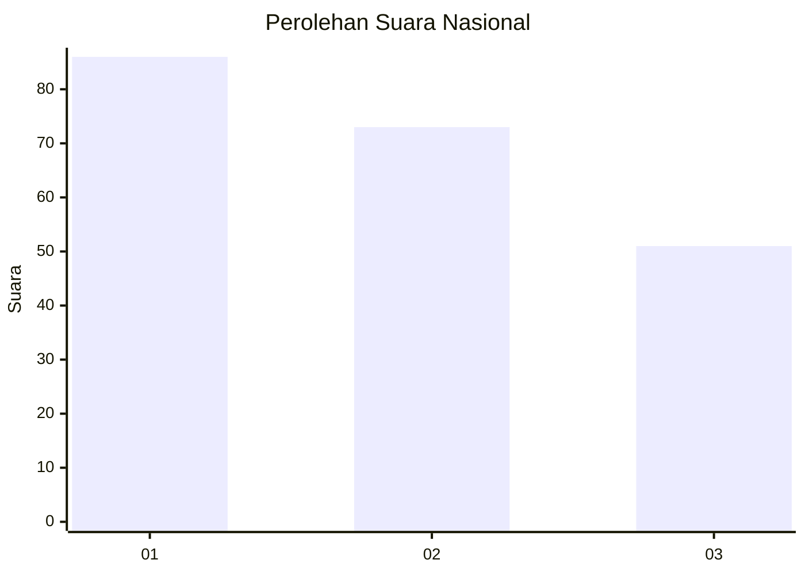
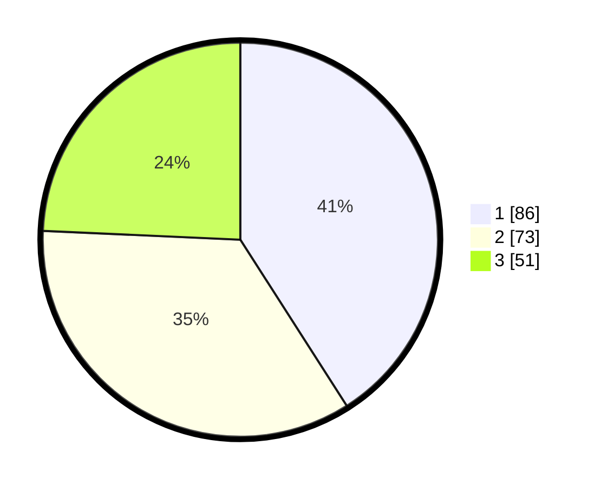

# Hasil

## Grafik

## Tabel

| No.    | Nama Paslon    | Suara | Suara (raw) | Persentase |
|:------ |:-------------- | -----:| -----------:| ----------:|
| 100025 | ANIES MUHAIMIN | 86    | [86][p-1]   | 40,95      |
| 100026 | PRABOWO GIBRAN | 73    | [73][p-2]   | 34,76      |
| 100027 | GANJAR MAHFUD  | 51    | [51][p-3]   | 24,29      |

[p-1]: https://github.com/gigit-pemilu/pemilu-2024/blob/main/pilpres/hitung-suara/sub/31-dki-jakarta/sub/72-jakarta-utara/sub/06-kelapa-gading/sub/1001-kelapa-gading-timur/sub/065-tps/sub/paslon-1.txt
[p-2]: https://github.com/gigit-pemilu/pemilu-2024/blob/main/pilpres/hitung-suara/sub/31-dki-jakarta/sub/72-jakarta-utara/sub/06-kelapa-gading/sub/1001-kelapa-gading-timur/sub/065-tps/sub/paslon-2.txt
[p-3]: https://github.com/gigit-pemilu/pemilu-2024/blob/main/pilpres/hitung-suara/sub/31-dki-jakarta/sub/72-jakarta-utara/sub/06-kelapa-gading/sub/1001-kelapa-gading-timur/sub/065-tps/sub/paslon-3.txt

## Foto C Plano

https://sirekap-obj-formc.kpu.go.id/9293/pemilu/ppwp/31/72/06/10/01/3172061001065-20240223-220458--3315e7e1-7b8a-4b9e-adbf-4af8fe7a95fc.jpg

https://sirekap-obj-formc.kpu.go.id/9293/pemilu/ppwp/31/72/06/10/01/3172061001065-20240223-220235--8e915841-f77c-4822-b937-353ceaf93a40.jpg

https://sirekap-obj-formc.kpu.go.id/9293/pemilu/ppwp/31/72/06/10/01/3172061001065-20240224-111756--7ebcd22d-5e99-4a93-a50e-789fdd48cd3c.jpg

## Metadata

| Key        | Value               |
| ---------- | ------------------- |
| Time Stamp | 2024-02-24 22:31:28 |

