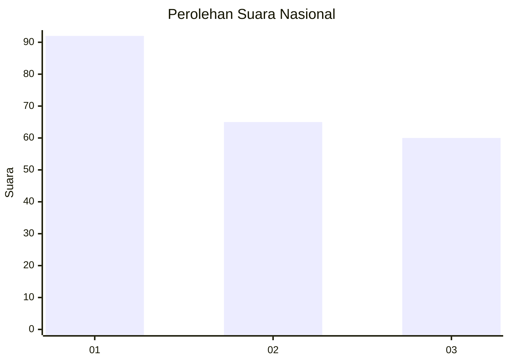
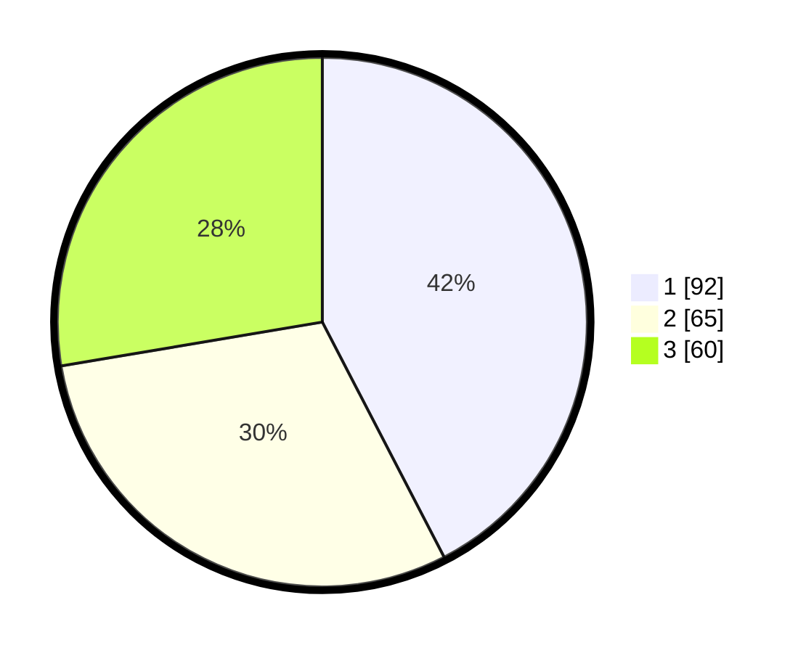

# Hasil

## Grafik

## Tabel

| No.    | Nama Paslon    | Suara | Suara (raw) | Persentase |
|:------ |:-------------- | -----:| -----------:| ----------:|
| 100025 | ANIES MUHAIMIN | 92    | [92][p-1]   | 42,40      |
| 100026 | PRABOWO GIBRAN | 65    | [65][p-2]   | 29,95      |
| 100027 | GANJAR MAHFUD  | 60    | [60][p-3]   | 27,65      |

[p-1]: https://github.com/gigit-pemilu/pemilu-2024/blob/main/pilpres/hitung-suara/sub/31-dki-jakarta/sub/72-jakarta-utara/sub/06-kelapa-gading/sub/1001-kelapa-gading-timur/sub/069-tps/sub/paslon-1.txt
[p-2]: https://github.com/gigit-pemilu/pemilu-2024/blob/main/pilpres/hitung-suara/sub/31-dki-jakarta/sub/72-jakarta-utara/sub/06-kelapa-gading/sub/1001-kelapa-gading-timur/sub/069-tps/sub/paslon-2.txt
[p-3]: https://github.com/gigit-pemilu/pemilu-2024/blob/main/pilpres/hitung-suara/sub/31-dki-jakarta/sub/72-jakarta-utara/sub/06-kelapa-gading/sub/1001-kelapa-gading-timur/sub/069-tps/sub/paslon-3.txt

## Foto C Plano

https://sirekap-obj-formc.kpu.go.id/7570/pemilu/ppwp/31/72/06/10/01/3172061001069-20240224-143431--53c253ad-a523-4533-87c5-6154f3f99ab8.jpg

https://sirekap-obj-formc.kpu.go.id/7570/pemilu/ppwp/31/72/06/10/01/3172061001069-20240224-143453--a23d540b-b19f-4e6d-a49e-f7141d6ff236.jpg

https://sirekap-obj-formc.kpu.go.id/7570/pemilu/ppwp/31/72/06/10/01/3172061001069-20240224-144738--e258e598-6743-4896-9e1e-4ad097fa5691.jpg

## Metadata

| Key        | Value               |
| ---------- | ------------------- |
| Time Stamp | 2024-02-25 03:00:00 |

