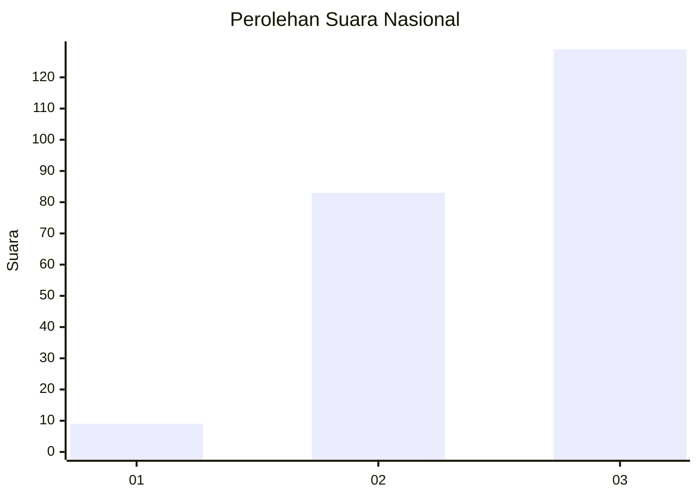
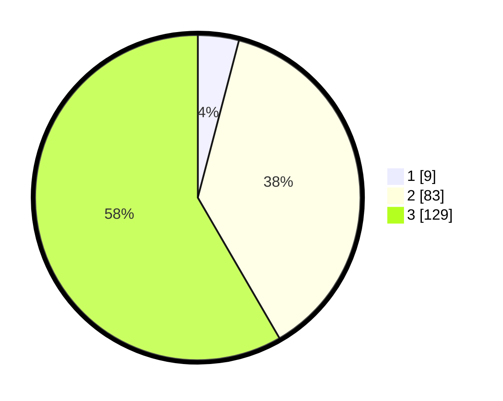

# Hasil

## Grafik

## Tabel

| No.    | Nama Paslon    | Suara | Suara (raw) | Persentase |
|:------ |:-------------- | -----:| -----------:| ----------:|
| 100025 | ANIES MUHAIMIN | 9     | [9][p-1]    | 4,07       |
| 100026 | PRABOWO GIBRAN | 83    | [83][p-2]   | 37,56      |
| 100027 | GANJAR MAHFUD  | 129   | [129][p-3]  | 58,37      |

[p-1]: https://github.com/gigit-pemilu/pemilu-2024/blob/main/pilpres/hitung-suara/sub/31-dki-jakarta/sub/72-jakarta-utara/sub/06-kelapa-gading/sub/1001-kelapa-gading-timur/sub/076-tps/sub/paslon-1.txt
[p-2]: https://github.com/gigit-pemilu/pemilu-2024/blob/main/pilpres/hitung-suara/sub/31-dki-jakarta/sub/72-jakarta-utara/sub/06-kelapa-gading/sub/1001-kelapa-gading-timur/sub/076-tps/sub/paslon-2.txt
[p-3]: https://github.com/gigit-pemilu/pemilu-2024/blob/main/pilpres/hitung-suara/sub/31-dki-jakarta/sub/72-jakarta-utara/sub/06-kelapa-gading/sub/1001-kelapa-gading-timur/sub/076-tps/sub/paslon-3.txt

## Foto C Plano

https://sirekap-obj-formc.kpu.go.id/d4aa/pemilu/ppwp/31/72/06/10/01/3172061001076-20240224-201118--4928f9bb-4545-4464-ac4f-7eb3072fcf45.jpg

https://sirekap-obj-formc.kpu.go.id/d4aa/pemilu/ppwp/31/72/06/10/01/3172061001076-20240224-201137--405cb1b0-e29d-480d-ade7-8b69d465e914.jpg

https://sirekap-obj-formc.kpu.go.id/d4aa/pemilu/ppwp/31/72/06/10/01/3172061001076-20240224-201203--4367fc34-1844-418a-936e-a16616d125bd.jpg

## Metadata

| Key        | Value               |
| ---------- | ------------------- |
| Time Stamp | 2024-02-25 03:00:00 |

