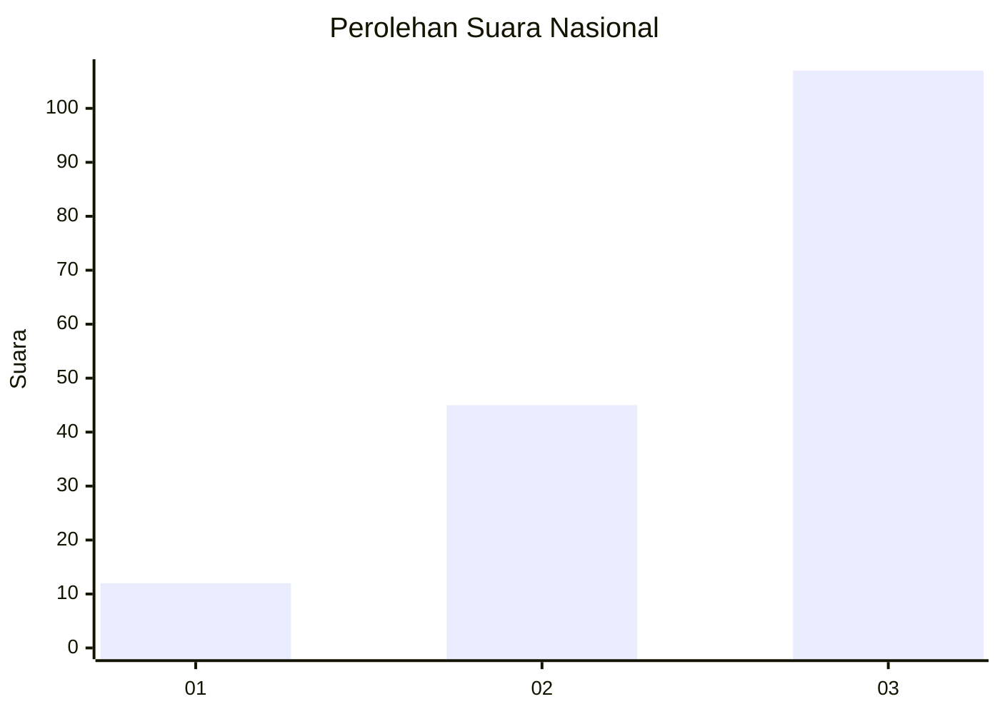
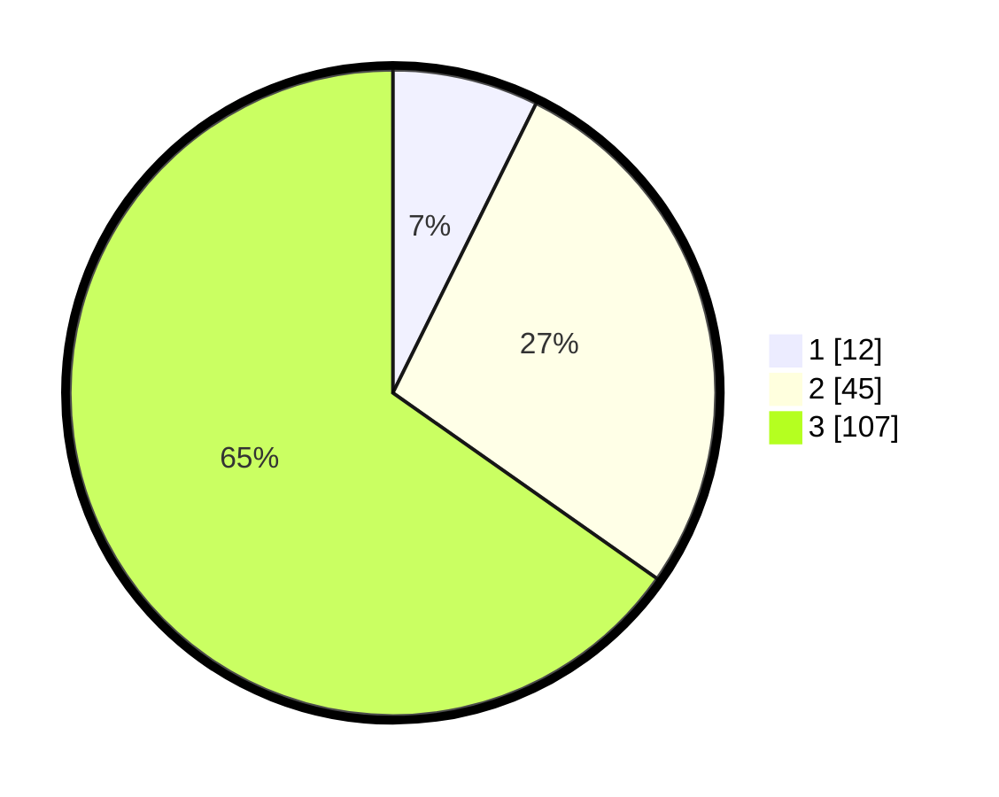

# Hasil

## Grafik

## Tabel

| No.    | Nama Paslon    | Suara | Suara (raw) | Persentase |
|:------ |:-------------- | -----:| -----------:| ----------:|
| 100025 | ANIES MUHAIMIN | 12    | [12][p-1]   | 7,32       |
| 100026 | PRABOWO GIBRAN | 45    | [45][p-2]   | 27,44      |
| 100027 | GANJAR MAHFUD  | 107   | [107][p-3]  | 65,24      |

[p-1]: https://github.com/gigit-pemilu/pemilu-2024/blob/main/pilpres/hitung-suara/sub/31-dki-jakarta/sub/72-jakarta-utara/sub/06-kelapa-gading/sub/1001-kelapa-gading-timur/sub/078-tps/sub/paslon-1.txt
[p-2]: https://github.com/gigit-pemilu/pemilu-2024/blob/main/pilpres/hitung-suara/sub/31-dki-jakarta/sub/72-jakarta-utara/sub/06-kelapa-gading/sub/1001-kelapa-gading-timur/sub/078-tps/sub/paslon-2.txt
[p-3]: https://github.com/gigit-pemilu/pemilu-2024/blob/main/pilpres/hitung-suara/sub/31-dki-jakarta/sub/72-jakarta-utara/sub/06-kelapa-gading/sub/1001-kelapa-gading-timur/sub/078-tps/sub/paslon-3.txt

## Foto C Plano

https://sirekap-obj-formc.kpu.go.id/b4f2/pemilu/ppwp/31/72/06/10/01/3172061001078-20240224-213729--4f5b3c80-40c0-4ee8-8050-9475a169f366.jpg

https://sirekap-obj-formc.kpu.go.id/b4f2/pemilu/ppwp/31/72/06/10/01/3172061001078-20240224-213655--04ab73a4-0363-4e29-9dc3-a8140cabe772.jpg

https://sirekap-obj-formc.kpu.go.id/b4f2/pemilu/ppwp/31/72/06/10/01/3172061001078-20240224-213641--c82abc34-6e97-462c-b7e5-4aea3569862d.jpg

## Metadata

| Key        | Value               |
| ---------- | ------------------- |
| Time Stamp | 2024-02-25 03:00:00 |

