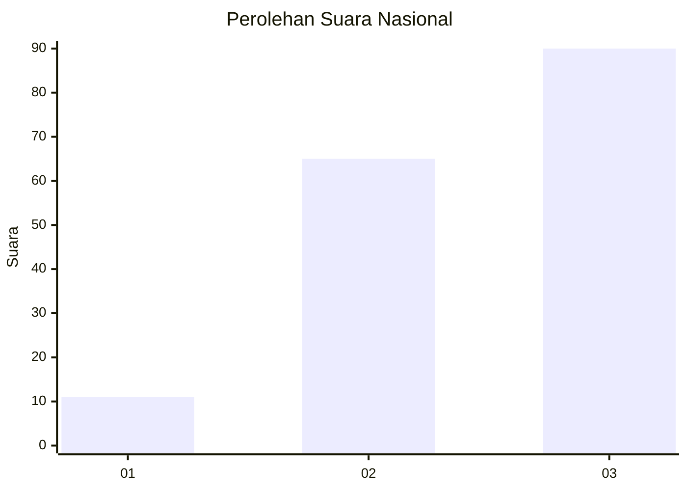
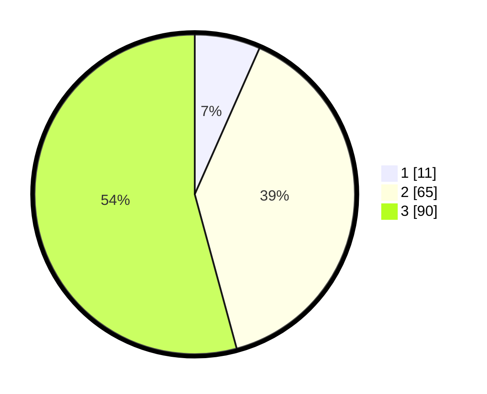

# Hasil

## Grafik

## Tabel

| No.    | Nama Paslon    | Suara | Suara (raw) | Persentase |
|:------ |:-------------- | -----:| -----------:| ----------:|
| 100025 | ANIES MUHAIMIN | 11    | [11][p-1]   | 6,63       |
| 100026 | PRABOWO GIBRAN | 65    | [65][p-2]   | 39,16      |
| 100027 | GANJAR MAHFUD  | 90    | [90][p-3]   | 54,22      |

[p-1]: https://github.com/gigit-pemilu/pemilu-2024/blob/main/pilpres/hitung-suara/sub/31-dki-jakarta/sub/72-jakarta-utara/sub/06-kelapa-gading/sub/1001-kelapa-gading-timur/sub/079-tps/sub/paslon-1.txt
[p-2]: https://github.com/gigit-pemilu/pemilu-2024/blob/main/pilpres/hitung-suara/sub/31-dki-jakarta/sub/72-jakarta-utara/sub/06-kelapa-gading/sub/1001-kelapa-gading-timur/sub/079-tps/sub/paslon-2.txt
[p-3]: https://github.com/gigit-pemilu/pemilu-2024/blob/main/pilpres/hitung-suara/sub/31-dki-jakarta/sub/72-jakarta-utara/sub/06-kelapa-gading/sub/1001-kelapa-gading-timur/sub/079-tps/sub/paslon-3.txt

## Foto C Plano

https://sirekap-obj-formc.kpu.go.id/11a8/pemilu/ppwp/31/72/06/10/01/3172061001079-20240224-214744--a74134a3-f016-4aaf-ad3f-d9362e1b88b5.jpg

https://sirekap-obj-formc.kpu.go.id/11a8/pemilu/ppwp/31/72/06/10/01/3172061001079-20240224-214806--8651075d-a6ba-4d23-b897-c742612a9c0a.jpg

https://sirekap-obj-formc.kpu.go.id/11a8/pemilu/ppwp/31/72/06/10/01/3172061001079-20240224-214919--1595e07b-4fda-4e03-aa65-bdb0656844c8.jpg

## Metadata

| Key        | Value               |
| ---------- | ------------------- |
| Time Stamp | 2024-02-25 03:00:00 |

