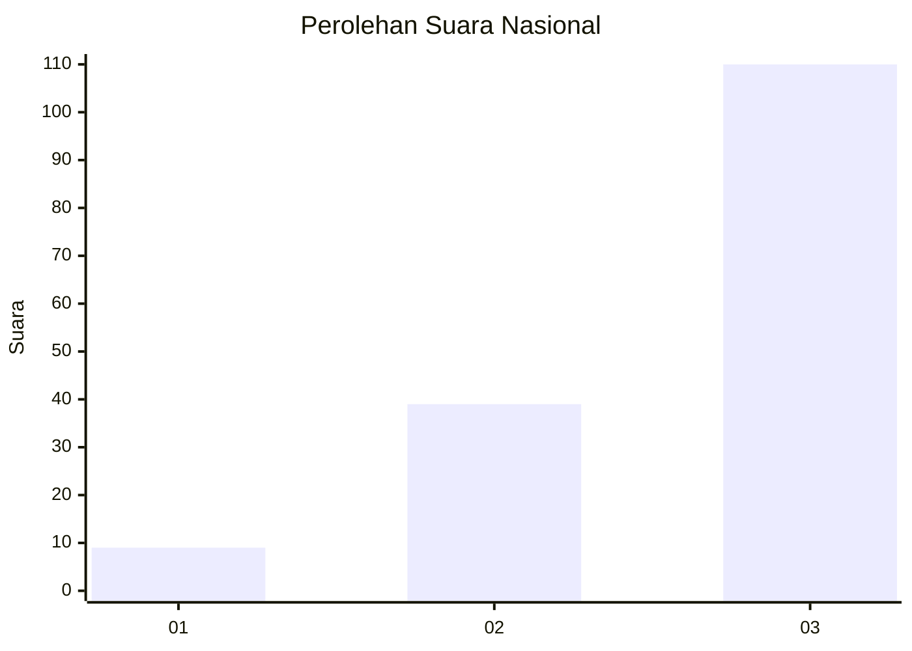
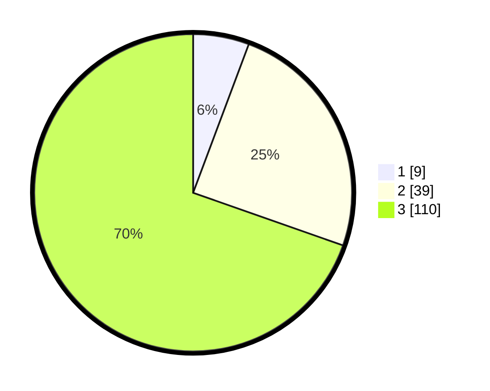

# Hasil

## Grafik

## Tabel

| No.    | Nama Paslon    | Suara | Suara (raw) | Persentase |
|:------ |:-------------- | -----:| -----------:| ----------:|
| 100025 | ANIES MUHAIMIN | 9     | [9][p-1]    | 5,70       |
| 100026 | PRABOWO GIBRAN | 39    | [39][p-2]   | 24,68      |
| 100027 | GANJAR MAHFUD  | 110   | [110][p-3]  | 69,62      |

[p-1]: https://github.com/gigit-pemilu/pemilu-2024/blob/main/pilpres/hitung-suara/sub/31-dki-jakarta/sub/72-jakarta-utara/sub/06-kelapa-gading/sub/1001-kelapa-gading-timur/sub/082-tps/sub/paslon-1.txt
[p-2]: https://github.com/gigit-pemilu/pemilu-2024/blob/main/pilpres/hitung-suara/sub/31-dki-jakarta/sub/72-jakarta-utara/sub/06-kelapa-gading/sub/1001-kelapa-gading-timur/sub/082-tps/sub/paslon-2.txt
[p-3]: https://github.com/gigit-pemilu/pemilu-2024/blob/main/pilpres/hitung-suara/sub/31-dki-jakarta/sub/72-jakarta-utara/sub/06-kelapa-gading/sub/1001-kelapa-gading-timur/sub/082-tps/sub/paslon-3.txt

## Foto C Plano

https://sirekap-obj-formc.kpu.go.id/b43d/pemilu/ppwp/31/72/06/10/01/3172061001082-20240225-115955--262c9f24-03ee-40e1-b9ae-7eb8d0a7f7f3.jpg

https://sirekap-obj-formc.kpu.go.id/b43d/pemilu/ppwp/31/72/06/10/01/3172061001082-20240225-120028--feea9e3f-6770-46c2-907b-fd309455e12b.jpg

https://sirekap-obj-formc.kpu.go.id/b43d/pemilu/ppwp/31/72/06/10/01/3172061001082-20240225-120251--bfc9ab79-abf9-4e0e-affd-3f989b067c32.jpg

## Metadata

| Key        | Value               |
| ---------- | ------------------- |
| Time Stamp | 2024-02-26 09:00:00 |

