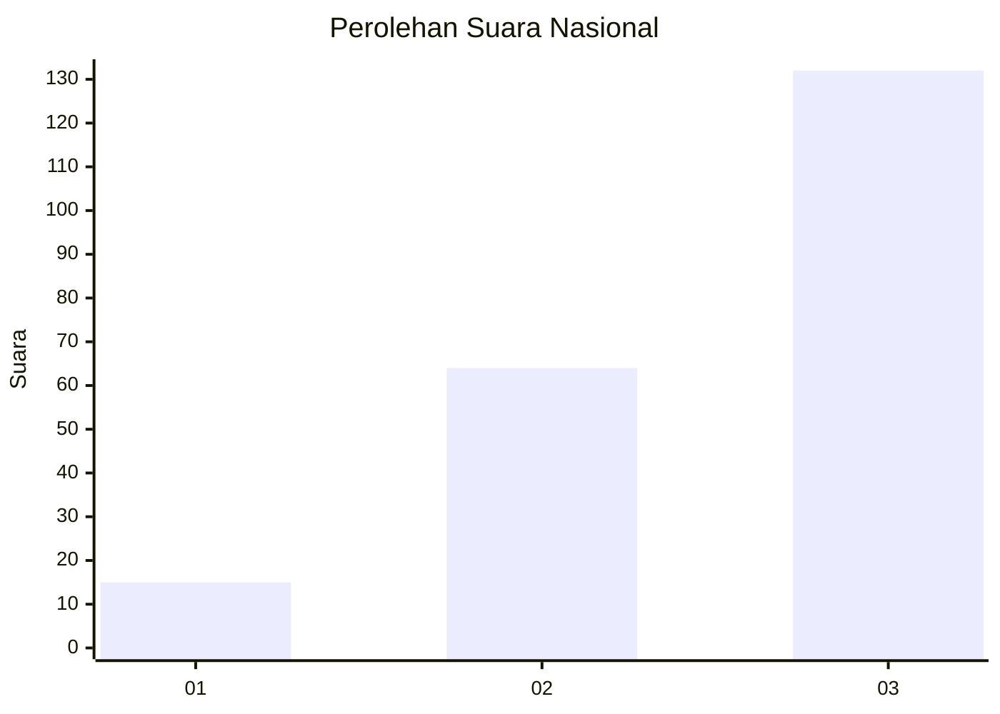
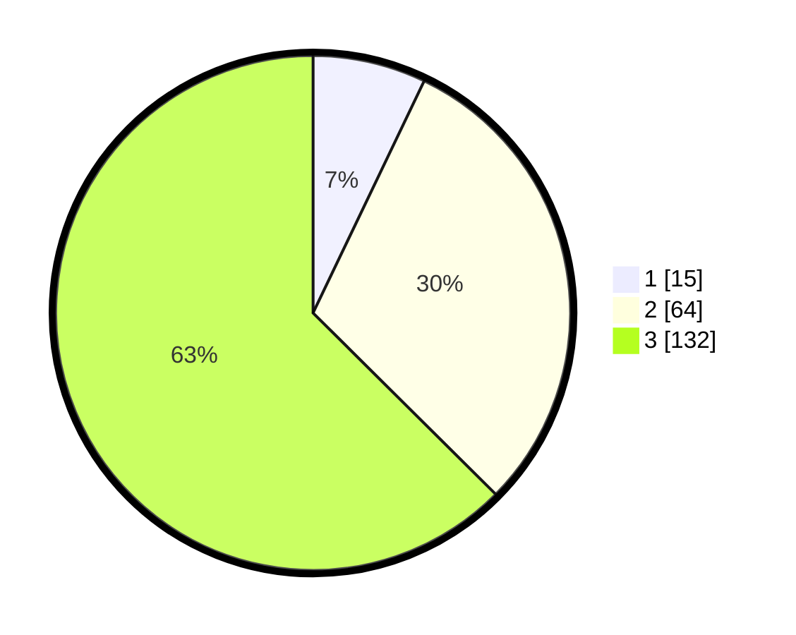

# Hasil

## Grafik

## Tabel

| No.    | Nama Paslon    | Suara | Suara (raw) | Persentase |
|:------ |:-------------- | -----:| -----------:| ----------:|
| 100025 | ANIES MUHAIMIN | 15    | [15][p-1]   | 7,11       |
| 100026 | PRABOWO GIBRAN | 64    | [64][p-2]   | 30,33      |
| 100027 | GANJAR MAHFUD  | 132   | [132][p-3]  | 62,56      |

[p-1]: https://github.com/gigit-pemilu/pemilu-2024/blob/main/pilpres/hitung-suara/sub/31-dki-jakarta/sub/72-jakarta-utara/sub/06-kelapa-gading/sub/1001-kelapa-gading-timur/sub/086-tps/sub/paslon-1.txt
[p-2]: https://github.com/gigit-pemilu/pemilu-2024/blob/main/pilpres/hitung-suara/sub/31-dki-jakarta/sub/72-jakarta-utara/sub/06-kelapa-gading/sub/1001-kelapa-gading-timur/sub/086-tps/sub/paslon-2.txt
[p-3]: https://github.com/gigit-pemilu/pemilu-2024/blob/main/pilpres/hitung-suara/sub/31-dki-jakarta/sub/72-jakarta-utara/sub/06-kelapa-gading/sub/1001-kelapa-gading-timur/sub/086-tps/sub/paslon-3.txt

## Foto C Plano

https://sirekap-obj-formc.kpu.go.id/1a21/pemilu/ppwp/31/72/06/10/01/3172061001086-20240225-150601--3733a0a2-7e87-40c6-861b-0ee3cc32811f.jpg

https://sirekap-obj-formc.kpu.go.id/1a21/pemilu/ppwp/31/72/06/10/01/3172061001086-20240225-150624--f2984bfa-f3ed-473f-a5c6-7c6f0b35ead2.jpg

https://sirekap-obj-formc.kpu.go.id/1a21/pemilu/ppwp/31/72/06/10/01/3172061001086-20240225-150721--0910e294-a67d-4ce9-9664-ce1fe39590de.jpg

## Metadata

| Key        | Value               |
| ---------- | ------------------- |
| Time Stamp | 2024-02-26 09:00:00 |

