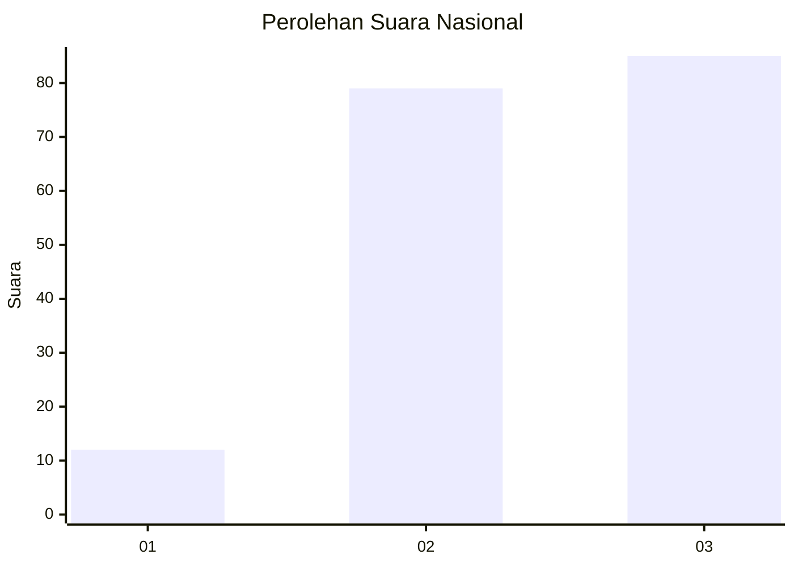
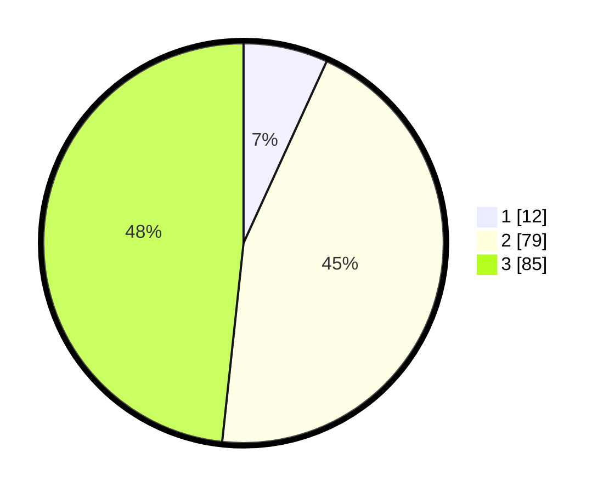

# Hasil

## Grafik

## Tabel

| No.    | Nama Paslon    | Suara | Suara (raw) | Persentase |
|:------ |:-------------- | -----:| -----------:| ----------:|
| 100025 | ANIES MUHAIMIN | 12    | [12][p-1]   | 6,82       |
| 100026 | PRABOWO GIBRAN | 79    | [79][p-2]   | 44,89      |
| 100027 | GANJAR MAHFUD  | 85    | [85][p-3]   | 48,30      |

[p-1]: https://github.com/gigit-pemilu/pemilu-2024/blob/main/pilpres/hitung-suara/sub/31-dki-jakarta/sub/72-jakarta-utara/sub/06-kelapa-gading/sub/1001-kelapa-gading-timur/sub/088-tps/sub/paslon-1.txt
[p-2]: https://github.com/gigit-pemilu/pemilu-2024/blob/main/pilpres/hitung-suara/sub/31-dki-jakarta/sub/72-jakarta-utara/sub/06-kelapa-gading/sub/1001-kelapa-gading-timur/sub/088-tps/sub/paslon-2.txt
[p-3]: https://github.com/gigit-pemilu/pemilu-2024/blob/main/pilpres/hitung-suara/sub/31-dki-jakarta/sub/72-jakarta-utara/sub/06-kelapa-gading/sub/1001-kelapa-gading-timur/sub/088-tps/sub/paslon-3.txt

## Foto C Plano

https://sirekap-obj-formc.kpu.go.id/a12c/pemilu/ppwp/31/72/06/10/01/3172061001088-20240225-152758--c5c1e803-4ee7-4c75-a61e-a076d4379a72.jpg

https://sirekap-obj-formc.kpu.go.id/a12c/pemilu/ppwp/31/72/06/10/01/3172061001088-20240225-152823--7d82c723-402d-4980-9db0-67f19c261d2c.jpg

https://sirekap-obj-formc.kpu.go.id/a12c/pemilu/ppwp/31/72/06/10/01/3172061001088-20240225-152927--20966462-1022-46f5-824d-24ac13298506.jpg

## Metadata

| Key        | Value               |
| ---------- | ------------------- |
| Time Stamp | 2024-02-26 10:00:00 |

