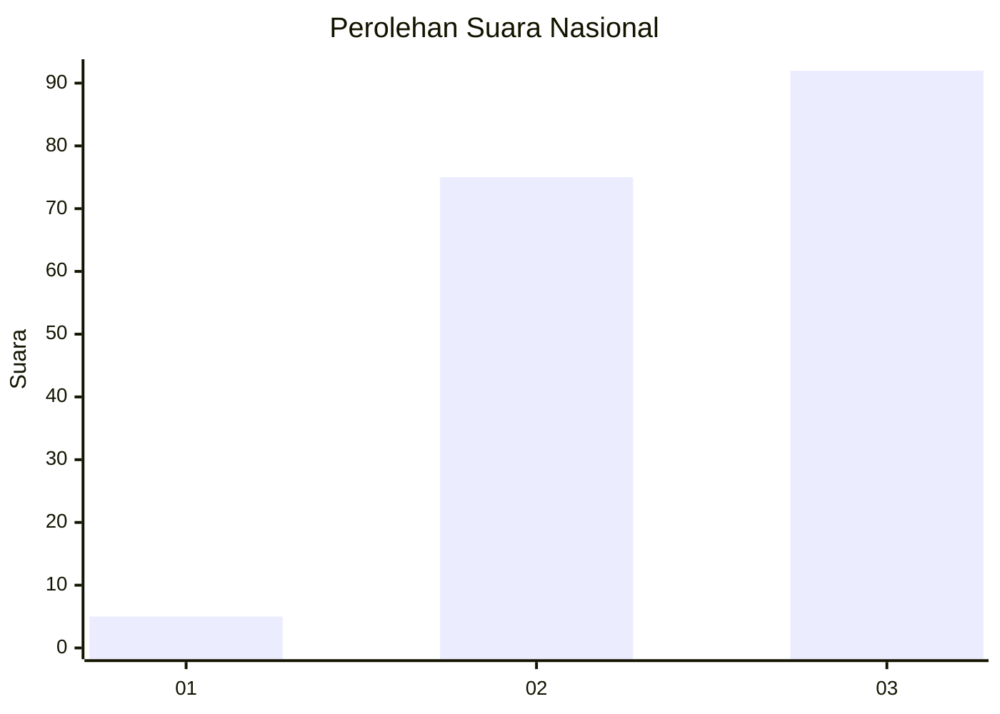
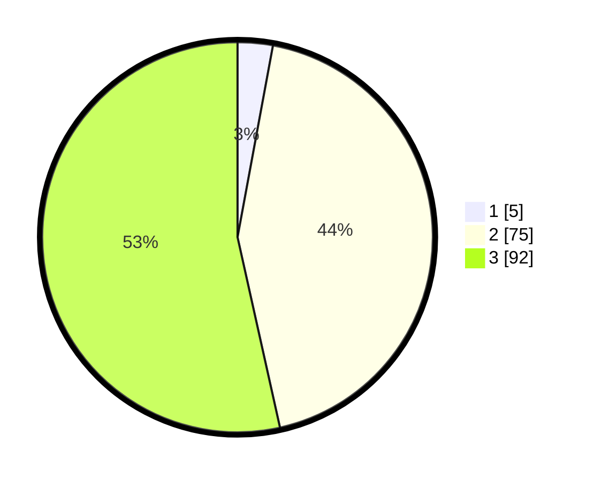

# Hasil

## Grafik

## Tabel

| No.    | Nama Paslon    | Suara | Suara (raw) | Persentase |
|:------ |:-------------- | -----:| -----------:| ----------:|
| 100025 | ANIES MUHAIMIN | 5     | [5][p-1]    | 2,91       |
| 100026 | PRABOWO GIBRAN | 75    | [75][p-2]   | 43,60      |
| 100027 | GANJAR MAHFUD  | 92    | [92][p-3]   | 53,49      |

[p-1]: https://github.com/gigit-pemilu/pemilu-2024/blob/main/pilpres/hitung-suara/sub/31-dki-jakarta/sub/72-jakarta-utara/sub/06-kelapa-gading/sub/1001-kelapa-gading-timur/sub/089-tps/sub/paslon-1.txt
[p-2]: https://github.com/gigit-pemilu/pemilu-2024/blob/main/pilpres/hitung-suara/sub/31-dki-jakarta/sub/72-jakarta-utara/sub/06-kelapa-gading/sub/1001-kelapa-gading-timur/sub/089-tps/sub/paslon-2.txt
[p-3]: https://github.com/gigit-pemilu/pemilu-2024/blob/main/pilpres/hitung-suara/sub/31-dki-jakarta/sub/72-jakarta-utara/sub/06-kelapa-gading/sub/1001-kelapa-gading-timur/sub/089-tps/sub/paslon-3.txt

## Foto C Plano

https://sirekap-obj-formc.kpu.go.id/f742/pemilu/ppwp/31/72/06/10/01/3172061001089-20240225-170507--542cac75-8b03-40e8-a569-799fa1759bb7.jpg

https://sirekap-obj-formc.kpu.go.id/f742/pemilu/ppwp/31/72/06/10/01/3172061001089-20240225-170518--b374dc6c-dd04-4542-9d8b-5cb895aa3e63.jpg

https://sirekap-obj-formc.kpu.go.id/f742/pemilu/ppwp/31/72/06/10/01/3172061001089-20240225-170742--374355e6-ccbf-4338-a02d-243e8d298ab4.jpg

## Metadata

| Key        | Value               |
| ---------- | ------------------- |
| Time Stamp | 2024-02-26 09:00:00 |

