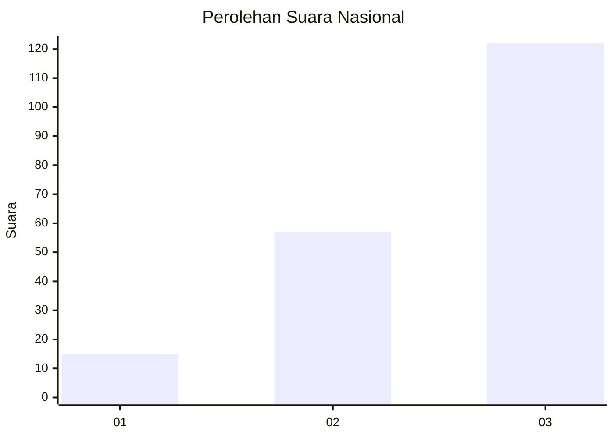
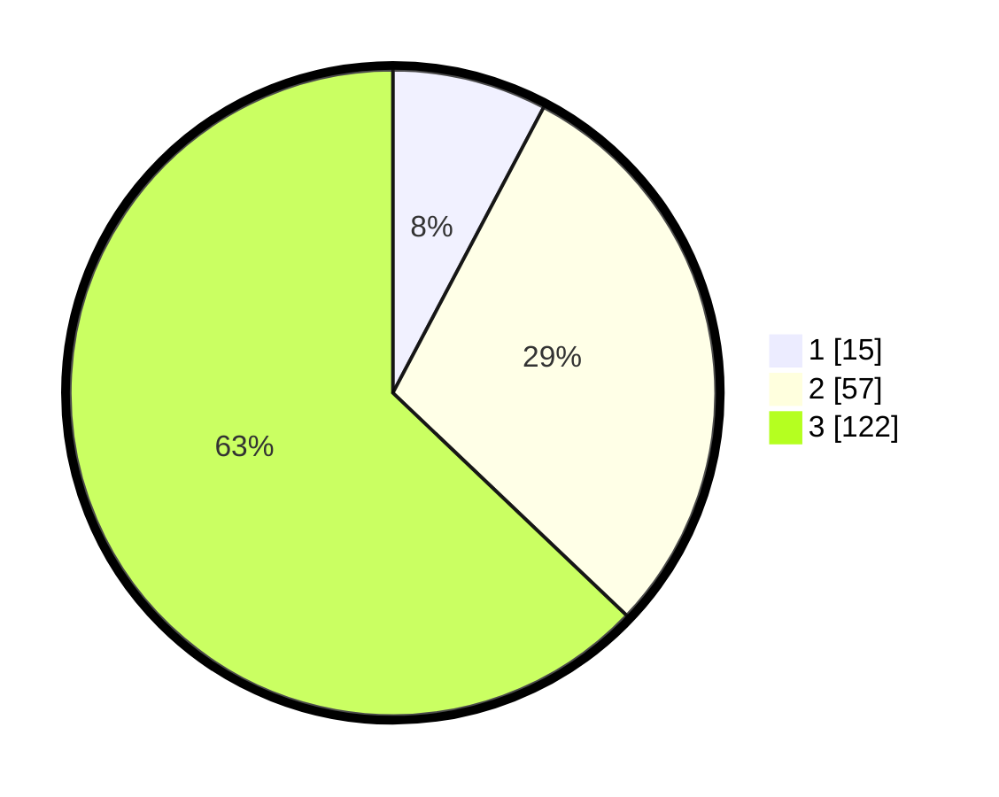

# Hasil

## Grafik

## Tabel

| No.    | Nama Paslon    | Suara | Suara (raw) | Persentase |
|:------ |:-------------- | -----:| -----------:| ----------:|
| 100025 | ANIES MUHAIMIN | 15    | [15][p-1]   | 7,73       |
| 100026 | PRABOWO GIBRAN | 57    | [57][p-2]   | 29,38      |
| 100027 | GANJAR MAHFUD  | 122   | [122][p-3]  | 62,89      |

[p-1]: https://github.com/gigit-pemilu/pemilu-2024/blob/main/pilpres/hitung-suara/sub/31-dki-jakarta/sub/72-jakarta-utara/sub/06-kelapa-gading/sub/1001-kelapa-gading-timur/sub/091-tps/sub/paslon-1.txt
[p-2]: https://github.com/gigit-pemilu/pemilu-2024/blob/main/pilpres/hitung-suara/sub/31-dki-jakarta/sub/72-jakarta-utara/sub/06-kelapa-gading/sub/1001-kelapa-gading-timur/sub/091-tps/sub/paslon-2.txt
[p-3]: https://github.com/gigit-pemilu/pemilu-2024/blob/main/pilpres/hitung-suara/sub/31-dki-jakarta/sub/72-jakarta-utara/sub/06-kelapa-gading/sub/1001-kelapa-gading-timur/sub/091-tps/sub/paslon-3.txt

## Foto C Plano

https://sirekap-obj-formc.kpu.go.id/2386/pemilu/ppwp/31/72/06/10/01/3172061001091-20240225-175353--531162b3-50b2-4e49-86dd-82356e8c1b83.jpg

https://sirekap-obj-formc.kpu.go.id/2386/pemilu/ppwp/31/72/06/10/01/3172061001091-20240225-175415--acd6b9bd-aa31-4de4-8f6b-c960c7b23fb7.jpg

https://sirekap-obj-formc.kpu.go.id/2386/pemilu/ppwp/31/72/06/10/01/3172061001091-20240225-175428--6d25b22a-5d24-4764-a034-15feaeb73716.jpg

## Metadata

| Key        | Value               |
| ---------- | ------------------- |
| Time Stamp | 2024-02-26 10:00:00 |

