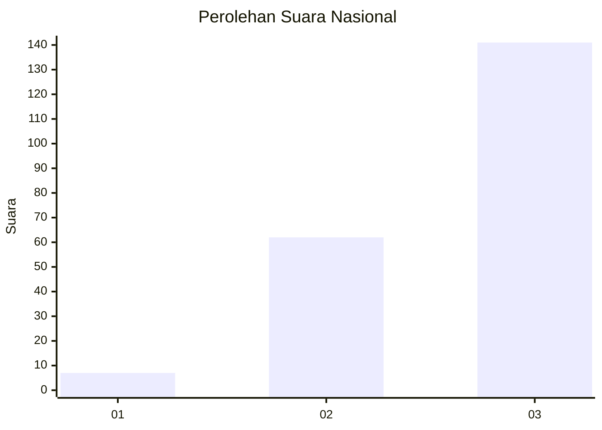
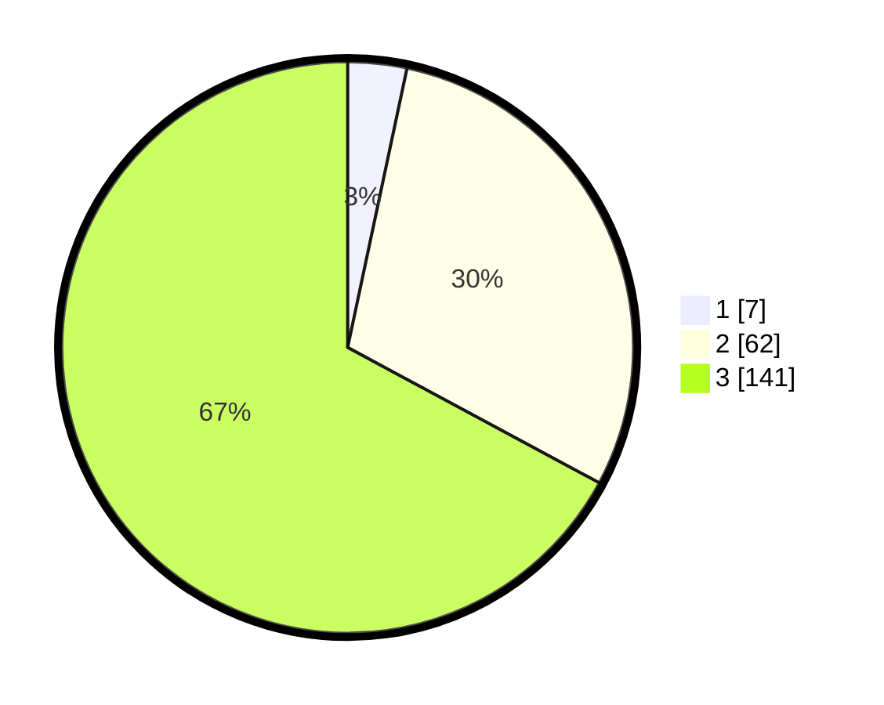

# Hasil

## Grafik

## Tabel

| No.    | Nama Paslon    | Suara | Suara (raw) | Persentase |
|:------ |:-------------- | -----:| -----------:| ----------:|
| 100025 | ANIES MUHAIMIN | 7     | [7][p-1]    | 3,33       |
| 100026 | PRABOWO GIBRAN | 62    | [62][p-2]   | 29,52      |
| 100027 | GANJAR MAHFUD  | 141   | [141][p-3]  | 67,14      |

[p-1]: https://github.com/gigit-pemilu/pemilu-2024/blob/main/pilpres/hitung-suara/sub/31-dki-jakarta/sub/72-jakarta-utara/sub/06-kelapa-gading/sub/1001-kelapa-gading-timur/sub/092-tps/sub/paslon-1.txt
[p-2]: https://github.com/gigit-pemilu/pemilu-2024/blob/main/pilpres/hitung-suara/sub/31-dki-jakarta/sub/72-jakarta-utara/sub/06-kelapa-gading/sub/1001-kelapa-gading-timur/sub/092-tps/sub/paslon-2.txt
[p-3]: https://github.com/gigit-pemilu/pemilu-2024/blob/main/pilpres/hitung-suara/sub/31-dki-jakarta/sub/72-jakarta-utara/sub/06-kelapa-gading/sub/1001-kelapa-gading-timur/sub/092-tps/sub/paslon-3.txt

## Foto C Plano

https://sirekap-obj-formc.kpu.go.id/c007/pemilu/ppwp/31/72/06/10/01/3172061001092-20240225-181344--de533431-ce30-4309-99be-4831708e962b.jpg

https://sirekap-obj-formc.kpu.go.id/c007/pemilu/ppwp/31/72/06/10/01/3172061001092-20240225-181406--613ff8ee-6b69-48e5-a6bd-9ff087da56a5.jpg

https://sirekap-obj-formc.kpu.go.id/c007/pemilu/ppwp/31/72/06/10/01/3172061001092-20240225-181439--914bdc0c-761d-415e-afd5-6f7b47765554.jpg

## Metadata

| Key        | Value               |
| ---------- | ------------------- |
| Time Stamp | 2024-02-26 10:00:00 |

