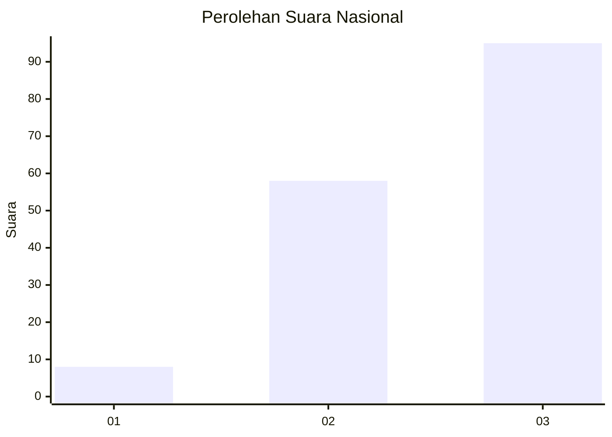
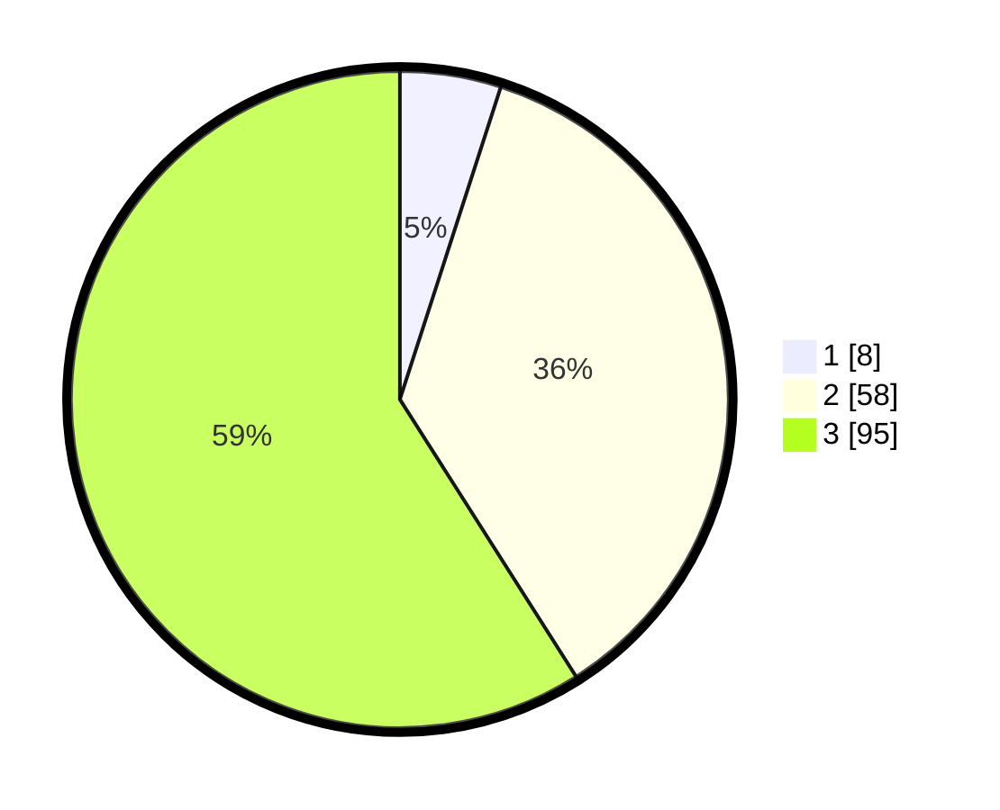

# Hasil

## Grafik

## Tabel

| No.    | Nama Paslon    | Suara | Suara (raw) | Persentase |
|:------ |:-------------- | -----:| -----------:| ----------:|
| 100025 | ANIES MUHAIMIN | 8     | [8][p-1]    | 4,97       |
| 100026 | PRABOWO GIBRAN | 58    | [58][p-2]   | 36,02      |
| 100027 | GANJAR MAHFUD  | 95    | [95][p-3]   | 59,01      |

[p-1]: https://github.com/gigit-pemilu/pemilu-2024/blob/main/pilpres/hitung-suara/sub/31-dki-jakarta/sub/72-jakarta-utara/sub/06-kelapa-gading/sub/1001-kelapa-gading-timur/sub/095-tps/sub/paslon-1.txt
[p-2]: https://github.com/gigit-pemilu/pemilu-2024/blob/main/pilpres/hitung-suara/sub/31-dki-jakarta/sub/72-jakarta-utara/sub/06-kelapa-gading/sub/1001-kelapa-gading-timur/sub/095-tps/sub/paslon-2.txt
[p-3]: https://github.com/gigit-pemilu/pemilu-2024/blob/main/pilpres/hitung-suara/sub/31-dki-jakarta/sub/72-jakarta-utara/sub/06-kelapa-gading/sub/1001-kelapa-gading-timur/sub/095-tps/sub/paslon-3.txt

## Foto C Plano

https://sirekap-obj-formc.kpu.go.id/6fc9/pemilu/ppwp/31/72/06/10/01/3172061001095-20240225-221009--01a9a90f-18a0-4c69-a530-7f8c1fbcfdde.jpg

https://sirekap-obj-formc.kpu.go.id/6fc9/pemilu/ppwp/31/72/06/10/01/3172061001095-20240225-221018--4d039f4f-3e68-4bca-86a0-dd59617221d3.jpg

https://sirekap-obj-formc.kpu.go.id/6fc9/pemilu/ppwp/31/72/06/10/01/3172061001095-20240225-221112--9169a2c1-e3c1-4da5-8f0a-525d34d3ee8c.jpg

## Metadata

| Key        | Value               |
| ---------- | ------------------- |
| Time Stamp | 2024-02-26 09:00:00 |

