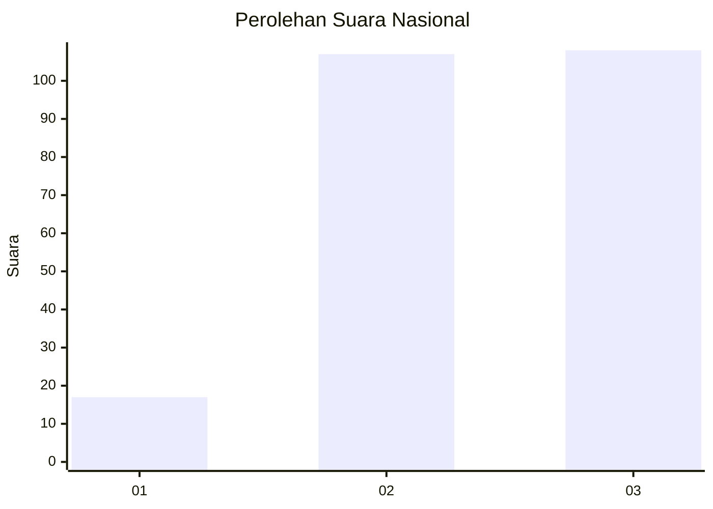
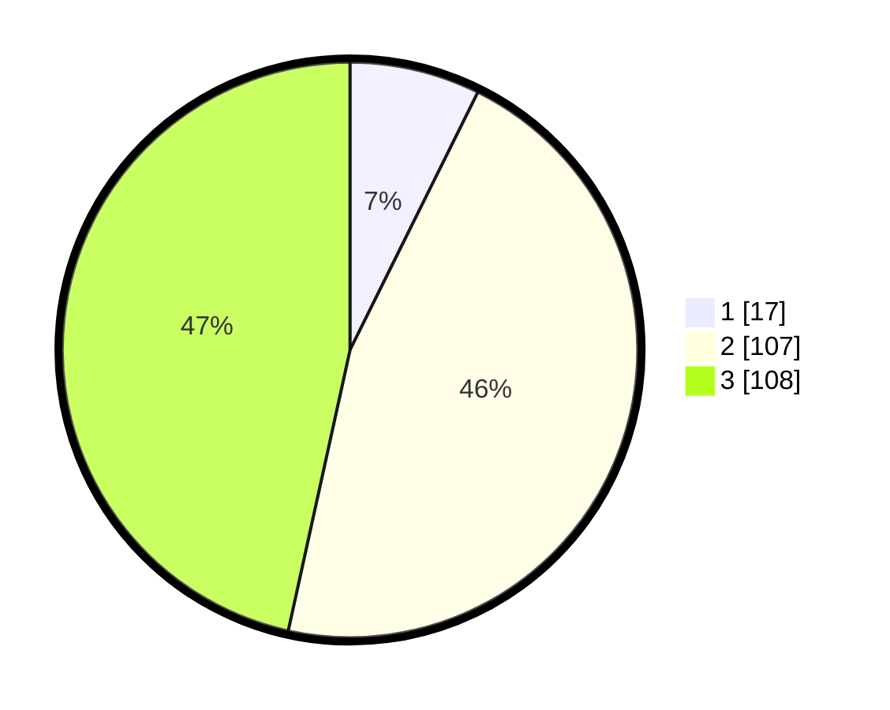

# Hasil

## Grafik

## Tabel

| No.    | Nama Paslon    | Suara | Suara (raw) | Persentase |
|:------ |:-------------- | -----:| -----------:| ----------:|
| 100025 | ANIES MUHAIMIN | 17    | [17][p-1]   | 7,33       |
| 100026 | PRABOWO GIBRAN | 107   | [107][p-2]  | 46,12      |
| 100027 | GANJAR MAHFUD  | 108   | [108][p-3]  | 46,55      |

[p-1]: https://github.com/gigit-pemilu/pemilu-2024/blob/main/pilpres/hitung-suara/sub/31-dki-jakarta/sub/72-jakarta-utara/sub/06-kelapa-gading/sub/1001-kelapa-gading-timur/sub/097-tps/sub/paslon-1.txt
[p-2]: https://github.com/gigit-pemilu/pemilu-2024/blob/main/pilpres/hitung-suara/sub/31-dki-jakarta/sub/72-jakarta-utara/sub/06-kelapa-gading/sub/1001-kelapa-gading-timur/sub/097-tps/sub/paslon-2.txt
[p-3]: https://github.com/gigit-pemilu/pemilu-2024/blob/main/pilpres/hitung-suara/sub/31-dki-jakarta/sub/72-jakarta-utara/sub/06-kelapa-gading/sub/1001-kelapa-gading-timur/sub/097-tps/sub/paslon-3.txt

## Foto C Plano

https://sirekap-obj-formc.kpu.go.id/811d/pemilu/ppwp/31/72/06/10/01/3172061001097-20240226-115513--6743eaee-4672-4b61-9997-d28bd7a3fd75.jpg

https://sirekap-obj-formc.kpu.go.id/811d/pemilu/ppwp/31/72/06/10/01/3172061001097-20240226-115535--6d32d259-36ca-42f9-b685-16d781b62a43.jpg

https://sirekap-obj-formc.kpu.go.id/811d/pemilu/ppwp/31/72/06/10/01/3172061001097-20240226-115556--a1e20f2d-30f2-4717-b1e7-03ad6e7b9869.jpg

## Metadata

| Key        | Value               |
| ---------- | ------------------- |
| Time Stamp | 2024-02-26 12:00:00 |

