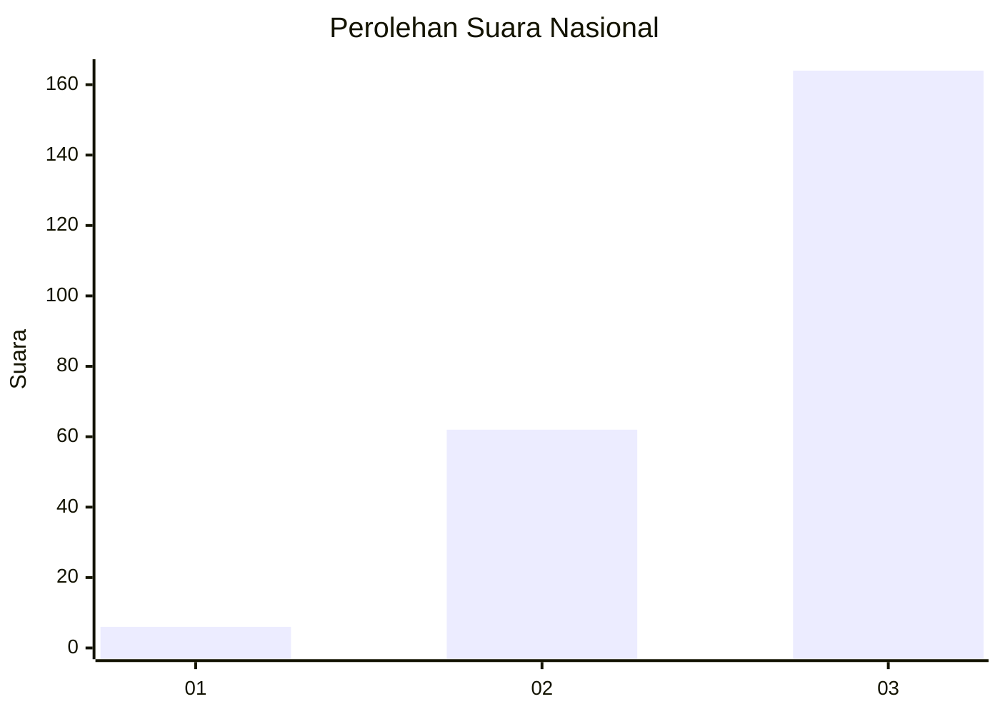
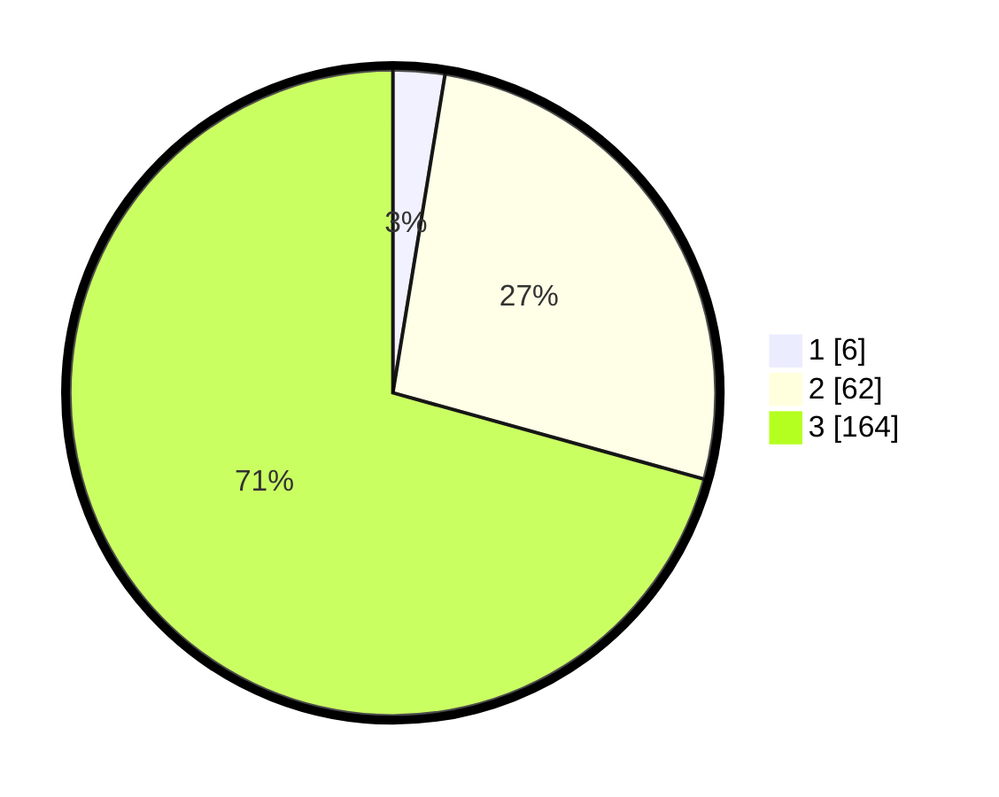

# Hasil

## Grafik

## Tabel

| No.    | Nama Paslon    | Suara | Suara (raw) | Persentase |
|:------ |:-------------- | -----:| -----------:| ----------:|
| 100025 | ANIES MUHAIMIN | 6     | [6][p-1]    | 2,59       |
| 100026 | PRABOWO GIBRAN | 62    | [62][p-2]   | 26,72      |
| 100027 | GANJAR MAHFUD  | 164   | [164][p-3]  | 70,69      |

[p-1]: https://github.com/gigit-pemilu/pemilu-2024/blob/main/pilpres/hitung-suara/sub/31-dki-jakarta/sub/72-jakarta-utara/sub/06-kelapa-gading/sub/1001-kelapa-gading-timur/sub/101-tps/sub/paslon-1.txt
[p-2]: https://github.com/gigit-pemilu/pemilu-2024/blob/main/pilpres/hitung-suara/sub/31-dki-jakarta/sub/72-jakarta-utara/sub/06-kelapa-gading/sub/1001-kelapa-gading-timur/sub/101-tps/sub/paslon-2.txt
[p-3]: https://github.com/gigit-pemilu/pemilu-2024/blob/main/pilpres/hitung-suara/sub/31-dki-jakarta/sub/72-jakarta-utara/sub/06-kelapa-gading/sub/1001-kelapa-gading-timur/sub/101-tps/sub/paslon-3.txt

## Foto C Plano

https://sirekap-obj-formc.kpu.go.id/574b/pemilu/ppwp/31/72/06/10/01/3172061001101-20240226-165723--795c4d33-5a5d-49f6-ad26-0010f469cd2d.jpg

https://sirekap-obj-formc.kpu.go.id/574b/pemilu/ppwp/31/72/06/10/01/3172061001101-20240226-165503--13f4dd66-405b-42fc-9194-f9a20c39a9ba.jpg

https://sirekap-obj-formc.kpu.go.id/574b/pemilu/ppwp/31/72/06/10/01/3172061001101-20240226-165805--9710efbf-9988-4d95-bac1-6c028a26e7a6.jpg

## Metadata

| Key        | Value               |
| ---------- | ------------------- |
| Time Stamp | 2024-02-28 19:00:00 |

