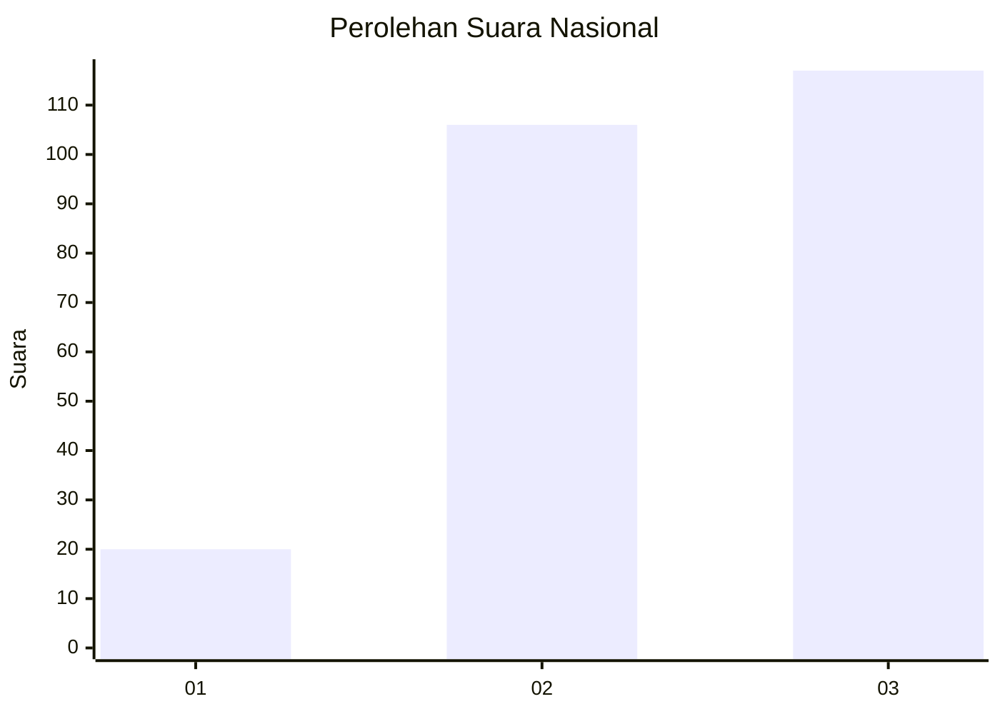
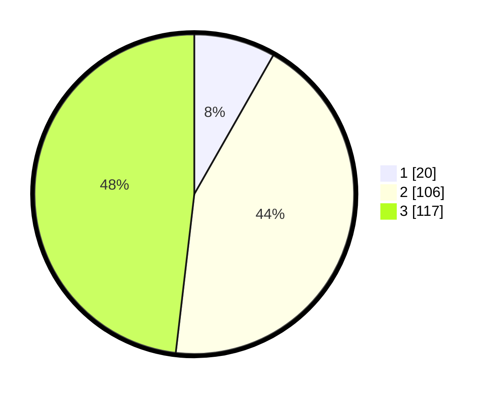

# Hasil

## Grafik

## Tabel

| No.    | Nama Paslon    | Suara | Suara (raw) | Persentase |
|:------ |:-------------- | -----:| -----------:| ----------:|
| 100025 | ANIES MUHAIMIN | 20    | [20][p-1]   | 8,23       |
| 100026 | PRABOWO GIBRAN | 106   | [106][p-2]  | 43,62      |
| 100027 | GANJAR MAHFUD  | 117   | [117][p-3]  | 48,15      |

[p-1]: https://github.com/gigit-pemilu/pemilu-2024/blob/main/pilpres/hitung-suara/sub/31-dki-jakarta/sub/72-jakarta-utara/sub/06-kelapa-gading/sub/1001-kelapa-gading-timur/sub/103-tps/sub/paslon-1.txt
[p-2]: https://github.com/gigit-pemilu/pemilu-2024/blob/main/pilpres/hitung-suara/sub/31-dki-jakarta/sub/72-jakarta-utara/sub/06-kelapa-gading/sub/1001-kelapa-gading-timur/sub/103-tps/sub/paslon-2.txt
[p-3]: https://github.com/gigit-pemilu/pemilu-2024/blob/main/pilpres/hitung-suara/sub/31-dki-jakarta/sub/72-jakarta-utara/sub/06-kelapa-gading/sub/1001-kelapa-gading-timur/sub/103-tps/sub/paslon-3.txt

## Foto C Plano

https://sirekap-obj-formc.kpu.go.id/5a7e/pemilu/ppwp/31/72/06/10/01/3172061001103-20240214-222945--975c20d5-de07-4ece-aa1f-80cfc02d4b72.jpg

https://sirekap-obj-formc.kpu.go.id/5a7e/pemilu/ppwp/31/72/06/10/01/3172061001103-20240214-222957--543b2f1f-3afa-4b10-881b-a2f32bb02983.jpg

https://sirekap-obj-formc.kpu.go.id/5a7e/pemilu/ppwp/31/72/06/10/01/3172061001103-20240214-223002--874448bd-b697-4960-8d2a-517300ec5be8.jpg

## Metadata

| Key        | Value               |
| ---------- | ------------------- |
| Time Stamp | 2024-02-20 16:00:00 |

