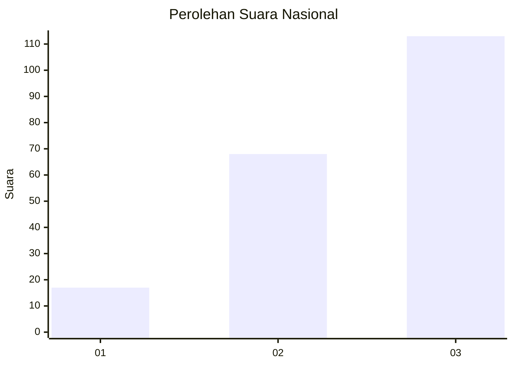
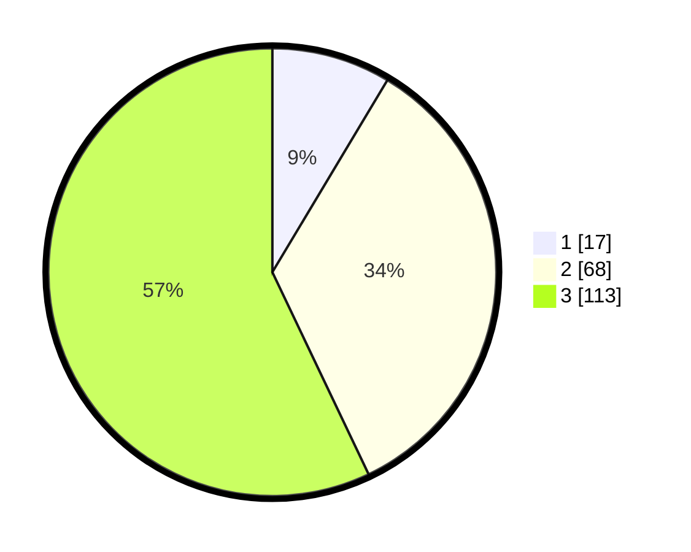

# Hasil

## Grafik

## Tabel

| No.    | Nama Paslon    | Suara | Suara (raw) | Persentase |
|:------ |:-------------- | -----:| -----------:| ----------:|
| 100025 | ANIES MUHAIMIN | 17    | [17][p-1]   | 8,59       |
| 100026 | PRABOWO GIBRAN | 68    | [68][p-2]   | 34,34      |
| 100027 | GANJAR MAHFUD  | 113   | [113][p-3]  | 57,07      |

[p-1]: https://github.com/gigit-pemilu/pemilu-2024/blob/main/pilpres/hitung-suara/sub/31-dki-jakarta/sub/72-jakarta-utara/sub/06-kelapa-gading/sub/1001-kelapa-gading-timur/sub/112-tps/sub/paslon-1.txt
[p-2]: https://github.com/gigit-pemilu/pemilu-2024/blob/main/pilpres/hitung-suara/sub/31-dki-jakarta/sub/72-jakarta-utara/sub/06-kelapa-gading/sub/1001-kelapa-gading-timur/sub/112-tps/sub/paslon-2.txt
[p-3]: https://github.com/gigit-pemilu/pemilu-2024/blob/main/pilpres/hitung-suara/sub/31-dki-jakarta/sub/72-jakarta-utara/sub/06-kelapa-gading/sub/1001-kelapa-gading-timur/sub/112-tps/sub/paslon-3.txt

## Foto C Plano

https://sirekap-obj-formc.kpu.go.id/2c47/pemilu/ppwp/31/72/06/10/01/3172061001112-20240227-141313--20b9ab4c-ceba-47d0-8f6b-98340357c649.jpg

https://sirekap-obj-formc.kpu.go.id/2c47/pemilu/ppwp/31/72/06/10/01/3172061001112-20240227-141331--fca3e117-59fd-458a-8148-4894b45c0000.jpg

https://sirekap-obj-formc.kpu.go.id/2c47/pemilu/ppwp/31/72/06/10/01/3172061001112-20240227-141351--25238383-aad7-457d-9b59-7b8e0cf27a59.jpg

## Metadata

| Key        | Value               |
| ---------- | ------------------- |
| Time Stamp | 2024-02-29 22:00:00 |

