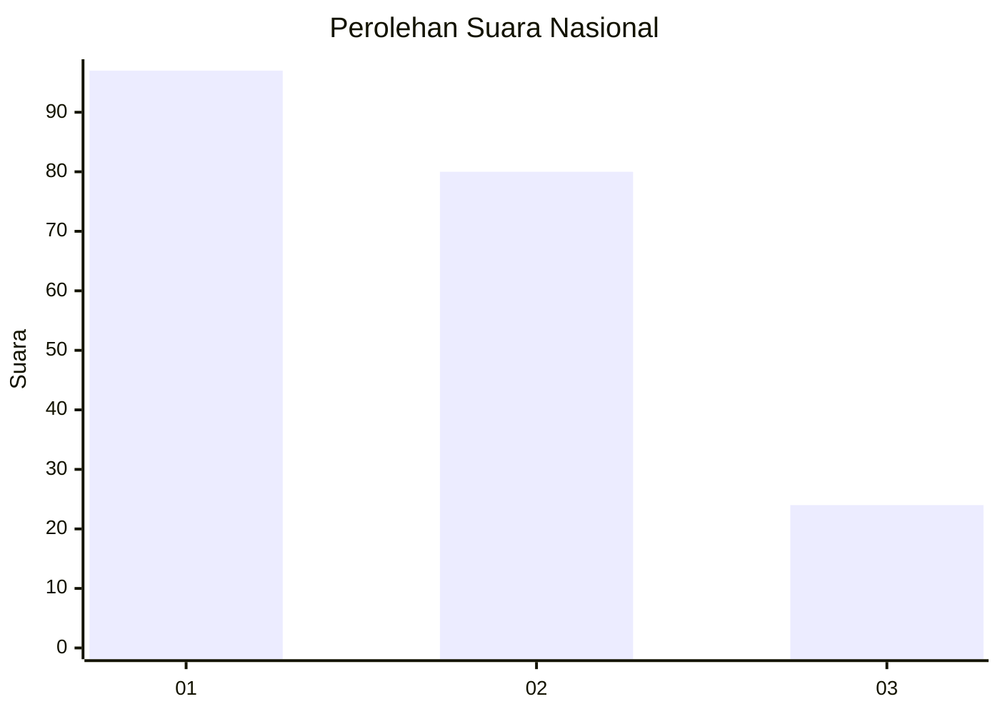
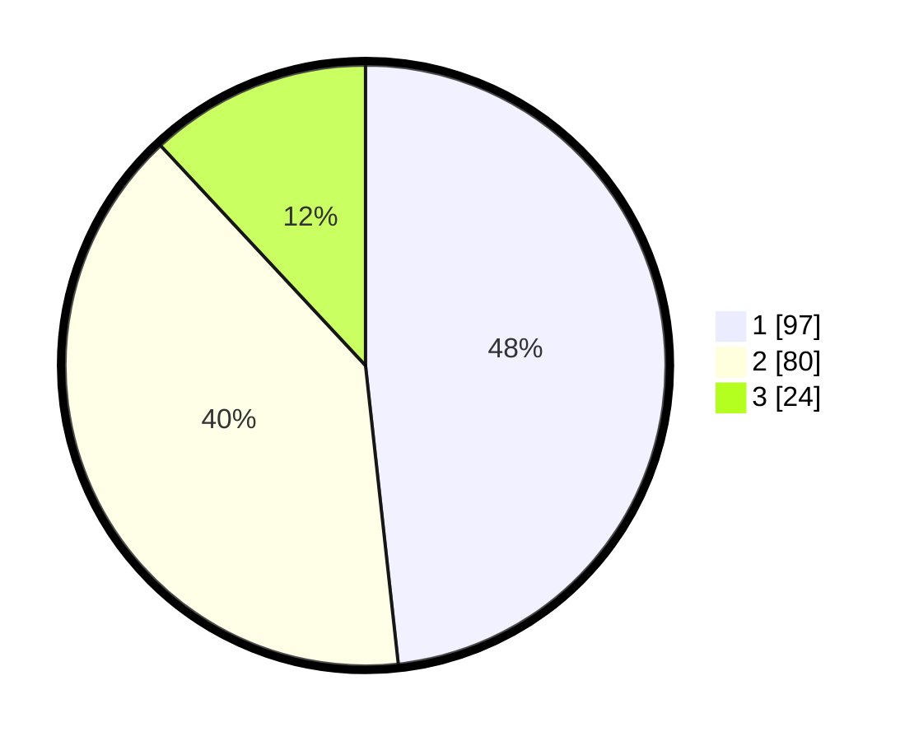

# Hasil

## Grafik

## Tabel

| No.    | Nama Paslon    | Suara | Suara (raw) | Persentase |
|:------ |:-------------- | -----:| -----------:| ----------:|
| 100025 | ANIES MUHAIMIN | 97    | [97][p-1]   | 48,26      |
| 100026 | PRABOWO GIBRAN | 80    | [80][p-2]   | 39,80      |
| 100027 | GANJAR MAHFUD  | 24    | [24][p-3]   | 11,94      |

[p-1]: https://github.com/gigit-pemilu/pemilu-2024/blob/main/pilpres/hitung-suara/sub/31-dki-jakarta/sub/72-jakarta-utara/sub/06-kelapa-gading/sub/1002-pegangsaan-dua/sub/003-tps/sub/paslon-1.txt
[p-2]: https://github.com/gigit-pemilu/pemilu-2024/blob/main/pilpres/hitung-suara/sub/31-dki-jakarta/sub/72-jakarta-utara/sub/06-kelapa-gading/sub/1002-pegangsaan-dua/sub/003-tps/sub/paslon-2.txt
[p-3]: https://github.com/gigit-pemilu/pemilu-2024/blob/main/pilpres/hitung-suara/sub/31-dki-jakarta/sub/72-jakarta-utara/sub/06-kelapa-gading/sub/1002-pegangsaan-dua/sub/003-tps/sub/paslon-3.txt

## Foto C Plano

https://sirekap-obj-formc.kpu.go.id/e0cf/pemilu/ppwp/31/72/06/10/02/3172061002003-20240216-150508--b682929b-01ab-4b8d-b9b4-68b7664da11c.jpg

https://sirekap-obj-formc.kpu.go.id/e0cf/pemilu/ppwp/31/72/06/10/02/3172061002003-20240216-150606--95d0fc75-139e-49b9-bb4c-81c4d5dcf612.jpg

https://sirekap-obj-formc.kpu.go.id/e0cf/pemilu/ppwp/31/72/06/10/02/3172061002003-20240216-150837--daffb8ec-761d-4bfd-9430-e61947100aaa.jpg

## Metadata

| Key        | Value               |
| ---------- | ------------------- |
| Time Stamp | 2024-02-20 16:00:00 |

