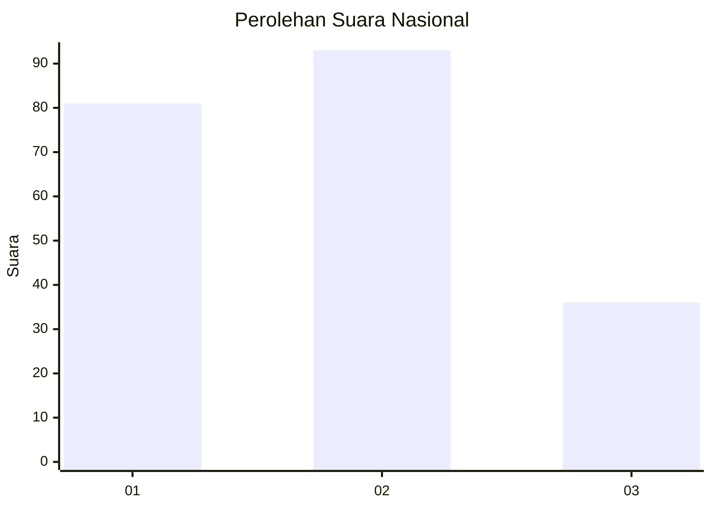
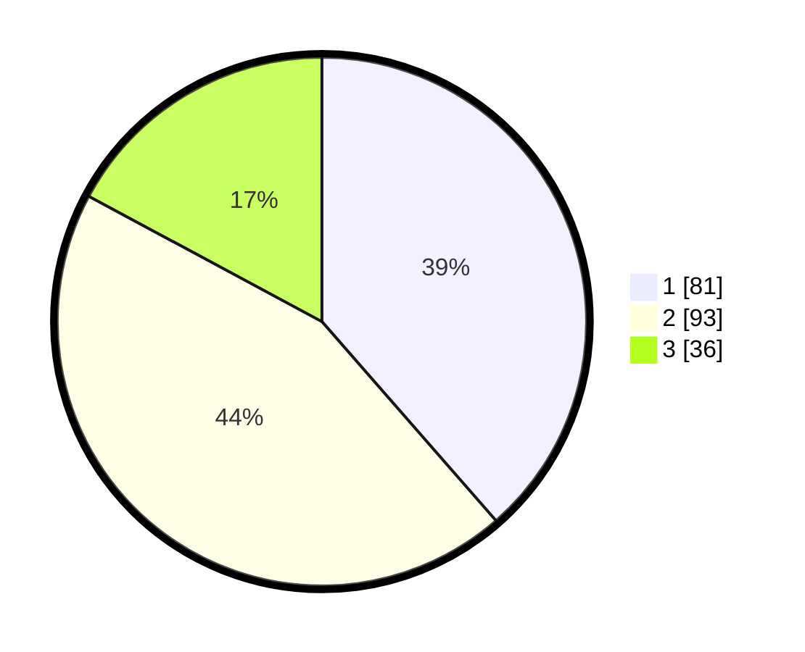

# Hasil

## Grafik

## Tabel

| No.    | Nama Paslon    | Suara | Suara (raw) | Persentase |
|:------ |:-------------- | -----:| -----------:| ----------:|
| 100025 | ANIES MUHAIMIN | 81    | [81][p-1]   | 38,57      |
| 100026 | PRABOWO GIBRAN | 93    | [93][p-2]   | 44,29      |
| 100027 | GANJAR MAHFUD  | 36    | [36][p-3]   | 17,14      |

[p-1]: https://github.com/gigit-pemilu/pemilu-2024/blob/main/pilpres/hitung-suara/sub/31-dki-jakarta/sub/72-jakarta-utara/sub/06-kelapa-gading/sub/1002-pegangsaan-dua/sub/004-tps/sub/paslon-1.txt
[p-2]: https://github.com/gigit-pemilu/pemilu-2024/blob/main/pilpres/hitung-suara/sub/31-dki-jakarta/sub/72-jakarta-utara/sub/06-kelapa-gading/sub/1002-pegangsaan-dua/sub/004-tps/sub/paslon-2.txt
[p-3]: https://github.com/gigit-pemilu/pemilu-2024/blob/main/pilpres/hitung-suara/sub/31-dki-jakarta/sub/72-jakarta-utara/sub/06-kelapa-gading/sub/1002-pegangsaan-dua/sub/004-tps/sub/paslon-3.txt

## Foto C Plano

https://sirekap-obj-formc.kpu.go.id/3ea9/pemilu/ppwp/31/72/06/10/02/3172061002004-20240216-162506--46d22862-7cc6-4099-b466-e2f530701beb.jpg

https://sirekap-obj-formc.kpu.go.id/3ea9/pemilu/ppwp/31/72/06/10/02/3172061002004-20240216-163222--2322f45b-18d9-4824-b9ab-d365be1a2fdb.jpg

https://sirekap-obj-formc.kpu.go.id/3ea9/pemilu/ppwp/31/72/06/10/02/3172061002004-20240216-163321--910fd6b4-f4c8-4e27-a292-a4f1bb98fb05.jpg

## Metadata

| Key        | Value               |
| ---------- | ------------------- |
| Time Stamp | 2024-02-21 19:00:00 |

