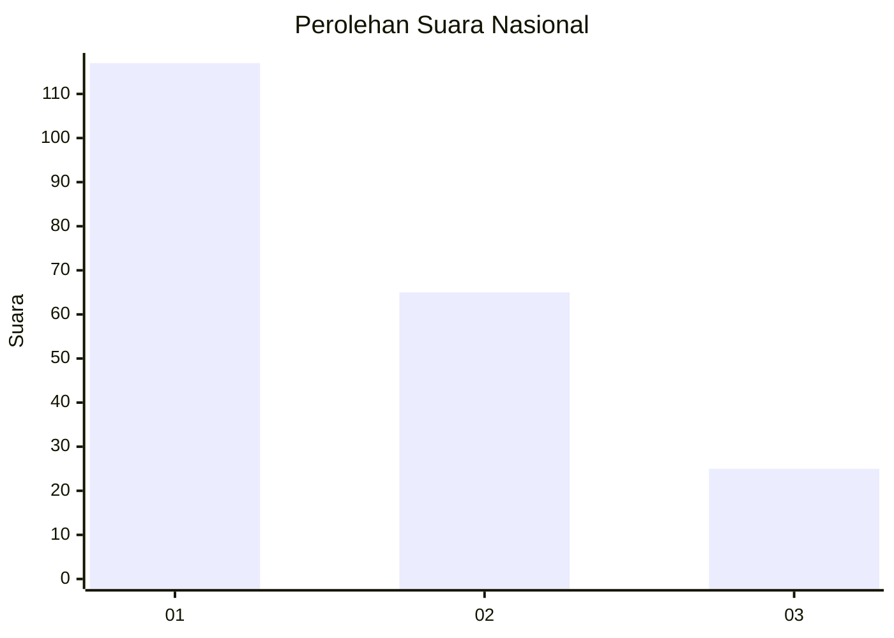
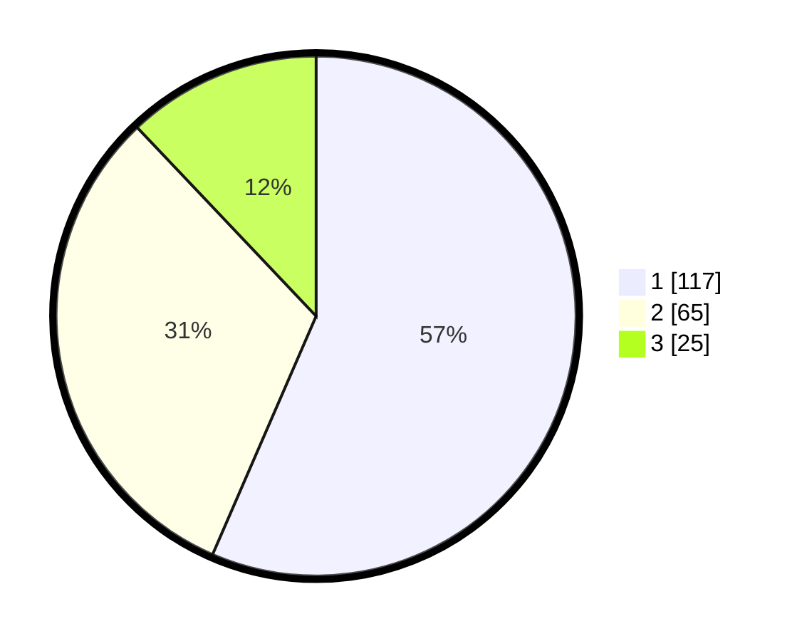

# Hasil

## Grafik

## Tabel

| No.    | Nama Paslon    | Suara | Suara (raw) | Persentase |
|:------ |:-------------- | -----:| -----------:| ----------:|
| 100025 | ANIES MUHAIMIN | 117   | [117][p-1]  | 56,52      |
| 100026 | PRABOWO GIBRAN | 65    | [65][p-2]   | 31,40      |
| 100027 | GANJAR MAHFUD  | 25    | [25][p-3]   | 12,08      |

[p-1]: https://github.com/gigit-pemilu/pemilu-2024/blob/main/pilpres/hitung-suara/sub/31-dki-jakarta/sub/72-jakarta-utara/sub/06-kelapa-gading/sub/1002-pegangsaan-dua/sub/007-tps/sub/paslon-1.txt
[p-2]: https://github.com/gigit-pemilu/pemilu-2024/blob/main/pilpres/hitung-suara/sub/31-dki-jakarta/sub/72-jakarta-utara/sub/06-kelapa-gading/sub/1002-pegangsaan-dua/sub/007-tps/sub/paslon-2.txt
[p-3]: https://github.com/gigit-pemilu/pemilu-2024/blob/main/pilpres/hitung-suara/sub/31-dki-jakarta/sub/72-jakarta-utara/sub/06-kelapa-gading/sub/1002-pegangsaan-dua/sub/007-tps/sub/paslon-3.txt

## Foto C Plano

https://sirekap-obj-formc.kpu.go.id/b838/pemilu/ppwp/31/72/06/10/02/3172061002007-20240216-174133--0517b5b3-752f-4c85-9491-bc8162b98792.jpg

https://sirekap-obj-formc.kpu.go.id/b838/pemilu/ppwp/31/72/06/10/02/3172061002007-20240216-174630--a0f96089-2354-471a-a10d-cb2a27ce37c0.jpg

https://sirekap-obj-formc.kpu.go.id/b838/pemilu/ppwp/31/72/06/10/02/3172061002007-20240216-174734--be7d67e5-b4ae-4de9-893e-f7fbfeef6b8e.jpg

## Metadata

| Key        | Value               |
| ---------- | ------------------- |
| Time Stamp | 2024-02-21 19:00:00 |

