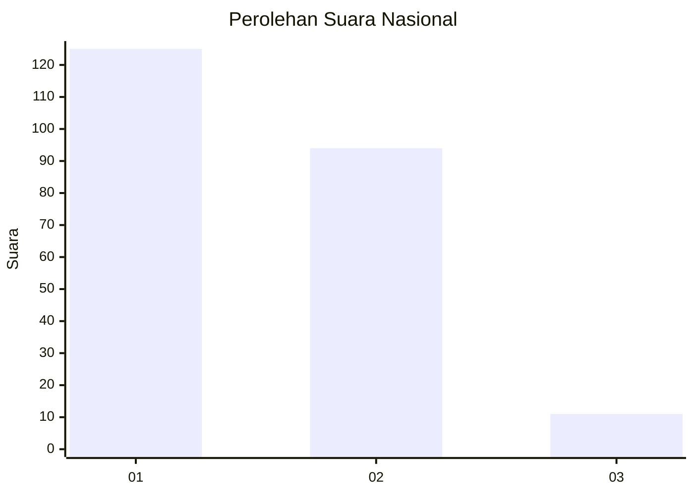
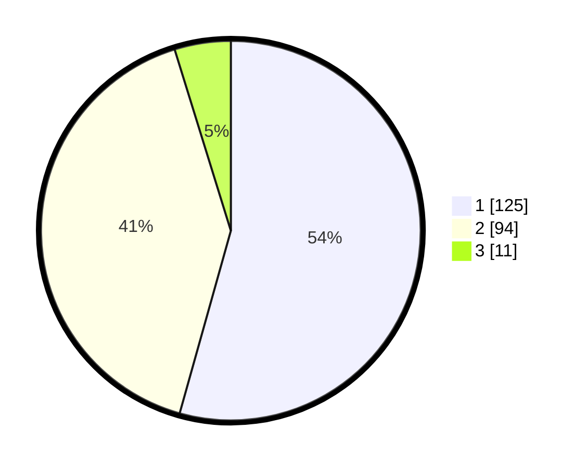

# Hasil

## Grafik

## Tabel

| No.    | Nama Paslon    | Suara | Suara (raw) | Persentase |
|:------ |:-------------- | -----:| -----------:| ----------:|
| 100025 | ANIES MUHAIMIN | 125   | [125][p-1]  | 54,35      |
| 100026 | PRABOWO GIBRAN | 94    | [94][p-2]   | 40,87      |
| 100027 | GANJAR MAHFUD  | 11    | [11][p-3]   | 4,78       |

[p-1]: https://github.com/gigit-pemilu/pemilu-2024/blob/main/pilpres/hitung-suara/sub/31-dki-jakarta/sub/72-jakarta-utara/sub/06-kelapa-gading/sub/1002-pegangsaan-dua/sub/009-tps/sub/paslon-1.txt
[p-2]: https://github.com/gigit-pemilu/pemilu-2024/blob/main/pilpres/hitung-suara/sub/31-dki-jakarta/sub/72-jakarta-utara/sub/06-kelapa-gading/sub/1002-pegangsaan-dua/sub/009-tps/sub/paslon-2.txt
[p-3]: https://github.com/gigit-pemilu/pemilu-2024/blob/main/pilpres/hitung-suara/sub/31-dki-jakarta/sub/72-jakarta-utara/sub/06-kelapa-gading/sub/1002-pegangsaan-dua/sub/009-tps/sub/paslon-3.txt

## Foto C Plano

https://sirekap-obj-formc.kpu.go.id/45ca/pemilu/ppwp/31/72/06/10/02/3172061002009-20240215-011529--cca8ba02-f0dc-407b-8b7b-f2ce7a8a90c2.jpg

https://sirekap-obj-formc.kpu.go.id/45ca/pemilu/ppwp/31/72/06/10/02/3172061002009-20240215-011649--d21fc7cc-efb0-4af6-baee-4abbb2c85317.jpg

https://sirekap-obj-formc.kpu.go.id/45ca/pemilu/ppwp/31/72/06/10/02/3172061002009-20240215-011708--16636689-1a18-4b62-8a74-c6be686ff157.jpg

## Metadata

| Key        | Value               |
| ---------- | ------------------- |
| Time Stamp | 2024-02-20 16:00:00 |

