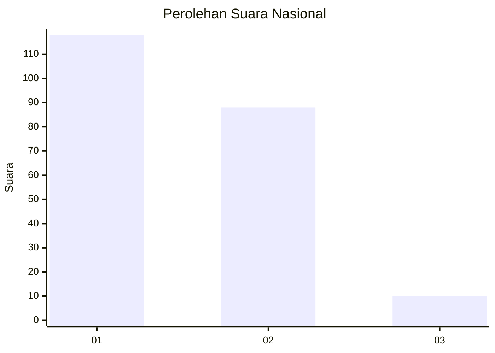
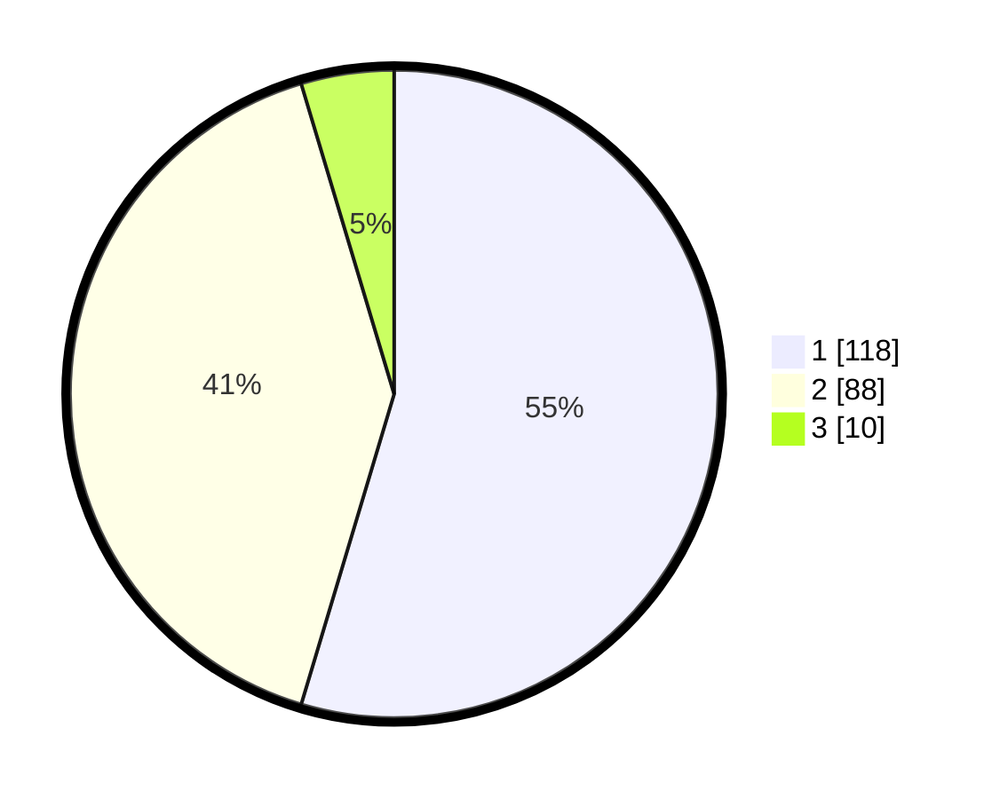

# Hasil

## Grafik

## Tabel

| No.    | Nama Paslon    | Suara | Suara (raw) | Persentase |
|:------ |:-------------- | -----:| -----------:| ----------:|
| 100025 | ANIES MUHAIMIN | 118   | [118][p-1]  | 54,63      |
| 100026 | PRABOWO GIBRAN | 88    | [88][p-2]   | 40,74      |
| 100027 | GANJAR MAHFUD  | 10    | [10][p-3]   | 4,63       |

[p-1]: https://github.com/gigit-pemilu/pemilu-2024/blob/main/pilpres/hitung-suara/sub/31-dki-jakarta/sub/72-jakarta-utara/sub/06-kelapa-gading/sub/1002-pegangsaan-dua/sub/011-tps/sub/paslon-1.txt
[p-2]: https://github.com/gigit-pemilu/pemilu-2024/blob/main/pilpres/hitung-suara/sub/31-dki-jakarta/sub/72-jakarta-utara/sub/06-kelapa-gading/sub/1002-pegangsaan-dua/sub/011-tps/sub/paslon-2.txt
[p-3]: https://github.com/gigit-pemilu/pemilu-2024/blob/main/pilpres/hitung-suara/sub/31-dki-jakarta/sub/72-jakarta-utara/sub/06-kelapa-gading/sub/1002-pegangsaan-dua/sub/011-tps/sub/paslon-3.txt

## Foto C Plano

https://sirekap-obj-formc.kpu.go.id/9d30/pemilu/ppwp/31/72/06/10/02/3172061002011-20240216-210221--6b2bb5b6-eb66-44e8-adb5-42df6c0151c8.jpg

https://sirekap-obj-formc.kpu.go.id/9d30/pemilu/ppwp/31/72/06/10/02/3172061002011-20240216-210549--49b97894-24cd-4282-b8d5-628b6807f02c.jpg

https://sirekap-obj-formc.kpu.go.id/9d30/pemilu/ppwp/31/72/06/10/02/3172061002011-20240216-210810--eeccc46d-f8bd-4ac1-9fdd-12747ae9b7ed.jpg

## Metadata

| Key        | Value               |
| ---------- | ------------------- |
| Time Stamp | 2024-02-21 19:00:00 |

