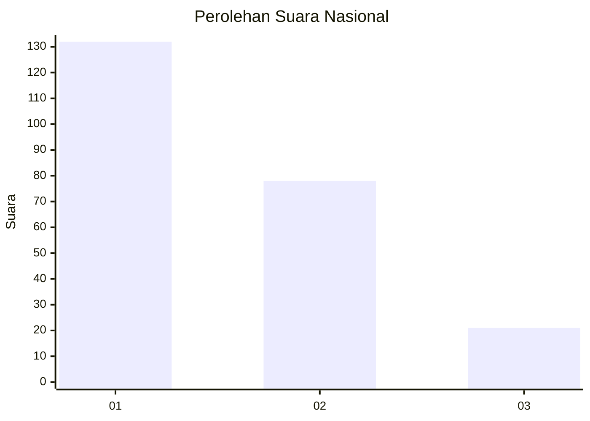
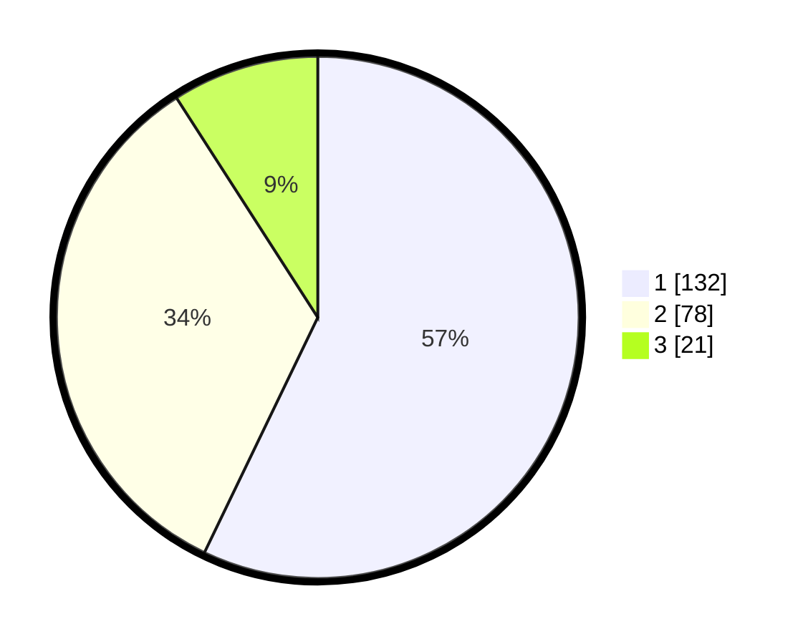

# Hasil

## Grafik

## Tabel

| No.    | Nama Paslon    | Suara | Suara (raw) | Persentase |
|:------ |:-------------- | -----:| -----------:| ----------:|
| 100025 | ANIES MUHAIMIN | 132   | [132][p-1]  | 57,14      |
| 100026 | PRABOWO GIBRAN | 78    | [78][p-2]   | 33,77      |
| 100027 | GANJAR MAHFUD  | 21    | [21][p-3]   | 9,09       |

[p-1]: https://github.com/gigit-pemilu/pemilu-2024/blob/main/pilpres/hitung-suara/sub/31-dki-jakarta/sub/72-jakarta-utara/sub/06-kelapa-gading/sub/1002-pegangsaan-dua/sub/013-tps/sub/paslon-1.txt
[p-2]: https://github.com/gigit-pemilu/pemilu-2024/blob/main/pilpres/hitung-suara/sub/31-dki-jakarta/sub/72-jakarta-utara/sub/06-kelapa-gading/sub/1002-pegangsaan-dua/sub/013-tps/sub/paslon-2.txt
[p-3]: https://github.com/gigit-pemilu/pemilu-2024/blob/main/pilpres/hitung-suara/sub/31-dki-jakarta/sub/72-jakarta-utara/sub/06-kelapa-gading/sub/1002-pegangsaan-dua/sub/013-tps/sub/paslon-3.txt

## Foto C Plano

https://sirekap-obj-formc.kpu.go.id/3fc7/pemilu/ppwp/31/72/06/10/02/3172061002013-20240218-203214--6f715ace-df65-490a-b0e9-049579a4d91d.jpg

https://sirekap-obj-formc.kpu.go.id/3fc7/pemilu/ppwp/31/72/06/10/02/3172061002013-20240218-203402--6411068b-355b-4b05-9fa5-ee6c28e4619b.jpg

https://sirekap-obj-formc.kpu.go.id/3fc7/pemilu/ppwp/31/72/06/10/02/3172061002013-20240218-203742--2a7ce452-2dd4-4d56-9a5f-a3b0244abe44.jpg

## Metadata

| Key        | Value               |
| ---------- | ------------------- |
| Time Stamp | 2024-02-21 19:00:00 |

